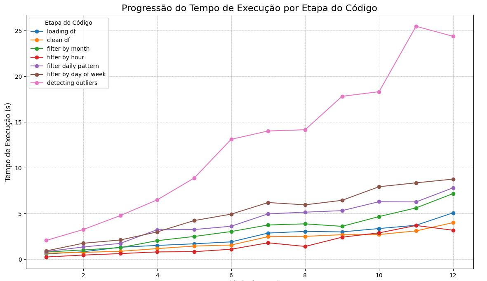

# Final project report: ny-taxis-big-data-analysis

## 1. Context and motivation

- Use data extracted from cab trips in New York to obtain insights, such as:
  - Day of the week with the most cab trips registered
  - Hour of the day with the most cab trips registered

These types of insights are useful for optimizing taxi fleet distribution throughout the city or improving pricing policies applied to the service.

- Detect outliers in the dataset to reduce potential issues caused by incorrect data.

## 2. Data

### 2.1 Detailed description

- The dataset used in this project is called TLC Trip Record Data, where each record represents a cab trip registered in New York. It has 24 columns, representing information such as the number of passengers, pickup location, drop-off location, pickup time, and drop-off time.

- The dataset is extracted and made available by the NYC Taxi & Limousine Commission.

### 2.2 How to obtain the data

- Each file contains all trip data recorded during one month. You can download it using the following link:

  ```sh
  wget -O data/yellow_tripdata_${year}-${month}.parquet https://d37ci6vzurychx.cloudfront.net/trip-data/yellow_tripdata_${year}-${month}.parquet
  ```

  Just replace ${year} with a year (e.g., 2024) and ${month} with a month (e.g., 02).

  - Instead of running the command above for each month, we created a script to automate the process by passing a date range. You just need to run:

  ```sh
  sh bin/download_data.sh ${first_year}-${first_month} ${last_year}-${last_month}
  ```

  For example, to download all data from 2024, you can execute:

  ```sh
  sh bin/download_data.sh 2024-01 2024-12
  ```

## 3. How to install and run

### 3.1 Quick start (using sample data in `data/`)

Once you have the data, you can proceed to run the code. First, build the Docker image by executing:

```sh
make
```

Then, start the container by typing:

```sh
sh bin/start.sh
```

On the notebook opened by starting the container, you will have the repositories data and src. Into src/ you will see 2 .ipynb. Open analysis_dataset.ipynb and roll to the 3th block of code. edit the variable amount_of_files to the number of files you want to process. In this case, change it to 1.

Note: If you encounter any issues while starting or running the container, try stopping it (sh bin/stop.sh), then removing it (sh bin/remove.sh), and finally starting it again.

You will then be able to access the Jupyter browser environment, with the data directory containing the data files and the src directory containing the notebook files.

If you haven't downloaded additional files, you can run the code using the example available in ./data/, which includes data for January 2024.

### 3.2 How to run with the full dataset

The concept of the "full dataset" in our case, means as much data as your machine can handle. You can download data from any month in the range 2009–2025 (currently available).

- Note: The dataset is updated monthly.

## 4. Project architecture


- Basically, our project starts by reading the entire dataset (all downloaded files in the data/ directory) into a Spark DataFrame.
- Then, we remove some rows containing suspicious data, such as:

  - Trip duration too long or too short
  - Total amount (total trip cost) less than or equal to 0
  - Passenger count less than or equal to 0

- After that, we perform all our analysis and print the output or a relevant slice of it.

## 5. Workloads evaluated

As an evaluation method, we measured the execution time of each processing step separately, varying the amount of data processed — starting with 1 file (2024-01) and incrementally adding one file at a time until the last file (2024-12). This allowed us to measure how the addition of each file impacted the processing time of each step.

### 5.1 loading df

- Description: Operation that loads all .parquet files into a single Spark DataFrame
- Operations: Read all data from each file into individual Spark DataFrames, then merge them into a single one
- Measures: Time to process

### 5.2 clean df

- Description: Operation that removes inconsistent data from the dataset, as mentioned in the architecture section
- Operations: Remove from the dataset all records where:
  - `total_amount` (total cost) is less than or equal to 0
  - `trip_distance` is less than or equal to 0
  - `passenger_count` (number of passengers) is less than or equal to 0 or greater than 5
  - `trip_duration` is less than or equal to 0 or greater than 180 (minutes)
- Measures: time to process

### 5.3 filter by month

- Description: Counts how many trips occurred in each month of each year
- Operations: Group the DataFrame by month and year, count how many records exist for each group, then sort them from oldest to newest
- Measures: time to process

### 5.4 filter by hour

- Description: Adds a new filtering option based on trip hour and type of day (weekday or weekend)
- Operations:
  - Create a new column in the DataFrame named pickup_hour, containing the hour of the pickup timestamp
  - Create another column named day_type, which contains the tag "weekend" for Saturday and Sunday, and "weekday" for the rest
- Measures: time to process

### 5.5 filter daily pattern

- Description: Counts how many trips occurred in each hour of the day
- Operations:
  - Use the data from step 5.4
  - Group it by day_type and pickup_hour, then count the records
  - This gives us the number of trips that started at each hour, segmented by day type
- Measures: time to process

### 5.6 filter by day of week

- Description: Counts how many trips occurred on each day of the week
- Operations:
  - Create a new column named pickup_day_name, which contains the name of the day (e.g., Sunday, Monday...) when each trip occurred
  - Then, sort the result by day name
- Measures: time to process

### 5.7 detecting outliers

- Description: Identifies outliers in the total_amount column using IQR and Z-score techniques
- Operations:
  - Calculate quartiles, mean, and standard deviation
  - Define outlier thresholds using both IQR and Z-score
  - Create a new column is_outlier with value 1.0 for outliers and 0.0 otherwise
- Measures: time to process

## 6. Experiments and results

### 6.1 Experimental environment

The experiments were conducted on the following setup:

- CPU's: 12
- Memory: 6gb ddr4
- Fedora 40 workstation
- Linux kernel v6.14
- Docker 28.1.1

- Enviroment: Jupyter running Spark driver

### 6.2 What did you test?

- Parameters
  - Amount of files
- Measures
  - Time to execute each task

### 6.3 Results


```text
In the image above, we see a plot that shows the proportion of records detected as outliers (`is_outlier = 1`) based on the `total_amount` of the trip. It reveals that the higher the trip cost, the greater the likelihood of it being considered an outlier.
```


```text
In the image above, we see a chart displaying the number of trips (y-axis) for each day of the week (x-axis).
```


```text
In the image above, we see a chart showing the number of trips (y-axis) by hour of the day (x-axis), distinguishing between weekdays (blue line) and weekend days (orange line).
```

|                       | 1      | 2      | 3      | 4      | 5      | 6       | 7       | 8       | 9       | 10      | 11      | 12      |
| --------------------- | ------ | ------ | ------ | ------ | ------ | ------- | ------- | ------- | ------- | ------- | ------- | ------- |
| loading df            | 0.5798 | 0.8210 | 1.3156 | 1.5146 | 1.6909 | 1.9029  | 2.8643  | 3.0495  | 2.9942  | 3.3598  | 3.7178  | 5.0746  |
| clean df              | 0.6693 | 0.7546 | 0.8704 | 1.1677 | 1.4417 | 1.5592  | 2.4726  | 2.5055  | 2.6875  | 2.7043  | 3.1007  | 4.0051  |
| filter by month       | 0.7927 | 1.0203 | 1.2719 | 2.0350 | 2.4925 | 3.0326  | 3.7496  | 3.8725  | 3.5991  | 4.6688  | 5.6153  | 7.1768  |
| filter by hour        | 0.2498 | 0.4597 | 0.6204 | 0.8047 | 0.8305 | 1.0971  | 1.8016  | 1.4018  | 2.4147  | 2.8867  | 3.6916  | 3.1769  |
| filter daily pattern  | 0.8420 | 1.3442 | 1.7344 | 3.2321 | 3.2480 | 3.6106  | 4.9674  | 5.1486  | 5.3170  | 6.2949  | 6.2697  | 7.8087  |
| filter by day of week | 0.9175 | 1.7513 | 2.1065 | 2.9912 | 4.2319 | 4.9342  | 6.2013  | 5.9494  | 6.4455  | 7.9319  | 8.3554  | 8.7609  |
| detecting outliers    | 2.0631 | 3.2505 | 4.7743 | 6.4968 | 8.8774 | 13.1131 | 14.0235 | 14.1566 | 17.8150 | 18.3153 | 25.4703 | 24.3715 |

```text
In the table above, we present the processing time for each step described in Section 5. The rows represent the processing sessions, while the columns represent the number of files processed. Each cell shows the time taken by that session to process the corresponding number of files.

This table was used as input to generate the chart below, which provides a more visual and easily analyzable representation.
```



Looking at the chart above, we can see that all processing sessions have similar execution times, except for the outlier detection step, which shows a significantly higher processing time compared to the others.

## 7. Discussion and conclusions

We initially planned to implement outlier detection using a framework called PyOD, but it did not work well in the Spark environment. Therefore, we replaced it with a combination of two methods — IQR and Z-score — to filter records with suspicious data, such as trips that were too long or had an unusually low average speed (calculated as trip distance divided by trip time). This approach worked well, so we decided to keep it, even though its computational cost was considerably high.

As a limitation of our work, all processing tasks were executed on a single machine. As a result, we were not able to collect data on the project’s performance in a distributed cluster environment, which could have provided insights into scalability.

In summary, our project processed real data from an actual dataset to extract insights that could support infrastructure or strategic decisions by the New York City Hall or ride-hailing platforms such as Uber.

## 8. References and external resources

- website to download the dataset manually, or see more about it:

```
https://www.nyc.gov/site/tlc/about/tlc-trip-record-data.page
```
