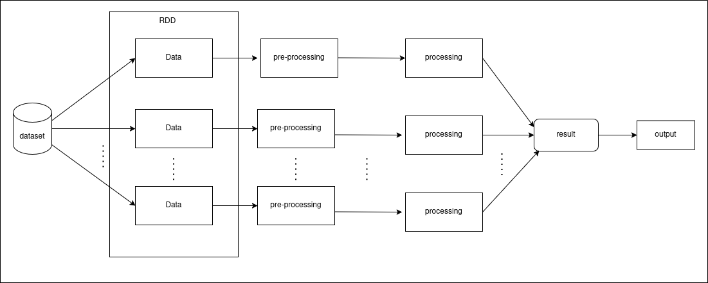

# Final project report: ny-taxis-big-data-analysis

## 1. Context and motivation

- Use data extracted from cab trips at New York to get some insights, for exemple:
  - Day of week with more cab trips registered
  - Hour of day with more cab trips registered

That type of insight is useful to optimize the taxi fleet distribution through the city, or improve price policies applied to that service.

- Outlying detect into the dataset, aiming to reduce possible issues caused by wrong data.

## 2. Data

### 2.1 Detailed description

- The dataset used in this project is called TLC Trip Record Data, in which each record represents one cab trip registered at New York. It has 24 columns, that represents infos as like amount of passengers, local pickup, local dropout, time pickup and time dropout.

- The dataset is extracted and made available by the NYC taxi & limousine commission.

### 2.2 How to obtain the data

- Each file contains all data got through 1 month. You can just download it using the following link:

  ```sh
  wget -O data/yellow_tripdata_${year}-${month}.parquet https://d37ci6vzurychx.cloudfront.net/trip-data/yellow_tripdata_${year}-${month}.parquet
  ```

  You just need to replace ${year} by an year, 2024 for exemple, and ${month} by a month, 02 for exemple.

  - Instead of run the code above once for each month, we made an script to do it automatically by passing a range to it. You just need to run:

  ```sh
  sh bin/download_data.sh ${first_year}-${first_month} ${last_year}-${last_month}
  ```

  For exemple, to download the whole data from 2024, you just need to execute `sh bin/download_data.sh 2024-01 2024-12`.

## 3. How to install and run

### 3.1 Quick start (using sample data in `datasample/`)

Now we have the data, we can go to the code. We just need to build up a docker image by executing:

```sh
make
```

And then, finally, start up the container, by typing:

```sh
sh bin/start.sh
```

Obs: if you have any trouble while starting or executing the container, try to stop it (sh bin/stop.sh) and then remove it (sh bin/remove.sh) and finally, start up it again.

Now, we can be able to acess the jupyter browser enviroment with the directories data containing the data files and src containing the notebook files.

If you don't download another files, you can be able to run all the code with the exemple available at ./data/, that is the file of 2024-01.

### 3.2 How to run with the full dataset

The concept of "full dataset" in our case is as much as your machine can run. You can download data from every month of the range 2009-2025 (at the moment).

- Obs.: The dataset is updated monthly.

## 4. Project architecture



- Basically our project starts to read the whole dataset (all downloaded files at data/ directory) into a spark dataframe.
- After, we delete some rows containing data with suspicious data, as for exemple:

  - Trip duration too large or too small
  - total amount (total trip cost) lesser or equal to 0
  - passanger count lesser or equal to 0

- After that, now we do all our analysis and print the output, or a slice of it

## 5. Workloads evaluated

## 6. Experiments and results

### 6.1 Experimental environment

### 6.2 What did you test?

### 6.3 Results

## 7. Discussion and conclusions

## How to execute the project

## 8. References and external resources

- website to download the dataset manually, or see more about it:

```
https://www.nyc.gov/site/tlc/about/tlc-trip-record-data.page
```
