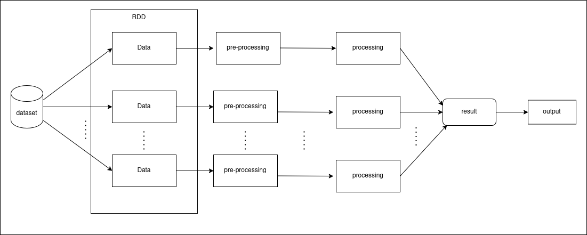
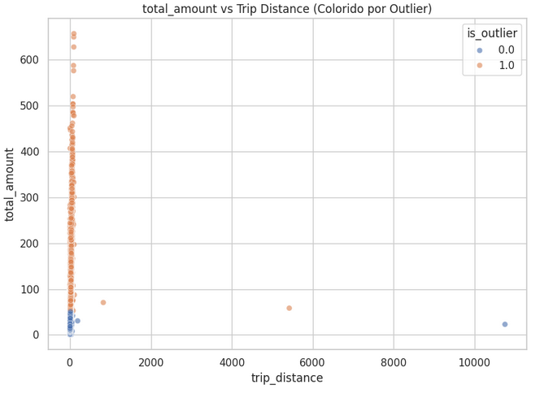
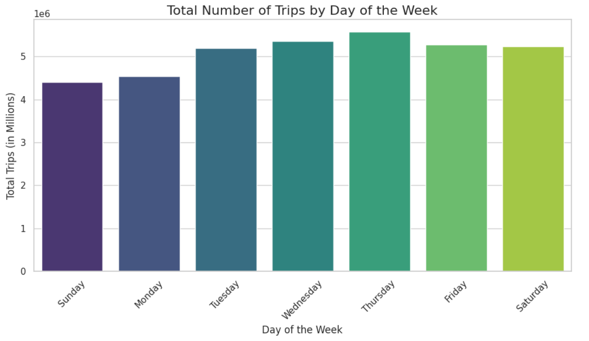
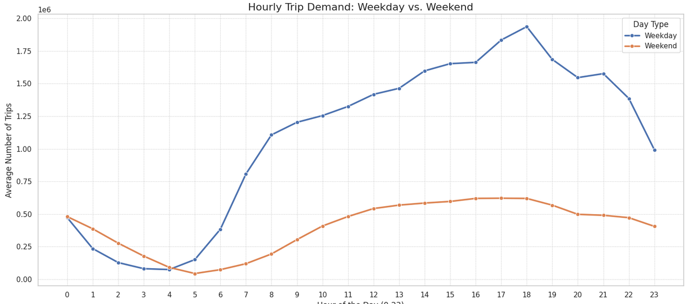

# Final project report: ny-taxis-big-data-analysis

## 1. Context and motivation

- Use data extracted from cab trips at New York to get some insights, for example:
  - Day of week with more cab trips registered
  - Hour of day with more cab trips registered

That type of insight is useful to optimize the taxi fleet distribution through the city, or improve price policies applied to that service.

- Outlying detect into the dataset, aiming to reduce possible issues caused by wrong data.

## 2. Data

### 2.1 Detailed description

- The dataset used in this project is called TLC Trip Record Data, in which each record represents one cab trip registered at New York. It has 24 columns, that represents infos as like amount of passengers, local pickup, local dropout, time pickup and time dropout.

- The dataset is extracted and made available by the NYC taxi & limousine commission.

### 2.2 How to obtain the data

- Each file contains all data got through 1 month. You can just download it using the following link:

  ```sh
  wget -O data/yellow_tripdata_${year}-${month}.parquet https://d37ci6vzurychx.cloudfront.net/trip-data/yellow_tripdata_${year}-${month}.parquet
  ```

  You just need to replace ${year} by an year, 2024 for example, and ${month} by a month, 02 for example.

  - Instead of run the code above once for each month, we made an script to do it automatically by passing a range to it. You just need to run:

  ```sh
  sh bin/download_data.sh ${first_year}-${first_month} ${last_year}-${last_month}
  ```

  For example, to download the whole data from 2024, you just need to execute `sh bin/download_data.sh 2024-01 2024-12`.

## 3. How to install and run

### 3.1 Quick start (using sample data in `datasample/`)

Now we have the data, we can go to the code. We just need to build up a docker image by executing:

```sh
make
```

And then, finally, start up the container, by typing:

```sh
sh bin/start.sh
```

Obs: if you have any trouble while starting or executing the container, try to stop it (sh bin/stop.sh) and then remove it (sh bin/remove.sh) and finally, start up it again.

Now, we can be able to acess the jupyter browser enviroment with the directories data containing the data files and src containing the notebook files.

If you don't download another files, you can be able to run all the code with the example available at ./data/, that is the file of 2024-01.

### 3.2 How to run with the full dataset

The concept of "full dataset" in our case is as much as your machine can run. You can download data from every month of the range 2009-2025 (at the moment).

- Obs.: The dataset is updated monthly.

## 4. Project architecture



- Basically our project starts to read the whole dataset (all downloaded files at data/ directory) into a spark dataframe.
- After, we delete some rows containing data with suspicious data, as for example:

  - Trip duration too large or too small
  - total amount (total trip cost) lesser or equal to 0
  - passanger count lesser or equal to 0

- After that, now we do all our analysis and print the output, or a slice of it

## 5. Workloads evaluated

As evaluation method, we collected the time to run all the processing parts separated, variating the amount of data to process, starting from 1 file (2024-01) and adding 1 by 1 file in which execution until the last file (2024-12) to measure how much that file adding impact to the time in which part of processing.

### 5.1 loading df

- Description: operation that loads all .parquet files into an unique spark dataframe
- Operations: read all data from all files into different spark dataframes and then marge them into only one
- Measures: time to process

### 5.2 clean df

- Description: operation that delete from the dataset the inconsistent data, as cited at the architecture topic
- Operations: removes from dataset all records in which:
  - total_amount (total cost) is lesser or equal 0
  - trip_distance is lesser or equal 0
  - passanger_count (number of passangers) is lesser or equal 0 or greater than 5
  - trip_duration is lesser or equal to 0 or greater than 180 (minutes)
- Measures: time to process

### 5.3 filter by month

- Description: counts how many trips each month of each year had
- Operations: group the dataframe by month and year, count how many records has for each value, then sort it from the oldest to newest record.
- Measures: time to process

### 5.4 filter by hour

- Description: adds a new filter option containing the trip hour and the type of the day (week or weekend)
- Operations: create a new column in the dataframe named pickup_hour, that has the time (in hour) of the trip pickup based on its datetime. After that, create another column named day_type, that contains a tag "weekend" for days saturday and sunday and a tag "weekday" to the rest.
- Measures: time to process

### 5.5 filter daily pattern

- Description: counts how many trips each hour of the day had
- Operations: gets the data created at the step 5.4 and group it by day_type and pickup_hour and then count it. Now, we got how many trips started in which hour of day in which day type
- Measures: time to process

### 5.6 filter by day of week

- Description: counts how many trips each day of week had
- Operations: create a new column named pickup_day_name, which contains the day (sunday, monday....) in which each trip ocurred. Now, we just sort it by the name of the day.
- Measures: time to process

### 5.7 detecting outliers

- Description: identifies outliers in the total_amount column using IQR and Z-score techniques
- Operations: calculates quartiles, mean, and standard deviation; defines outlier thresholds using both IQR and Z-score; creates a new column is_outlier with 1.0 for outliers and 0.0 otherwise
- Measures: time to process

## 6. Experiments and results

### 6.1 Experimental environment

Os experimentos foram executados em:

- CPU's: 12
- Memory: 6gb ddr4
- Fedora 40 workstation
- Linux kernel v6.14
- Docker 28.1.1

- Enviroment: Jupyter running Spark driver

### 6.2 What did you test?

- Parameters
  - Amount of files
- Measures
  - Time to execute each task

### 6.3 Results



```text
On the image above, we have a plot that shows the proportion of records that was detected as outlier (is_outlier=1) by the total_amount of the trip, showing that as high is the price, as high the chance to be outlier.
```



```text
On the image above, we have a chart that shows the amount of trips (y axis) by day of week (x axis).
```



```text
On the image above, we have a chart that shows the amount of trip (y axis) by hour of day (x axis), considering weekdays (blue line) and weekend days (orange lines).
```

## 7. Discussion and conclusions

We planned to make the outlier detect using a framework called pyod, but it does not worked with spark enviroment so well, so we made that part using a combination of two methods called IQR and Z-score, to filter some registers with suspect data, as trips too much large or with average speed (trip distance / trip time) too low for example. That worked well, so we decided to mantain it, even the cost being too much high.
As a limitation of our work, we used an unique computer to process all the processing tasks, so we couldn't collect data about our project running into a cluster to test its limitation in distributed systems.
In general, this is our project, that got real data from a real dataset to process some insights that can be used into some infrastructure or strategic decisions by the NY city hall or ride application managers (as uber for example).

## 8. References and external resources

- website to download the dataset manually, or see more about it:

```
https://www.nyc.gov/site/tlc/about/tlc-trip-record-data.page
```
