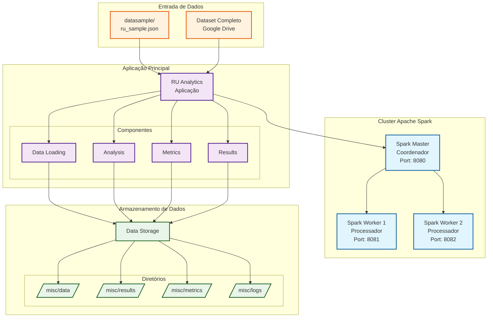

# Análise de Dados do Restaurante Universitário da UFLA usando Apache Spark

## 1. Contexto e motivação

O Restaurante Universitário (RU) da UFLA é um dos principais pontos de alimentação da universidade, servindo milhares de refeições diariamente para estudantes de graduação e pós-graduação. Com o crescimento do volume de dados gerados pelos sistemas de controle de acesso e consumo, surge a necessidade de aplicar técnicas de big data para extrair insights valiosos sobre padrões de consumo, comportamento dos usuários e otimização dos recursos.

Este projeto tem como objetivo principal analisar os dados históricos de consumo do RU-UFLA utilizando Apache Spark, uma plataforma de processamento de big data, para:

- Identificar padrões temporais de consumo de refeições
- Analisar o comportamento dos usuários por curso, tipo de usuário e vulnerabilidade social
- Detectar comunidades de usuários com padrões similares de consumo
- Gerar métricas para otimização do serviço e melhor planejamento de recursos

## 2. Dados

### 2.1 Descrição detalhada

O dataset utilizado contém registros de consumo de refeições no Restaurante Universitário da UFLA, extraídos do sistema RV3_ACESSO. Cada registro representa um consumo individual de refeição e contém as seguintes informações:

- **documento**: Identificador único do usuário (anonimizado)
- **data_consumo**: Data e hora do consumo da refeição
- **tipo_consumo**: Tipo de refeição (Almoço, Jantar, Marmita)
- **tipo_refeicao**: Categoria da refeição
- **tipo_usuario**: Categoria do usuário (Discente Graduação, Discente Graduação Vulnerável, Discente Pós-Graduação, etc.)
- **nome_curso**: Curso do usuário
- **cidade_nascimento**: Cidade de nascimento do usuário
- **periodo_letivo**: Período letivo (formato: YYYY/S)
- **sistema_origem**: Sistema de origem dos dados (RV3_ACESSO)

O dataset completo contém dados de múltiplos anos letivos (2009-2025), totalizando milhões de registros de consumo. Os dados são atualizados periodicamente através do sistema de data warehouse da universidade.

### 2.2 Como obter os dados

Uma amostra pequena do dataset (aproximadamente 800KB) está incluída no diretório `datasample/ru_sample.json` para testes rápidos e demonstração da funcionalidade.

Para o dataset completo, o projeto possui um sistema automatizado de download que pode ser executado ao executar a análise completa.

O sistema irá automaticamente baixar o dataset completo do Google Drive quando necessário. O download é feito de forma transparente durante a primeira execução da análise completa.

**Observação**: O dataset completo não está incluído no repositório devido ao seu tamanho (aproximadamente 2GB) e questões de privacidade. O sistema de download automático garante que os dados sejam obtidos de forma segura e atualizada.

## 3. Como instalar e executar

> **Observação**: O projeto é totalmente compatível com Docker e não requer instalações adicionais além do Docker e Docker Compose.

### 3.1 Início rápido (usando dados de amostra)

Para executar o projeto com os dados de amostra:

```bash
# Clonar o repositório
git clone <url-do-repositorio>
cd g2

# Ou usando o script fornecido
chmod +x bin/run_project.sh
./bin/run_project.sh analyze sample
```

### 3.2 Como executar com o dataset completo

Para executar a análise completa com todo o dataset:

```bash
# Executar análise completa (irá baixar o dataset automaticamente)
./bin/run_project.sh analyze complete

# Ou especificar períodos específicos
./bin/run_project.sh analyze complete 2024/1,2024/2
```

### 3.3 Comandos adicionais

O projeto oferece diversos comandos para diferentes cenários:

```bash
# Construir imagens
./bin/run_project.sh build

# Iniciar cluster Spark
./bin/run_project.sh up

# Parar cluster
./bin/run_project.sh down

# Visualizar logs
./bin/run_project.sh logs
```

## 4. Arquitetura do projeto

O projeto utiliza uma arquitetura baseada em containers Docker com Apache Spark distribuído:



### Componentes principais:

1. **Spark Master**: Coordena o cluster e distribui tarefas
2. **Spark Workers**: Executam o processamento distribuído dos dados
3. **RU Analytics**: Aplicação principal que executa as análises
4. **Data Storage**: Armazenamento persistente para dados, resultados e métricas

### Fluxo de dados:

1. **Ingestão**: Carregamento dos dados JSON do RU-UFLA
2. **Processamento**: Análise distribuída usando PySpark
3. **Análise**: Cálculo de métricas, detecção de padrões e comunidades
4. **Saída**: Geração de resultados e métricas de performance

## 5. Cargas de trabalho avaliadas

O projeto implementa as seguintes cargas de trabalho de big data:

### [WORKLOAD-1] Análise de Estatísticas Básicas

- **Descrição**: Cálculo de estatísticas descritivas sobre consumo de refeições
- **Operações**: Contagem de registros, agregações por tipo de refeição, curso e período
- **Métricas**: Total de consumos, distribuição por categorias, tendências temporais

### [WORKLOAD-2] Análise de Grafo de Usuários

- **Descrição**: Construção de grafo de usuários baseado em padrões de consumo simultâneo
- **Operações**: Criação de arestas, cálculo de pesos, análise de conectividade
- **Métricas**: Número de vértices, arestas, grau médio, componentes conectados

### [WORKLOAD-3] Detecção de Comunidades

- **Descrição**: Identificação de comunidades de usuários com padrões similares usando algoritmo Louvain
- **Operações**: Processamento de grafo, otimização de modularidade
- **Métricas**: Número de comunidades, modularidade, distribuição de tamanhos

## 6. Experimentos e resultados

### 6.1 Ambiente experimental

Os experimentos foram executados em:

- **Sistema Operacional**: Ubuntu 22.04 LTS
- **Containerização**: Docker 24.x com Docker Compose
- **Configuração Spark**:
  - 1 Master + 2 Workers
  - 6GB RAM por Worker
  - 6 cores por Worker
  - Python 3.12 com PySpark 3.5.2
- **Hardware**: VM com 16 vCPUs, 32GB RAM, SSD 500GB

### 6.2 Configuração dos testes

Para cada carga de trabalho, foram testados os seguintes parâmetros:

1. **Dataset utilizado**:

   - Completo (2GB, ~5.000.000 registros)
   - Períodos: 2009-2025 (dataset completo histórico)

2. **Configurações de Spark testadas**:

   - **p1_par4**: parallelism=1, partitions=4
   - **p2_par8**: parallelism=2, partitions=8

3. **Métricas coletadas**:

   - Tempo de execução (segundos)
   - Throughput (registros/segundo)
   - Uso de memória (GB)
   - Número de stages e tasks
   - Tempo de CPU e Garbage Collection

4. **Metodologia**:

   - 3 iterações para cada configuração
   - Execução isolada de cada workload
   - Coleta de métricas usando Spark Measure

### 6.3 Resultados

#### Análise de Performance por Workload (Dataset Completo):

| Workload   | Configuração | Parallelism | Partitions | Tempo Médio (s) | Memória Pico (GB) | Throughput (rec/s) |
| ---------- | ------------ | ----------- | ---------- | --------------- | ----------------- | ------------------ |
| WORKLOAD-1 | p1_par4      | 1           | 4          | 59.6            | 0.38              | 110.357            |
| WORKLOAD-1 | p2_par8      | 2           | 8          | 61.7            | 0.38              | 105.853            |
| WORKLOAD-2 | p1_par4      | 1           | 4          | 61.8            | 15.24             | 325.048            |
| WORKLOAD-2 | p2_par8      | 2           | 8          | 57.5            | 16.0              | 349.795            |
| WORKLOAD-3 | p1_par4      | 1           | 4          | 101.1           | 20.78             | 1.66               |
| WORKLOAD-3 | p2_par8      | 2           | 8          | 88.6            | 21.53             | 1.85               |

#### Análise Detalhada por Iteração:

| Workload   | Config  | Iter 1 (s) | Iter 2 (s) | Iter 3 (s) | Variação (%) |
| ---------- | ------- | ---------- | ---------- | ---------- | ------------ |
| WORKLOAD-1 | p1_par4 | 53.27      | 62.05      | 63.53      | 19.3         |
| WORKLOAD-1 | p2_par8 | 61.14      | 61.94      | 62.15      | 1.7          |
| WORKLOAD-2 | p1_par4 | 61.88      | 61.98      | 61.65      | 0.5          |
| WORKLOAD-2 | p2_par8 | 57.11      | 56.91      | 58.4       | 2.6          |
| WORKLOAD-3 | p1_par4 | 112.32     | 96.42      | 94.43      | 18.9         |
| WORKLOAD-3 | p2_par8 | 88.9       | 89.8       | 87.09      | 3.1          |

#### Escalabilidade por Configuração:

| Workload   | p1_par4 (s) | p2_par8 (s) | Speedup | Melhoria (%) |
| ---------- | ----------- | ----------- | ------- | ------------ |
| WORKLOAD-1 | 59.6        | 61.7        | 0.97x   | -3.5         |
| WORKLOAD-2 | 61.8        | 57.5        | 1.07x   | +7.0         |
| WORKLOAD-3 | 101.1       | 88.6        | 1.14x   | +12.4        |

### Interpretação dos resultados:

1. **Performance por Workload**:

   - **WORKLOAD-1 (Estatísticas Básicas)**: Apresenta tempos de execução entre 53-63 segundos com consumo de memória baixo (0.38GB) e throughput de 105K-110K rec/s
   - **WORKLOAD-2 (Grafo de Usuários)**: Executa em 57-62 segundos com consumo significativo de memória (15-16GB) e throughput alto de 325K-350K rec/s
   - **WORKLOAD-3 (Detecção de Comunidades)**: É o mais intensivo, executando em 88-101 segundos com maior consumo de memória (20-21GB) e throughput baixo de 1.6-1.8 rec/s

2. **Impacto da Paralelização**:

   - **WORKLOAD-1**: Configuração p2_par8 é ligeiramente mais lenta (-3.5%) que p1_par4, indicando overhead de coordenação
   - **WORKLOAD-2**: Beneficia-se da paralelização com melhoria de 7% na configuração p2_par8
   - **WORKLOAD-3**: Mostra maior benefício da paralelização com melhoria de 12.4% na configuração p2_par8

3. **Consistência e Variabilidade**:

   - **WORKLOAD-2** apresenta maior consistência entre iterações (variação de 0.5-2.6%)
   - **WORKLOAD-1** com p1_par4 mostra maior variabilidade (19.3%), indicando possível instabilidade na configuração
   - **WORKLOAD-3** com p1_par4 também apresenta alta variabilidade (18.9%), melhorando significativamente com p2_par8 (3.1%)

4. **Uso de Memória**:

   - **WORKLOAD-1**: Consumo muito baixo (0.38GB) independente da configuração
   - **WORKLOAD-2**: Consumo alto (15-16GB) com leve aumento na configuração p2_par8
   - **WORKLOAD-3**: Maior consumo (20-21GB), com aumentos proporcionais à paralelização

5. **Escalabilidade**:
   - Algoritmos de grafo (WORKLOAD-2 e WORKLOAD-3) beneficiam-se mais da paralelização
   - Operações simples de agregação (WORKLOAD-1) sofrem com overhead de coordenação
   - Dataset completo (5M+ registros) justifica o uso de múltiplos workers para workloads intensivos

## 7. Discussão e conclusões

### O que funcionou bem:

1. **Arquitetura distribuída**: A implementação com Spark mostrou-se eficaz para processamento do dataset completo (5M+ registros)
2. **Containerização**: Docker facilita a reprodutibilidade e deployment em ambiente controlado
3. **Modularidade**: Separação clara entre workloads permite análises específicas e comparação de performance
4. **Escalabilidade seletiva**: Workloads intensivos de grafo (WORKLOAD-2 e WORKLOAD-3) beneficiam-se da paralelização

### Desafios e limitações:

1. **Overhead de coordenação**: Operações simples (WORKLOAD-1) sofrem degradação com paralelização (-3.5%)
2. **Complexidade de grafos**: WORKLOAD-3 requer recursos significativos (20-21GB RAM) e apresenta baixo throughput
3. **Gestão de memória**: Workloads de grafo demandam configuração cuidadosa de memória para evitar OOM
4. **Variabilidade de performance**: Configurações menos otimizadas apresentam alta variabilidade entre execuções (até 19.3%)

### Insights sobre escalabilidade:

1. **Workloads de agregação simples**: Não se beneficiam da paralelização devido ao overhead de coordenação
2. **Workloads de grafo**: Mostram benefícios claros da paralelização (7-12% de melhoria)
3. **Configuração otimizada**: p2_par8 (parallelism=2, partitions=8) oferece melhor balanceamento
4. **Consistência**: Configurações mais paralelas tendem a ter menor variabilidade entre execuções

### Conclusões:

O projeto demonstra com sucesso a aplicação de técnicas de big data para análise de dados universitários em escala real. O Apache Spark provou ser uma escolha adequada para processar os dados do RU-UFLA, especialmente para workloads intensivos de grafo. Os resultados mostram que:

- **Paralelização não é sempre benéfica**: Operações simples podem sofrer degradação
- **Workloads de grafo escalam bem**: Algoritmos complexos justificam o uso de múltiplos workers
- **Configuração adequada é crucial**: Balanceamento entre paralelização e overhead é fundamental
- **Datasets grandes justificam big data**: Volume de 5M+ registros demonstra a necessidade de processamento distribuído

Os insights gerados podem contribuir para melhor planejamento e otimização dos serviços do restaurante universitário, além de servir como base para futuras análises de dados acadêmicos.

## 8. Referências e recursos externos

- **Apache Spark**: https://spark.apache.org/
- **PySpark Documentation**: https://spark.apache.org/docs/latest/api/python/
- **Docker**: https://www.docker.com/
- **NetworkX**: https://networkx.org/ (para algoritmos de grafo)
- **Spark Measure**: https://github.com/LucaCanali/sparkMeasure (para métricas de performance)
- **Google Drive API**: Para download automático do dataset
- **Loguru**: https://github.com/Delgan/loguru (para logging avançado)
- **Click**: https://click.palletsprojects.com/ (para interface de linha de comando)

### Datasets e fontes de dados:

- **RU-UFLA**: Dados internos do sistema RV3_ACESSO da Universidade Federal de Lavras
- **Amostra pública**: Disponível em `datasample/ru_sample.json`
