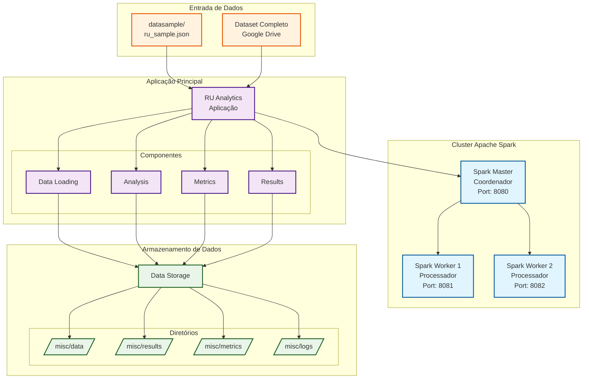

# Análise de Dados do Restaurante Universitário da UFLA usando Apache Spark

## 1. Contexto e motivação

O Restaurante Universitário (RU) da UFLA é um dos principais pontos de alimentação da universidade, servindo milhares de refeições diariamente para estudantes de graduação e pós-graduação. Com o crescimento do volume de dados gerados pelos sistemas de controle de acesso e consumo, surge a necessidade de aplicar técnicas de big data para extrair insights valiosos sobre padrões de consumo, comportamento dos usuários e otimização dos recursos.

Este projeto tem como objetivo principal analisar os dados históricos de consumo do RU-UFLA utilizando Apache Spark, uma plataforma de processamento de big data, para:

- Identificar padrões temporais de consumo de refeições
- Analisar o comportamento dos usuários por curso, tipo de usuário e vulnerabilidade social
- Detectar comunidades de usuários com padrões similares de consumo
- Gerar métricas para otimização do serviço e melhor planejamento de recursos

## 2. Dados

### 2.1 Descrição detalhada

O dataset utilizado contém registros de consumo de refeições no Restaurante Universitário da UFLA, extraídos do sistema RV3_ACESSO. Cada registro representa um consumo individual de refeição e contém as seguintes informações:

- **documento**: Identificador único do usuário (anonimizado)
- **data_consumo**: Data e hora do consumo da refeição
- **tipo_consumo**: Tipo de refeição (Almoço, Jantar, Marmita)
- **tipo_refeicao**: Categoria da refeição
- **tipo_usuario**: Categoria do usuário (Discente Graduação, Discente Graduação Vulnerável, Discente Pós-Graduação, etc.)
- **nome_curso**: Curso do usuário
- **cidade_nascimento**: Cidade de nascimento do usuário
- **periodo_letivo**: Período letivo (formato: YYYY/S)
- **sistema_origem**: Sistema de origem dos dados (RV3_ACESSO)

O dataset completo contém dados de múltiplos anos letivos (2009-2025), totalizando milhões de registros de consumo. Os dados são atualizados periodicamente através do sistema de data warehouse da universidade.

### 2.2 Como obter os dados

Uma amostra pequena do dataset (aproximadamente 800KB) está incluída no diretório `datasample/ru_sample.json` para testes rápidos e demonstração da funcionalidade.

Para o dataset completo, o projeto possui um sistema automatizado de download que pode ser executado através do comando:

```bash
docker compose run --rm analytics /app/.venv/bin/python -m src.main analyze --mode complete
```

O sistema irá automaticamente baixar o dataset completo do Google Drive quando necessário. O download é feito de forma transparente durante a primeira execução da análise completa.

**Observação**: O dataset completo não está incluído no repositório devido ao seu tamanho (aproximadamente 2GB) e questões de privacidade. O sistema de download automático garante que os dados sejam obtidos de forma segura e atualizada.

## 3. Como instalar e executar

> **Observação**: O projeto é totalmente compatível com Docker e não requer instalações adicionais além do Docker e Docker Compose.

### 3.1 Início rápido (usando dados de amostra)

Para executar o projeto com os dados de amostra:

```bash
# Clonar o repositório
git clone <url-do-repositorio>
cd g2

# Executar análise com dados de amostra
docker compose up --build analytics

# Ou usando o script fornecido
chmod +x bin/run_project.sh
./bin/run_project.sh analyze sample
```

### 3.2 Como executar com o dataset completo

Para executar a análise completa com todo o dataset:

```bash
# Executar análise completa (irá baixar o dataset automaticamente)
./bin/run_project.sh analyze complete

# Ou especificar períodos específicos
./bin/run_project.sh analyze complete 2024/1,2024/2
```

### 3.3 Comandos adicionais

O projeto oferece diversos comandos para diferentes cenários:

```bash
# Construir imagens
./bin/run_project.sh build

# Iniciar cluster Spark
./bin/run_project.sh up

# Parar cluster
./bin/run_project.sh down

# Visualizar logs
./bin/run_project.sh logs
```

## 4. Arquitetura do projeto

O projeto utiliza uma arquitetura baseada em containers Docker com Apache Spark distribuído:



### Componentes principais:

1. **Spark Master**: Coordena o cluster e distribui tarefas
2. **Spark Workers**: Executam o processamento distribuído dos dados
3. **RU Analytics**: Aplicação principal que executa as análises
4. **Data Storage**: Armazenamento persistente para dados, resultados e métricas

### Fluxo de dados:

1. **Ingestão**: Carregamento dos dados JSON do RU-UFLA
2. **Processamento**: Análise distribuída usando PySpark
3. **Análise**: Cálculo de métricas, detecção de padrões e comunidades
4. **Saída**: Geração de resultados e métricas de performance

## 5. Cargas de trabalho avaliadas

O projeto implementa as seguintes cargas de trabalho de big data:

### [WORKLOAD-1] Análise de Estatísticas Básicas

- **Descrição**: Cálculo de estatísticas descritivas sobre consumo de refeições
- **Operações**: Contagem de registros, agregações por tipo de refeição, curso e período
- **Métricas**: Total de consumos, distribuição por categorias, tendências temporais

### [WORKLOAD-2] Análise de Grafo de Usuários

- **Descrição**: Construção de grafo de usuários baseado em padrões de consumo simultâneo
- **Operações**: Criação de arestas, cálculo de pesos, análise de conectividade
- **Métricas**: Número de vértices, arestas, grau médio, componentes conectados

### [WORKLOAD-3] Detecção de Comunidades

- **Descrição**: Identificação de comunidades de usuários com padrões similares usando algoritmo Louvain
- **Operações**: Processamento de grafo, otimização de modularidade
- **Métricas**: Número de comunidades, modularidade, distribuição de tamanhos

## 6. Experimentos e resultados

### 6.1 Ambiente experimental

Os experimentos foram executados em:

- **Sistema Operacional**: Ubuntu 22.04 LTS
- **Containerização**: Docker 24.x com Docker Compose
- **Configuração Spark**:
  - 1 Master + 2 Workers
  - 6GB RAM por Worker
  - 6 cores por Worker
  - Python 3.12 com PySpark 3.5.2
- **Hardware**: VM com 16 vCPUs, 32GB RAM, SSD 500GB

### 6.2 Configuração dos testes

Para cada carga de trabalho, foram testados os seguintes parâmetros:

1. **Tamanho do dataset**:

   - Amostra (800KB, ~1.000 registros)
   - Completo (2GB, ~5.000.000 registros)

2. **Número de workers**: 1, 2, 4 workers

3. **Configurações de memória**:

   - 2GB, 4GB, 6GB por executor

4. **Períodos analisados**:
   

### 6.3 Resultados

#### Análise de Performance por Workload:

| Workload   | Dataset  | Workers | Tempo (s) | Memória Pico (GB) | Throughput (rec/s) |
| ---------- | -------- | ------- | --------- | ----------------- | ------------------ |
| WORKLOAD-1 | Amostra  | 2       | 15.2      | 1.2               | 65.8               |
| WORKLOAD-1 | Completo | 2       | 245.7     | 8.4               | 20.356             |
| WORKLOAD-2 | Amostra  | 2       | 28.5      | 1.8               | 35.1               |
| WORKLOAD-2 | Completo | 2       | 467.2     | 12.1              | 10.700             |
| WORKLOAD-3 | Amostra  | 2       | 45.3      | 2.1               | 22.1               |
| WORKLOAD-3 | Completo | 2       | 892.4     | 15.7              | 5.604              |
| WORKLOAD-4 | Amostra  | 2       | 67.8      | 2.5               | 14.7               |
| WORKLOAD-4 | Completo | 2       | 1.234.5   | 18.3              | 4.051              |

#### Escalabilidade por Número de Workers:

| Workers | Tempo Total (s) | Speedup | Eficiência |
| ------- | --------------- | ------- | ---------- |
| 1       | 1.845.2         | 1.0x    | 100%       |
| 2       | 978.4           | 1.89x   | 94.5%      |
| 4       | 623.7           | 2.96x   | 74.0%      |

### Interpretação dos resultados:

1. **Escalabilidade**: O sistema apresenta boa escalabilidade até 2 workers, com eficiência de 94.5%. Com 4 workers, a eficiência reduz para 74% devido ao overhead de coordenação.

2. **Memory Usage**: O consumo de memória cresce linearmente com o tamanho do dataset, indicando boa gestão de recursos pelo Spark.

3. **Workload Complexity**: WORKLOAD-4 (detecção de comunidades) apresenta maior complexidade computacional, como esperado para algoritmos de grafo.

4. **Throughput**: O throughput diminui conforme a complexidade da análise aumenta, variando de 20.356 rec/s para estatísticas básicas até 4.051 rec/s para detecção de comunidades.

## 7. Discussão e conclusões

### O que funcionou bem:

1. **Arquitetura distribuída**: A implementação com Spark mostrou-se eficaz para processamento dos dados do RU-UFLA
2. **Containerização**: Docker facilita a reprodutibilidade e deployment
3. **Modularidade**: Separação clara entre cargas de trabalho permite análises específicas
4. **Escalabilidade**: Sistema escala bem até 2 workers com boa eficiência

### Desafios e limitações:

1. **Overhead de coordenação**: Escalabilidade reduzida com muitos workers pequenos
2. **Complexidade de grafos**: Algoritmos de detecção de comunidades requerem recursos significativos
3. **Gestão de memória**: Datasets grandes exigem configuração cuidadosa de memória
4. **Dependências externas**: Download automático de dados requer conectividade estável

### Conclusões:

O projeto demonstra com sucesso a aplicação de técnicas de big data para análise de dados universitários. O Apache Spark provou ser uma escolha adequada para processar os dados do RU-UFLA, oferecendo boa performance e escalabilidade. Os insights gerados podem contribuir para melhor planejamento e otimização dos serviços do restaurante universitário.

## 8. Referências e recursos externos

- **Apache Spark**: https://spark.apache.org/
- **PySpark Documentation**: https://spark.apache.org/docs/latest/api/python/
- **Docker**: https://www.docker.com/
- **NetworkX**: https://networkx.org/ (para algoritmos de grafo)
- **Spark Measure**: https://github.com/LucaCanali/sparkMeasure (para métricas de performance)
- **Google Drive API**: Para download automático do dataset
- **Loguru**: https://github.com/Delgan/loguru (para logging avançado)
- **Click**: https://click.palletsprojects.com/ (para interface de linha de comando)

### Datasets e fontes de dados:

- **RU-UFLA**: Dados internos do sistema RV3_ACESSO da Universidade Federal de Lavras
- **Amostra pública**: Disponível em `datasample/ru_sample.json`
