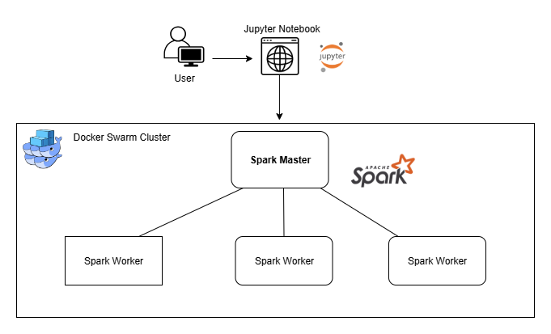

# Relatório Final do Projeto: *Processamento de Dados Musicais do Spotify com PySpark*
## 1. Contexto e motivação

Nos últimos anos, com o crescimento de plataformas de streaming como o Spotify, uma enorme quantidade de dados musicais passou a ser gerada, incluindo letras, metadados, métricas de áudio e classificações emocionais. Esse volume de dados abre oportunidades para análises em larga escala sobre padrões linguísticos, sentimentos e relações entre linguagem e música.

O objetivo principal deste projeto é analisar e processar letras de músicas em escala utilizando ferramentas de Big Data, em particular Apache Spark, com foco em:

- Identificar as palavras mais associadas a diferentes emoções musicais

- Avaliar a distribuição e frequência dessas palavras em um corpus massivo

- Otimizar o processamento através de formato Parquet e execução distribuída

O projeto utiliza um dataset real com aproximadamente 500 mil músicas (extraído do Spotify), com atributos como gênero, artista, letra e emoção associada, o que seria inviável de processar eficientemente com ferramentas tradicionais.

Além disso, o trabalho propõe uma infraestrutura distribuída replicável via Docker Swarm, simulando um cluster Spark com múltiplos nós, de forma prática e portátil, permitindo testar desempenho, escalabilidade e custo computacional em diferentes configurações.

## 2. Dados 🎧

Este projeto utiliza o dataset “500K+ Spotify Songs with Lyrics,Emotions & More”, disponível publicamente no Kaggle:

🔗 Fonte oficial: https://www.kaggle.com/datasets/devdope/900k-spotify

### 2.1 **O que o dataset contém**:
- Aproximadamente 500 mil registros de músicas
- Cada linha representa uma música e seus dados
- Tamanho aproximado: 1,3 GB
- Está disponível nos formatos .csv e .json
- São 39 colunas com atributos como:
    - Nome da música, artista, álbum, gênero, data de lançamento
    - Letra completa da música
    - Emoção da música (campo emotion) associada à letra
    - Características Técnicas e popularidade da música
    - Indicadores de Atmosfera Musical (energia, positividade, dança, acústica, instrumentalidade etc.)
    - Usos Sugeridos para a Faixa (Good for Party, Good for Work, etc)
    - Indicações por Similaridade Sonora

### 2.2 Como obter os dados


## 3. Como rodar o projeto

1. Clone o repositório do projeto
2. Acesse a branch do grupo e a a pasta do projeto do grupo
```bash
git checkout finalproject-20251-G5

cd finalproject/20251/g5
```
3. Execute o script de configuração inicial e ative as configurações no terminal
```bash
./bin/pdmtf setup
source ~/.bashrc
pdmtf
```
### ⚙️ **Inicialização do ambiente com Docker Swarm**

1. Acesse a pasta `src` do projeto para rodar os comandos `pdmtf`
```bash
cd src
```
2. Inicie os serviços Spark com Jupyter usando Docker Swarm, esse comando sobe os serviços: Jupyter Notebook, Spark Master e Spark Worker
```bash
pdmtf init
```
3. Execute um `docker ps` para verificar se o containers estão ativos e acesse a interface web em `http://localhost:8888/lab?token=spark123`

4. Execute `pdmtf help` para visualizar outros comandos disponíveis como `pdmtf stop` (Parar o cluster Spark) ou `pdmtf scale 3` (Alterar o número de workers)


## 4. Arquitetura do projeto

O projeto utiliza contêineres orquestrados com Docker Swarm para processar dados com Apache Spark e interagir via Jupyter Notebook. Seus principais componentes são:

- **Usuário (navegador web):** Acessa a interface do Jupyter Notebook em `http://localhost:8888` para escrever e executar scripts PySpark. O navegador não integra o cluster, mas é o ponto de entrada para o usuário.

- **Jupyter Notebook (Spark Driver):** Executado em um contêiner, fornece a interface web e atua como Spark Driver. Inicia a SparkSession e envia os jobs para o cluster via `spark://spark-master:7077`. Compartilha o volume /spark-data com os demais serviços.

- **Spark Master:** Coordena o cluster, recebendo jobs do Driver e distribuindo-os entre os Workers. Roda em contêiner próprio e expõe sua interface de monitoramento em `http://localhost:8080`.

- **Spark Workers:** Executam as tarefas de forma distribuída. Conectam-se automaticamente ao Master e acessam o volume /spark-data para leitura e escrita. São contêineres escaláveis no Docker Swarm.

- **Volume /spark-data:** Pasta compartilhada entre todos os contêineres, usada para armazenar dados de entrada (.csv) e saída (.parquet). Elimina a necessidade de transferência via rede.

- **Rede spark-net:** Interliga todos os contêineres, permitindo comunicação entre os serviços.

<p align="center">
  
</p>

- Fluxo de Dados:

  ```
  [CSV] → [Transformação Parquet] → [Limpeza] → [Processamento] → [Resultados]
  ```


## 5. Workloads evaluated

#### [WORKLOAD-1] Agrupamento de letras de músicas por emoção

**Objetivo:** Mostrar quais palavras são mais frequentes nas letras das músicas em cada emoção.

**Etapas:**
- Leitura do dataset no formato Parquet.
- Remoção de pontuação e símbolos usando `regex_replace`.
- Remoção de StopWords (palavras sem sentido semântico).
- Tokenização por espaços.
- Conversão para minúsculas.
- Explosão das palavras em linhas individuais usando `explode`.
- Ranqueamento de palavras mais recorrentes por emoção.

---

#### [WORKLOAD-2] Cálculo da Similaridade de Jaccard

**Objetivo:** Comparar todos os pares possíveis de artistas dentro do mesmo gênero utilizando a métrica de Jaccard com base no vocabulário textual.

**Etapas:**
- Realização de um self-join (cruzamento) entre os artistas por gênero.
- Cálculo de interseção (`array_intersect`) e união (`array_union`) de vocabulários.
- Cálculo da similaridade de Jaccard: `interseção / união`.
- Ranqueamento dos pares mais similares por gênero.

---

#### [WORKLOAD-3] Similaridade Léxica entre Gêneros Musicais (Sem Numpy)

**Objetivo:** Encontrar o número de palavras em comum entre os principais gêneros musicais, medindo similaridade léxica sem o uso de bibliotecas externas como NumPy.

**Etapas**:

- Leitura do dataset `musicas_limpas.parquet`.
- Seleção dos 10 gêneros musicais com mais músicas no dataset.
- Explosão das palavras com `explode` e `split`.
- Agrupamento por `main_genre` usando `collect_set("palavra")` para obter vocabulário único por gênero.
- Self-join do vocabulário de gêneros usando `crossJoin`, comparando pares distintos (`g1 < g2`).
- Cálculo do número de palavras em comum por par de gêneros usando `array_intersect` + `size`.
- Ordenação decrescente pelo número de palavras em comum.

---

- Specify each big data task evaluated in your project (queries, data pre-processing, sub-routines, etc.).
- Be specific: describe the details of each workload, and give each a clear name. These named workloads will be referenced and evaluated via performance experiments in the next section.
  - Example: [WORKLOAD-1] Query that computes the average occupation within each
    time window (include query below). [WORKLOAD-2] Preprocessing, including
  removing duplicates, standardization, etc.

---

## 6. Experiments and results

### 6.1 Experimental environment

- As execuções foram realizadas em ambiente Docker com Spark.
- Os experimentos foram realizados em uma máquina:
> Windows 11
> Ubuntu 22.04 (containers)
> Docker Version 28.3.0
> Spark Version 3.4.1
> Modo Cluster
> 1 Spark Master + N workers (varíavel)
> CPU 3.70 Ghz base (até 4.6 Ghz)
> 16 GB de RAM DDR4 3200 MHz

### 6.2 What did you test?

Foram avaliadas as seguintes variações de configuração:

| Parâmetro                 | Valores Testados              |
|--------------------------|-------------------------------|
| Workers                  | 1, 2, 6                        |
| Núcleos por Worker       | 1, 2, 6                        |
| Métricas observadas      | Tempo total (s), uso de memória, distribuição de tarefas, uso de CPU |
| Repetições               | 3 execuções por configuração   |

### 6.3 Results
#### Tabela Comparativa por Configuração


## 7. Discussion and conclusions

- Summarize what worked and what did not.
- Discuss any challenges or limitations of this work.

## 8. References and external resources

- List all external resources, datasets, libraries, and tools you used (with links).