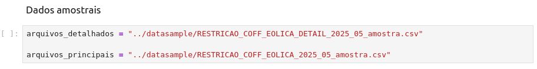
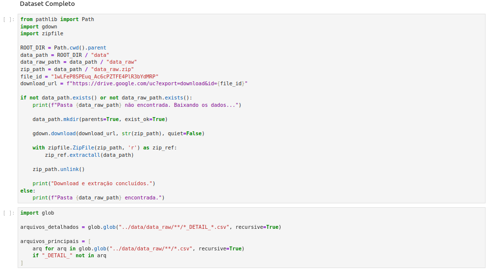
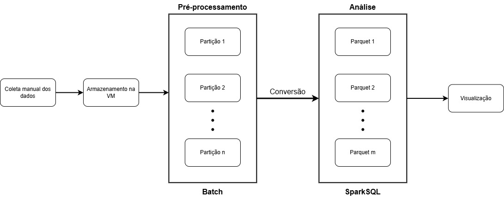

# Relatório Final do Projeto: Análise de Constrained-Off Eólico

## 1. Contexto e motivação

### 📋 Descrição

Este projeto implementa uma solução completa de big-data para análise de constrained-off (restrições de geração) em usinas eólicas brasileiras, utilizando dados consolidados do ONS (Operador Nacional do Sistema Elétrico).

### 🎯 Objetivos

1. **Processamento** dos dados consolidados via lotes.
2. **Agregações temporais e espaciais** com conversão para formato Parquet.
3. **Detecção de padrões e anomalias** nos eventos de constrained-off.
4. **Visualização interativa** das análises.
5. **Avaliação da arquitetura** proposta.

## 2. Data

### 2.1 Descrição detalhada

O dataset utilizado consiste em dois tipos complementares: **principal** e **detalhamento**.

<ins>Observação</ins>: As informações são associadas à apuração das restrições de operação por constrained-off nas usinas eólicas classificadas nas modalidades Tipo I, Tipo II-B e Tipo II-C.

Os dados são abertos e disponibilizados pela ONS, o qual pode ser acessível pelo link: https://dados.ons.org.br/.

Abaixo está representado uma descrição breve, e após, o cabeçalho de cada estrutura.

### 📊 Dados de Entrada (Consolidados)
- **Arquivo Principal**: `restricoes_coff_eolicas_consolidado.csv`
  - <ins>Definição</ins>: representa a geração, disponibilidade e restrições por usina.
  - Apresenta os dados consolidados de todos os meses com uma granularidade de 30 minutos.

- **Arquivo de Detalhamento**: `restricoes_coff_eolicas_detalhamento_consolidado.csv`
  - <ins>Definição</ins>: representa os dados de vento, geração estimada vs verificada.
  - As informações são por unidade geradora.

Os arquivos originais são históricos mensais, tal que há ~1.000.000 registros por arquivo, resultando em ~8GB de dados (considerando 42 meses de dados).

### 🧩 Cabeçalho

- Presente em ambas estruturas:
  - **id_subsistema**: Identificador do Subsistema.
  - **id_estado**: Sigla do Estado.
  - **nom_usina**: Nome da Usina ou Conjunto de Usinas.
  - **id_ons**: Identificador da Usina ou do Conjunto de Usina no ONS.
  - **ceg**: Código Único do Empreendimento de Geração (CEG), estabelecido pela ANEEL.
  - **din_instante**: Data/Hora.

- Presente somente na estrutura **principal**:
  - **nom_subsistema**: Nome do Subsistema.
  - **nom_estado**: Nome do Estado.
  - **val_geracao**: Valor da Geração, em MWmed.
  - **val_geracaolimitada**: Valor da Geração Limitada por alguma Restrição, em MWmed.
  - **val_disponibilidade**: Valor da Disponibilidade Verificada no Tempo Real, em MWmed.
  - **val_geracaoreferencia**: Valor da Geração de referência (ou estimada), em MWmed.
  - **val_geracaoreferenciafinal**: Valor da Geração de Referência Final, em MWmed.
  - **cod_razaorestricao**: Código da Razão da Restrição, podendo ser:
    - **REL** – Razão de indisponibilidade externa (elétrica).
    - **CNF** – Razão de atendimento a requisitos de confiabilidade.
    - **ENE** – Razão energética.
    - **PAR** - Restrição indicada no parecer de acesso.
  - **cod_origemrestricao**: Código da Origem da Restrição, podendo ser:
    - **LOC** – Local.
    - **SIS** – Sistêmica.

- Presente somente na estrutura **detalhamento**:
  - **nom_modalidadeoperacao**: Modalidade de Operação da Usina.
  - **nom_conjuntousina**: Nome do Conjunto de Usina (apenas para usinas com modalidade de operação Tipo II-C)
  - **val_ventoverificado**: Vento verificado, em m<sup>3</sup>/s.
  - **flg_dadoventoinvalido**: Indicativo do dado de vento inválido (quando flag = 1).
  - **val_geracaoestimada**: Valor da geração estimada da usina, em MWmed.
  - **val_geracaoverificada**: Geração verificada da usina, em MWmed.

### 🗓️ Período de Análise
  - **Início**: Outubro/2021
  - **Fim**: Abril/2025
  - **Total**: 42 meses de dados.
  - **Volume**: Dados consolidados de constrained-off eólico.

### 2.3 Como obter os dados

Uma amostra (dois arquivos complementares, totalizando um pouco mais de 512KB) está incluída no diretório `datasample/` para a execução de testes rápidos e demonstração do projeto funcionando.

Para o dataset completo, mais informações serão apresentadas posteriormente, mas basicamente pode-se obtê-lo via execução de células dos notebooks Jupyter do projeto, previamente já configuradas com o link público via Google Drive.

## 3. Como instalar e executar

> Observação: O projeto é compatível com Docker e não requer ferramentas ou instalações adicionais além do necessário.

Para uso da amostra ou do dataset completo, a inicialização é a mesma.

Para executar o projeto, clone este repositório e acesse a pasta `/g7` via terminal a fim de utilizar:

```bash
./bin/run.sh
```

Este comando irá automaticamente criar a imagem do container `jupytercli-g7`, além de realizar o deploy, via swarm, do `spark-master-g7` e do(s) `spark-worker-g7`.

Ao final da inicialização, é disponibilizado três links:
- JupyterLab:    http://localhost:8888 + (token)
- Spark Master:  http://localhost:8080
- Spark UI:      http://localhost:4040

Fica a critério do usuário acessar as referências do Spark Master e UI, porém é essencial acessar a referência do JupyterLab para a execução do projeto.

É de extrema importância que, após o usuário executar o projeto e realizar suas análises, seja efetuado o seguinte comando:

```bash
./bin/run.sh clean
```

Isso remove todos os containers, volumes, redes e o Jupyter (imagem é mantida) do projeto.

Caso seja de curiosidade do usuário, recomenda-se observar os outros comandos disponíveis pelo código:

```bash
./bin/run.sh help
```

Para o restante da execução, o usuário **DEVE** clicar na referência do JupyterLab disponível via terminal, depois acessar o notebok `src/Pre-Process.ipynb`.

### 3.1 Início rápido (usando dados de amostra)

No notebook `src/Pre-Process.ipynb`, basta seguir as instruções e executar as células `Passo 2 - Dados amostrais`.



### 3.2 Como executar com o dataset inteiro

No notebook `src/Pre-Process.ipynb`, basta seguir as instruções e executar as células `Passo 2 - Dataset Completo`.



### 3.3 (Opcional) Execução na VM

Durante a disciplina foi disponibilizado máquina virtuais para os grupos trabalharem seus projetos dentro delas. Portanto, para acessar a VM destinada a este grupo, pode-se executar o comando:

```bash
./bin/deploy-to-vm.sh
```

As credenciais serão solicitadas, e automaticamente o usuário será direcionado ao terminal da VM, onde já terá disponível os arquivos necessários para a execução do projeto conforme os passos deste tópico.

## 4. Arquitetura do projeto

O projeto utiliza uma arquitetura baseada no pré-processamento utilizando Apache Spark, convertendo os resultados para a extensão Parquet, a fim de se realizar as análises de constrained-off via SparkSQL.



```
Consolidated CSV Files → Parquet Processing → Temporal/Spatial Aggregations → Anomaly Detection → Visualization
```

### Componentes Principais

A. **Pré-Processamento** (`Pre-Process.ipynb`)
   - Carregamento de dados consolidados.
   - Limpeza e normalização.
   - Conversão para Parquet.

B. **Comparação de Desempenho** (`Performance-Benchmark.ipynb`)
  - Compara o tempo de execução entre CSV e Parquet.
  - Analisa o uso de memória e throughput.
  - Executa as queries de detecção de anomalias em ambos os formatos.
  - Gera os relatórios de performance detalhados com recomendações.

### Fluxo de dados

1. **Ingestão**: Carregamento dos dados das usinas (A).
2. **Pré-processamento**: Limpeza e normalização (A).
3. **Análise**: Detecção de padrões constrained-off (B).
4. **Comparação**: Métricas de performance entre CSV e Parquet e derivados (B).
5. **Saída**: Relatórios de constrained-off e de performance (B).


## 5. Workloads Avaliados

### [WORKLOAD-1] CARREGAMENTO_DADOS
**Descrição**: Carregamento e transformações básicas de dados eólicos
- **Operações CSV**: 
  - Leitura de arquivos CSV com delimitador ";"
  - Inferência de schema
  - Aplicação de transformações: cálculo de constrained-off, percentual de constrained-off, extração de ano/mês/hora
- **Operações Parquet**:
  - Leitura direta de arquivo Parquet
  - Verificação e aplicação condicional de transformações
  - Mesmo conjunto de cálculos derivados

**Métrica Principal**: Contagem total de registros processados (9.503.712 registros)

### [WORKLOAD-2] QUERIES_ANOMALIA
**Descrição**: Execução de queries complexas para detecção de anomalias em dados eólicos
- **Query 1 - Constrained-off Extremo**:
  ```sql
  SELECT nom_usina, nom_estado, ano, mes,
         AVG(percentual_constrained) as percentual_medio,
         MAX(percentual_constrained) as percentual_max,
         COUNT(*) as registros
  FROM wind_data
  WHERE percentual_constrained > 50
  GROUP BY nom_usina, nom_estado, ano, mes
  HAVING AVG(percentual_constrained) > 70
  ORDER BY percentual_medio DESC
  ```

- **Query 2 - Padrões Temporais**:
  ```sql
  SELECT nom_usina, nom_estado, hora,
         AVG(percentual_constrained) as percentual_medio_hora,
         COUNT(*) as registros_hora
  FROM wind_data
  GROUP BY nom_usina, nom_estado, hora
  HAVING AVG(percentual_constrained) > 30
  ORDER BY percentual_medio_hora DESC
  ```

- **Query 3 - Clusters Espaciais**:
  ```sql
  WITH state_anomalies AS (
      SELECT nom_estado, ano, mes,
             AVG(percentual_constrained) as percentual_estado,
             COUNT(DISTINCT nom_usina) as num_usinas_afetadas
      FROM wind_data
      WHERE percentual_constrained > 30
      GROUP BY nom_estado, ano, mes
  )
  SELECT nom_estado, ano, mes, percentual_estado, num_usinas_afetadas,
         CASE 
             WHEN percentual_estado > 50 AND num_usinas_afetadas > 3 THEN 'CLUSTER_CRITICO'
             WHEN percentual_estado > 30 AND num_usinas_afetadas > 2 THEN 'CLUSTER_MODERADO'
             ELSE 'ISOLADO'
         END as tipo_cluster
  FROM state_anomalies
  WHERE percentual_estado > 30
  ORDER BY percentual_estado DESC, num_usinas_afetadas DESC
  ```

**Métrica Principal**: Total de registros retornados pelas queries (9.604 registros)

## 6. Experimentos e Resultados

### 6.1 Ambiente Experimental

**Configuração do Cluster Spark**:
- **Master Node**: spark-master-g7:7077
- **Configurações testadas**:
  - 1 Worker: 2 cores, 2GB RAM, paralelismo 2
  - 2 Workers: 4 cores, 4GB RAM, paralelismo 4  
  - 3 Workers: 6 cores, 6GB RAM, paralelismo 6
- **Configurações Spark**:
  - Serializer: KryoSerializer
  - Adaptive Query Execution: habilitado
  - Parquet: compressão Snappy, leitor vetorizado
  - CSV: column pruning habilitado

### 6.2 Parâmetros Testados

**Variáveis Independentes**:
- Formato de dados: CSV vs Parquet
- Número de workers: 1, 2, 3
- Paralelismo: 2, 4, 6 partições
- Tipo de workload: carregamento vs queries complexas

**Métricas Coletadas**:
- **Tempo de execução** (segundos)
- **Throughput** (registros/segundo)
- **Uso de memória** (GB)
- **Registros processados** (contagem)

**Metodologia**: Cada configuração foi executada 2 vezes, calculando-se média e desvio padrão.

### 6.3 Resultados

#### Resumo Geral de Performance

| Workload | Formato | Tempo Médio (s) | Throughput (reg/s) | Memória (GB) |
|----------|---------|-----------------|-------------------|--------------|
| CARREGAMENTO_DADOS | CSV | 52.32 ± 5.95 | 183,639 | 1.13 ± 0.58 |
| CARREGAMENTO_DADOS | Parquet | 10.06 ± 3.22 | 1,051,694 | 0.68 ± 0.30 |
| QUERIES_ANOMALIA | CSV | 112.87 ± 16.51 | 86.59 | 1.61 ± 0.74 |
| QUERIES_ANOMALIA | Parquet | 25.07 ± 5.74 | 402.09 | 1.61 ± 0.79 |

#### Análise de Speedup

| Workload | Speedup Factor | Melhoria Temporal (%) | Melhoria Throughput (%) |
|----------|----------------|----------------------|-------------------------|
| CARREGAMENTO_DADOS | **5.2x** | 80.8% | 472.7% |
| QUERIES_ANOMALIA | **4.5x** | 77.8% | 364.4% |
| **Média Geral** | **4.8x** | **79.3%** | **418.5%** |

#### Performance por Configuração de Cluster

**Carregamento de Dados**:
- 1 Worker: CSV 57.9s → Parquet 6.5s (8.9x speedup)
- 2 Workers: CSV 45.9s → Parquet 10.3s (4.5x speedup)
- 3 Workers: CSV 53.2s → Parquet 13.3s (4.0x speedup)

**Queries de Anomalia**:
- 1 Worker: CSV 131.9s → Parquet 18.3s (7.2x speedup)
- 2 Workers: CSV 109.5s → Parquet 26.0s (4.2x speedup)
- 3 Workers: CSV 97.2s → Parquet 30.9s (3.1x speedup)

#### Análise de Escalabilidade

**Eficiência Paralela**:
- **CSV**: Mantém 100% de eficiência em configurações de 2-4 cores
- **Parquet**: Mantém 100% de eficiência em configurações de 2-4 cores
- **Observação**: Degradação de performance com 3 workers devido a overhead de coordenação

#### Uso de Memória

- **Parquet**: 40% menos uso de memória no carregamento (0.68GB vs 1.13GB)
- **Queries**: Uso similar de memória entre formatos (~1.6GB)
- **Variabilidade**: Parquet apresenta menor variabilidade no uso de memória

## 7. Discussão e Conclusões

### 7.1 Principais Descobertas

**1. Superioridade Consistente do Parquet**:
- Parquet demonstrou performance consistentemente superior com speedup médio de 4.8x
- Melhoria mais significativa em carregamento de dados (5.2x) vs queries complexas (4.5x)
- Throughput 4-5x maior em todas as configurações testadas

**2. Eficiência de Armazenamento e I/O**:
- Parquet reduziu significativamente o tempo de I/O devido à compressão e organização colunar
- Menor uso de memória (40% redução) durante carregamento
- Leitor vetorizado do Parquet otimiza operações em lote

**3. Comportamento de Escalabilidade**:
- Configuração ótima: 1-2 workers para este dataset
- Overhead de coordenação com 3+ workers reduz eficiência
- Parquet mantém vantagem em todas as configurações de paralelismo

### 7.2 Análise dos Workloads

**Carregamento de Dados**:
- Maior benefício do Parquet (5.2x speedup)
- Schema pré-definido elimina overhead de inferência
- Compressão Snappy reduz volume de dados lidos

**Queries de Anomalia**:
- Speedup moderado mas consistente (4.5x)
- Organização colunar beneficia agregações e filtros
- Pushdown de predicados mais eficiente

### 7.3 Limitações e Desafios

**Limitações Identificadas**:
1. **Overhead de Coordenação**: Performance degrada com mais de 2 workers
2. **Variabilidade**: Maior variabilidade nos tempos do Parquet (desvio padrão 3.2s vs 5.9s)
3. **Preparação de Dados**: Transformações condicionais adicionam complexidade

**Desafios Técnicos**:
1. **Configuração de Cluster**: Balanceamento entre paralelismo e overhead
2. **Gerenciamento de Memória**: Necessidade de limpeza entre execuções
3. **Consistência de Resultados**: Variabilidade nos tempos de execução

### 7.4 Recomendações

**Para Workloads Similares**:
1. **Use Parquet** para datasets de produção com +5M registros
2. **Configure 1-2 workers** para datasets de tamanho médio
3. **Implemente cache** para queries repetitivas
4. **Monitore uso de memória** em clusters compartilhados

**Para Otimização Futura**:
1. **Particionamento**: Particionar Parquet por ano/mês para queries temporais
2. **Compressão**: Testar diferentes algoritmos (LZ4, GZIP)
3. **Bucketing**: Implementar bucketing para joins frequentes
4. **Caching**: Usar cache de dados para queries iterativas

### 7.5 Conclusão Final

O benchmark demonstra que **Parquet é significativamente superior ao CSV** para workloads de big data com Apache Spark, oferecendo:

- **4.8x speedup médio** em performance
- **40% redução** no uso de memória
- **Maior throughput** (418% de melhoria)
- **Melhor escalabilidade** em configurações distribuídas

Para o contexto específico de análise de dados eólicos, **recomenda-se fortemente a migração para Parquet** como formato de armazenamento padrão, especialmente para workloads que envolvem carregamento frequente de dados e queries analíticas complexas.

A diferença de performance justifica o investimento em conversão de dados e ajustes de pipeline, resultando em economia significativa de recursos computacionais e tempo de processamento.

## 8. Referências e recursos externos

- Apache Spark: https://spark.apache.org/
- Documentação PySpark: https://spark.apache.org/docs/latest/api/python/
- Docker: https://www.docker.com/
- Google Drive

- List all external resources, datasets, libraries, and tools you used (with links).
