# Final project report: GPU Starvation & The Small File Problem — otimizando a ingestão de dados para aceleradores com PySpark ETL + Parquet

> **Grupo G15** · PDM / Big Data (UFLA) · 2026-1
> Gabriel Barros Ferreira · Davi G. Miranda · Lucas Expedito

---

## 1. Context and motivation

Um pipeline de Machine Learning para visão computacional é, na prática, um sistema **produtor–consumidor**:

- **Produtor** = CPU + disco: lê o arquivo, **decodifica** (JPEG → pixels), redimensiona, normaliza e entrega o tensor pronto.
- **Consumidor** = GPU: executa o forward/backward do modelo.

Quando o produtor não acompanha o consumidor, a GPU termina cada lote e **fica ociosa esperando o próximo** — o fenômeno de **GPU Starvation** (inanição da GPU). Como a GPU é o recurso caro (US$ 1–4/h na nuvem, ou custo de oportunidade de ficar parada), mantê-la faminta é desperdício direto de dinheiro.

Esse gargalo se agrava com o **Small File Problem**, um anti-padrão clássico de Big Data: ler **milhares de arquivos `.jpg` pequenos e independentes**, cada um exigindo abertura, descompressão (decode JPEG) e resize em tempo real — um custo de CPU que não escala.

**Objetivo do projeto:** provar, com **evidência estatística** (3 rodadas, média ± desvio padrão), que o Small File Problem estrangula a ingestão de dados num pipeline de ML e causa GPU Starvation, e que **converter as imagens para blocos colunares `.parquet` via um ETL Apache Spark** elimina esse gargalo, aumentando o **throughput de ingestão (imagens/segundo)**.

**Tese central:** *a forma como os dados são armazenados pode importar tanto quanto o poder de cálculo bruto.* Trocamos disco barato (formato pré-processado) por eficiência de compute (CPU liberada, GPU alimentada).

> **A jornada científica (honestidade metodológica).** A hipótese literal inicial era "small file → gargalo de **disco**". Testes de teto controlados a **falsificaram**: a leitura pura do SSD entrega **34.615 img/s** com só 24% de CPU — o disco tem ~30× de folga. O gargalo real é o **decode JPEG na CPU**. Isso redirecionou o experimento para o gargalo verdadeiro (CPU-bound), em vez de forçar uma narrativa falsa. Dois pivots reforçaram o rigor: (1) corrigir a métrica de CPU dentro do Docker — `psutil` enxergava os 12 threads do host e escondia a saturação dos 2 vCPUs; passamos a ler a cota via cgroup (`/sys/fs/cgroup/cpu.max`); (2) migrar de **treino** (ResNet50, cujo backward mascarava o gargalo) para **inferência em batch** (MobileNetV2, forward-only), que é o cenário de produção onde o Small File Problem realmente dói.

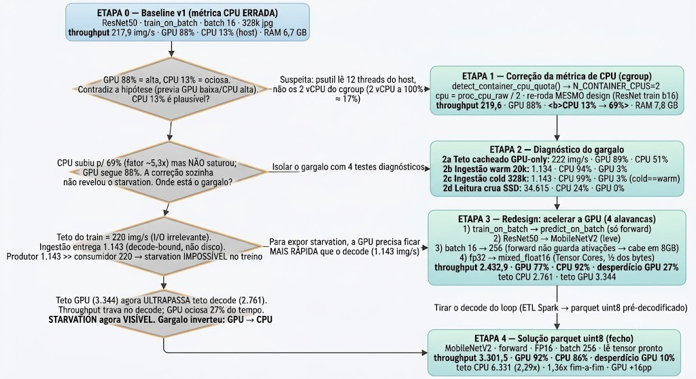

<sub>*Figura — Cronologia das decisões experimentais, com os números reais que dispararam cada mudança (baseline v1 → correção da métrica de CPU → diagnóstico do gargalo → redesign para inferência → solução Parquet).*</sub>

---

## 2. Data

### 2.1 Detailed description

- **Fonte:** [Dogs vs. Cats (Kaggle)](https://www.kaggle.com/c/dogs-vs-cats/data). Download manual (Kaggle exige login).
- **Conteúdo bruto:** 25.000 imagens `.jpg` coloridas (RGB), dimensões variadas, ~0,53 GB. O **rótulo está no nome do arquivo** (`cat.*.jpg` → 0, `dog.*.jpg` → 1) — classificação binária.
- **Inflação reprodutível:** as imagens são **duplicadas de forma controlada** (sufixo `__dupN`, preservando o rótulo cat/dog) até **70.433 imagens / ~1,5 GB**. Isso ultrapassa o piso da disciplina sem custo de download e estressa o I/O de forma realista.
- **Transformação (ETL):** durante a conversão, cada imagem é decodificada, redimensionada para o tensor `(224, 224, 3)` e serializada estritamente como **`uint8`** (0–255, 150.528 bytes por imagem). O `.parquet` resultante ocupa **~9,4 GB em ~35 blocos** — o dado descomprimido explode ~6× e **não cabe confortavelmente em RAM**, forçando leitura de disco (característica de Big Data por Volume).

> **Por que `uint8` e não bytes JPEG nem `float16`?** Guardar bytes JPEG faria o Parquet re-decodificar na leitura → mesmo teto → empate. Guardar `float16` pré-normalizado dobraria o disco (~16,5 GB) e arredondaria o pixel. Guardar o **array já decodificado como `uint8`** ataca o gargalo real (o decode sai do caminho crítico), usa metade do disco e do barramento CPU→GPU, e é **sem perda** (o pixel que sai do decode já é `uint8`). A normalização (`x/127.5 − 1`) migra para a **GPU** no read.

### 2.2 How to obtain the data

- **Amostra (incluída no repo):** `datasample/sample_images/` — **40 imagens** (20 gatos + 20 cães), **~862 KB** (abaixo do limite de 1 MB do template). Serve para o *smoke test* que prova que o projeto **roda**.

  > ⚠ **Aviso:** com tão poucas imagens, o dataset cabe na RAM/cache e o Small File Problem **não aparece** — os números do smoke test são **inconclusivos de propósito**. Os resultados válidos do relatório vêm do dataset completo.

- **Dataset completo (não versionado):**

  ```bash
  # 1. Baixe o "train.zip" (login Kaggle necessario):
  #    https://www.kaggle.com/c/dogs-vs-cats/data
  # 2. Coloque em:  output/data/raw_jpg/train.zip
  # 3. Descompacte (dentro do container, so Docker necessario):
  ./bin/download_data.sh
  # A duplicacao ate ~1,5 GB e feita automaticamente pela etapa 01 do bin/run_full.sh.
  ```

---

## 3. How to install and run

> **Único requisito: Docker + Docker Compose com suporte a GPU NVIDIA** (nvidia-container-toolkit). Todo o código roda **exclusivamente dentro do container** — o host permanece intocado. Não é preciso instalar Python, Spark ou Java no host.

A imagem base é a **NVIDIA NGC `tensorflow:25.02-tf2-py3`** (TensorFlow otimizado com CUDA 12.8, necessário para a RTX 5060 / Blackwell `sm_120`, que o TF stock não suporta). O container é limitado a **2 vCPUs + 16 GB RAM** — o limite de 2 vCPUs é justamente o que **cria o gargalo** que estudamos.

### 3.1 Quick start (using sample data in `datasample/`)

Um único comando faz o build e roda o pipeline completo (baseline → ETL → otimizado) sobre a amostra:

```bash
./bin/run.sh
```

Resultados (CSVs + PNGs) aparecem em `./output/results/`.
(Lembre: com 40 imagens os números são inconclusivos — isto só prova que executa.)

### 3.2 How to run with the full dataset

Reproduz os resultados do relatório (preparo + duplicação até ~1,5 GB + 3 rodadas de cada benchmark):

```bash
# 1. Obtenha o dataset (ver secao 2.2):
./bin/download_data.sh
# 2. Rode o pipeline completo:
./bin/run_full.sh
# Ajustes opcionais:
TARGET_GB=8 N_ROUNDS=3 BATCH_SIZE=256 ./bin/run_full.sh
```

O **mesmo código** serve para o smoke test e para o dataset completo — só mudam as variáveis de ambiente (`RAW_DIR`, `PARQUET_DIR`, `N_ROUNDS`, `BATCH_SIZE`, `TARGET_GB`…) passadas pelos scripts em `bin/`.

**Modo interativo (inspecionar os notebooks originais em `src/notebooks/`):**

```bash
docker compose -f misc/docker-compose.yml up
# Abra o JupyterLab em http://localhost:8888  (Spark UI em :4040 durante o ETL)
# Os 4 notebooks estao montados em /tf/src/notebooks
```

---

## 4. Project architecture

Tudo roda em **um único container Docker** (reprodutibilidade total): duas vias de ingestão com um ETL no meio.

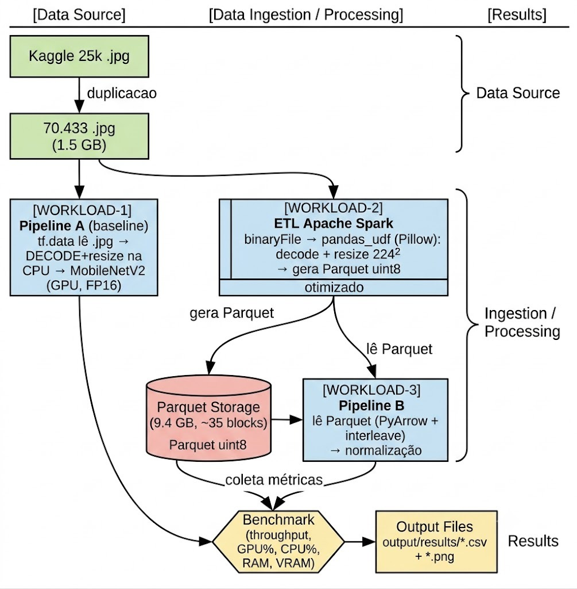

<sub>*Figura 2 — Arquitetura do pipeline. Diagrama equivalente em texto (ASCII) abaixo.*</sub>

```
[Data Source]                 [Data Ingestion / Processing]                    [Results]
Kaggle 25k .jpg
      |
   duplicacao          ┌───────────────────────────────────────────┐
      v                │                                             │
70.433 .jpg  ──────────┤──►  [WORKLOAD-1]  Pipeline A (baseline)     │
(1,5 GB)               │        tf.data le .jpg → DECODE+resize      │──►  benchmark
                       │        na CPU → MobileNetV2 (GPU, FP16)     │     (throughput,
                       │                                             │      GPU%, CPU%,
                       └──►  [WORKLOAD-2]  ETL Apache Spark          │      RAM, VRAM)
                                binaryFile → pandas_udf (Pillow):    │          |
                                decode + resize 224² → Parquet uint8 │          v
                                     │  (9,4 GB, ~35 blocos)         │    output/results/
                                     v                               │    *.csv + *.png
                                [WORKLOAD-3]  Pipeline B (otimizado) │
                                    le Parquet (PyArrow + interleave)│
                                    → normaliza NA GPU → MobileNetV2 ─┘
```

**Componentes e como interagem (todos no mesmo container):**

| Componente | Stack | Função |
|---|---|---|
| Preparo (`src/01_download.py`) | Python | Move labels do nome do arquivo + duplica até `TARGET_GB` |
| **Pipeline A** (`src/02_baseline_jpg.py`) | tf.data + MobileNetV2 | Ingestão de `.jpg` soltos (decode na CPU) + benchmark |
| **ETL** (`src/03_spark_etl.py`) | PySpark 3.5 (local[2]) + Pillow | `.jpg` → `.parquet` uint8 (offline, pago 1×) |
| **Pipeline B** (`src/04_optimized_parquet.py`) | tf.data + PyArrow + MobileNetV2 | Ingestão do `.parquet` (normaliza na GPU) + comparação |
| Módulo comum (`src/bench_common.py`) | psutil + pynvml | Config, monitor de recursos (cgroup-aware), modelo |
| Orquestrador (`src/run_all.py`) | Python | Roda 02 → 03 → 04 em **processos separados** (evita que o cache/estado do TF de uma etapa contamine a medição da outra) |

**Decisões de engenharia que moldam a arquitetura:**

- **Preprocess na GPU (Pipeline B):** o Parquet entrega `uint8`; o cast+escala `tf.cast(x, float16)/127.5 - 1` roda **na GPU**. A CPU (só 2 vCPUs) fica livre para o que só ela faz (ler o byte e transferir), e trafegamos 1 byte/canal em vez de 4.
- **`prefetch(AUTOTUNE)`:** sobrepõe produtor e consumidor — enquanto a GPU processa o lote N, a CPU prepara o N+1. É o que torna o gargalo "o mais lento dos dois".
- **`interleave(cycle_length=2)` (Pipeline B):** lê vários Parquet em paralelo; `cycle_length=2` casa com os 2 vCPUs. O PyArrow **libera o GIL** no I/O, então paraleliza de verdade.
- **PyArrow, não `tensorflow-io`:** o `tensorflow-io` puxaria o TF stock por cima do TF otimizado da NVIDIA → a RTX 5060 pararia de funcionar. Decisão forçada por hardware real.
- **ETL Spark `local[2]`** casando com os 2 vCPUs; **`repartition` ANTES do decode** (~35 blocos) espalha o trabalho pesado e define o número de arquivos de saída, embaralhando só os bytes JPEG leves (~1,7 GB), não os pixels (9,4 GB).
- **Pillow no `pandas_udf`, não TensorFlow:** o TF (~2 GB) não sobrevive ao fork dos workers Spark → segfault/OOM. Pillow é leve e forka limpo; imagem corrompida vira array de zeros (não derruba a task).

---

## 5. Workloads evaluated

Comparação **justa**: mesmo modelo (MobileNetV2, ImageNet, forward-only, FP16), mesmo batch (256), mesmo hardware, mesmo `N_IMAGES` (70.433), mesma estrutura de rodadas/tetos. **Só muda a fonte do dado e onde o pré-processamento roda.**

### [WORKLOAD-1] Pipeline A — Baseline (ingestão de `.jpg`)

`tf.data` lê os 70.433 arquivos `.jpg`, **decodifica e redimensiona 224×224 na CPU** (`num_parallel_calls=AUTOTUNE`), e alimenta o forward-only do MobileNetV2 (FP16) na GPU. Mede o throughput de ingestão e quantifica o starvation. Cold read garantido por `shuffle=True` + dataset > RAM.

### [WORKLOAD-2] ETL Apache Spark (`.jpg` → `.parquet`)

Pré-processa **offline, uma única vez**. Lê os JPEGs como binário (`binaryFile`), num `pandas_udf` (Arrow + Pillow) decodifica + redimensiona + serializa como `uint8`, e grava **Parquet particionado** (`repartition` antes do decode → ~35 blocos grandes). É o investimento único que elimina o Small File Problem.

### [WORKLOAD-3] Pipeline B — Otimizado (ingestão de `.parquet`)

`tf.data` lê o Parquet via **PyArrow com `interleave`** (arquivos em paralelo) + `prefetch`, **normaliza na GPU**, mesma inferência MobileNetV2. Mede o throughput após remover o decode do caminho crítico.

---

## 6. Experiments and results

> **Metodologia obrigatória atendida:** cada benchmark de ingestão roda **3 rodadas completas** e reporta **média ± desvio padrão amostral (ddof=1)** do throughput, conforme a regra acadêmica do projeto. Os **CSVs brutos** das 3 rodadas (dados por rodada, amostras de recursos ~1×/s e estatísticas agregadas) estão versionados em [`misc/results/`](misc/results/) como evidência reproduzível; os gráficos deste relatório (em `assets/`) são gerados a partir desses CSVs.

### 6.1 Experimental environment

| Componente | Especificação |
|---|---|
| SO (host) | Ubuntu (kernel 7.0), host intocado |
| CPU (host) | Ryzen 5 (NVMe SSD) |
| GPU | NVIDIA GeForce RTX 5060, 8 GB VRAM (Blackwell `sm_120`, CUDA 12.8, driver 580) |
| Container | Docker Compose, imagem NGC `tensorflow:25.02-tf2-py3` (TF 2.17) |
| **Limites do container** | **2 vCPUs** (força o gargalo) · 16 GB RAM · GPU via NVIDIA Container Toolkit |
| ETL | PySpark 3.5.0 sobre OpenJDK 17 · Pillow · Arrow habilitado |
| Ingestão | tf.data (map/interleave + AUTOTUNE + prefetch) · PyArrow · MobileNetV2 FP16 |

> **Por que 2 vCPUs?** O host é forte demais — com CPU sobrando, o decode acompanharia a GPU e **não haveria gargalo para estudar**. Limitar a 2 vCPUs cria artificialmente o gargalo de produtor, e **não é arbitrário**: reproduz um cenário real e comum (VMs de nuvem com 1 GPU e poucos cores; nós densos com muitas GPUs disputando CPU). Razão vCPU-por-GPU baixa é o cenário econômico normal quando a GPU é o recurso caro.

### 6.2 How to perform benchmarking

Métricas capturadas por uma thread `ResourceMonitor` amostrando ~1×/s durante a inferência:

1. **Throughput** (img/s) — métrica base para média e desvio.
2. **Tempo total** da rodada (s).
3. **Ocupação média da GPU** (%) via `pynvml`/`nvidia-ml-py`.
4. **Pico de RAM** (GB) e **CPU** (%) via `psutil` — **normalizados pela cota do cgroup do container** (senão a saturação dos 2 vCPUs fica invisível).
5. **Pico de VRAM** (GB) — com `set_memory_growth(True)` para o pynvml medir a VRAM real.

Robustez: **warmup fora do cronômetro** (traça o `@tf.function` e esquenta o pipeline, para a rodada 1 não inflar o desvio); orquestração em processos separados; 3 rodadas → média ± desvio.

### 6.3 What did you test?

- **Parâmetro variado:** a **fonte do dado e o local do pré-processamento** — `.jpg` com decode na CPU (Pipeline A) vs `.parquet` uint8 com normalização na GPU (Pipeline B). Todo o resto é mantido constante (comparação justa).
- **Métricas medidas:** throughput (img/s), tempo de rodada, utilização de GPU e CPU, pico de RAM/VRAM, e **tetos de produtor/consumidor** (teto de decode/leitura na CPU vs teto de forward na GPU) — a evidência direta do starvation.
- **Repetições:** 3 rodadas por pipeline, média ± desvio.

### 6.4 Results

#### Métrica principal — Throughput de ingestão (3 rodadas, 70.433 imagens, batch 256)

| Workload | Configuration | Avg Throughput (img/s) | Std Dev (img/s) | Runs |
|---|---|---|---|---|
| WORKLOAD-1 (Pipeline A) | `.jpg`, decode na CPU | 2.432,9 | ±275,1 | 3 |
| WORKLOAD-3 (Pipeline B) | `.parquet` uint8, GPU | **3.301,5** | **±58,9** | 3 |

**Discussão:** o Pipeline B é **+36% (1,36×) mais rápido E mais estável** — o desvio caiu de ±275 para ±59 img/s, porque o decode JPEG introduzia variância no baseline. Throughput por rodada (img/s): A = [2.123 · 2.649 · 2.527]; B = [3.250 · 3.366 · 3.289].

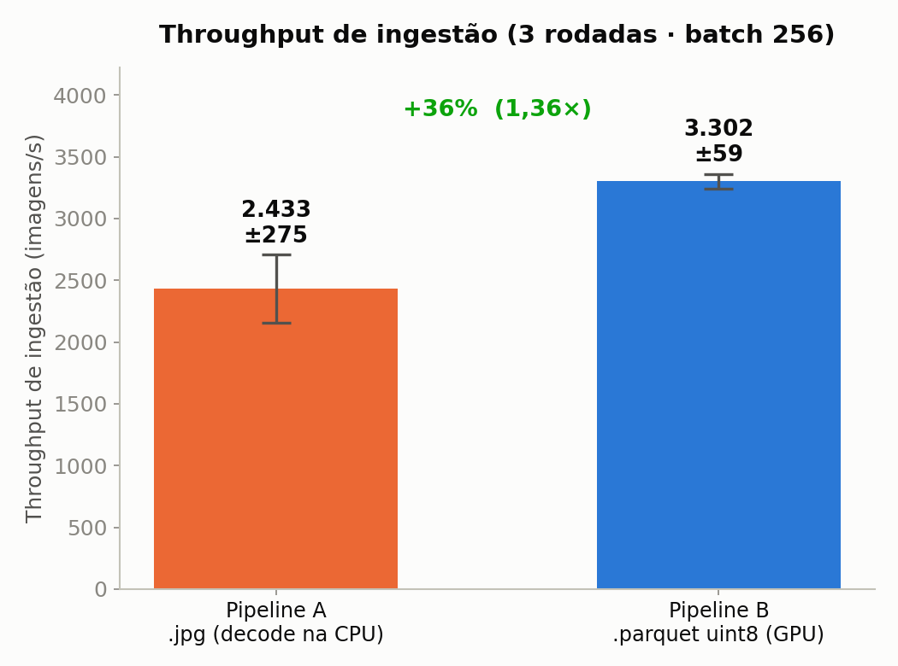
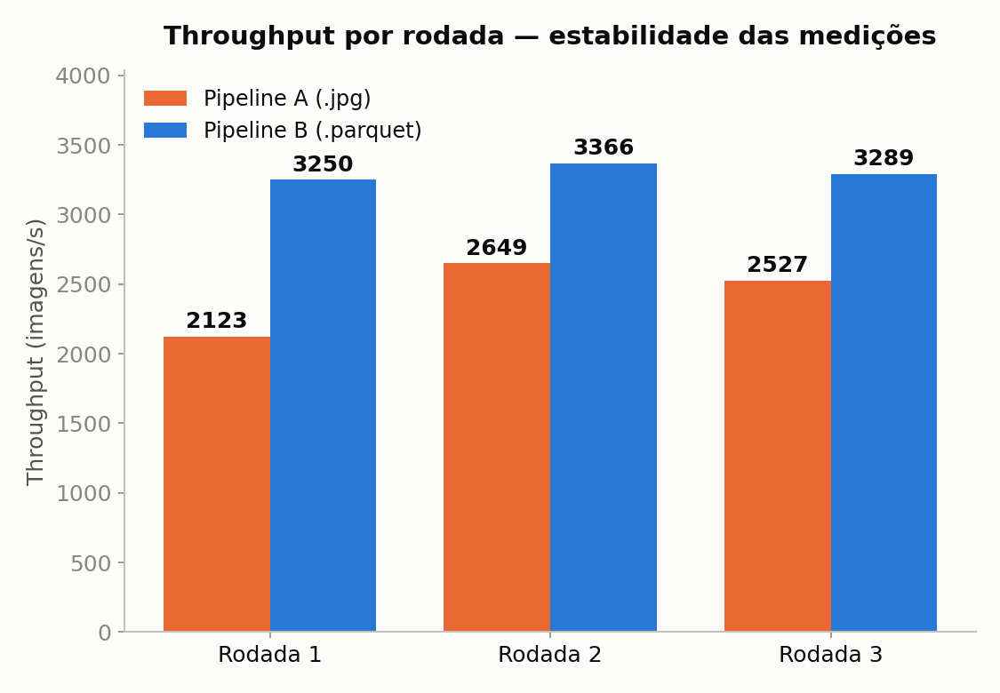

#### Tetos produtor/consumidor — onde está o gargalo (a prova do starvation)

| Cenário | Avg (img/s) | Std Dev (img/s) | Runs |
|---|---|---|---|
| A: teto CPU decode (**produtor**) | 2.760,7 | ±3,7 | 3 |
| A: teto GPU forward (**consumidor**) | 3.344,5 | ±7,6 | 3 |
| B: teto CPU leitura Parquet (**produtor**) | **6.330,8** | ±79,7 | 3 |
| B: teto GPU forward (**consumidor**) | 3.656,1 | ±9,4 | 3 |

**Discussão:** no baseline o **produtor (2.761) < consumidor (3.344)** → a GPU passa fome. Após o ETL, o produtor fica **2,29× mais rápido (6.331) e ultrapassa a GPU** → o gargalo **migra para a GPU** (o limite legítimo do sistema). É a prova de que o decode deixou de ser o gargalo.

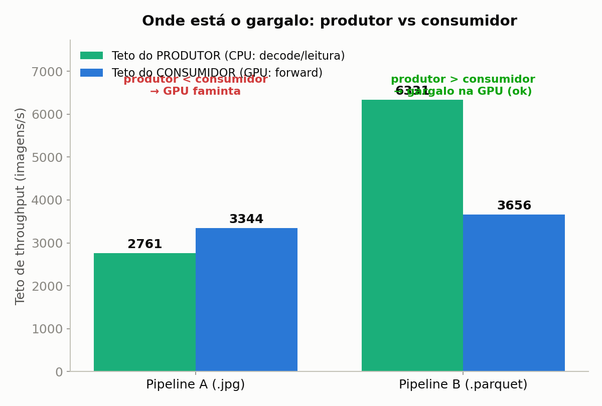

#### Utilização de recursos e starvation

| Configuration | Avg GPU util (%) | Avg CPU util (%) | GPU desperdiçada (starvation, %) | Peak RAM (GB) | Peak VRAM (GB) | Runs |
|---|---|---|---|---|---|---|
| jpg (A) | 76,6 | 92,2 | 27,3 | 4,0 | 4,01 | 3 |
| parquet (B) | **92,4** | 85,6 | **9,7** | 16,0 | 4,01 | 3 |

**Discussão:** a GPU sobe **77% → 92% (+16 pp)** e o starvation cai **27% → 10% (−18 pp)**. A CPU deixa de estar saturada em decode (92% → 86%): agora só lê bytes prontos. Os ~10% residuais são contenção dos 2 vCPUs entre leitura e dispatch (esperado). O baseline satura a CPU em 100% (máximos por rodada), confirmando o gargalo CPU-bound.

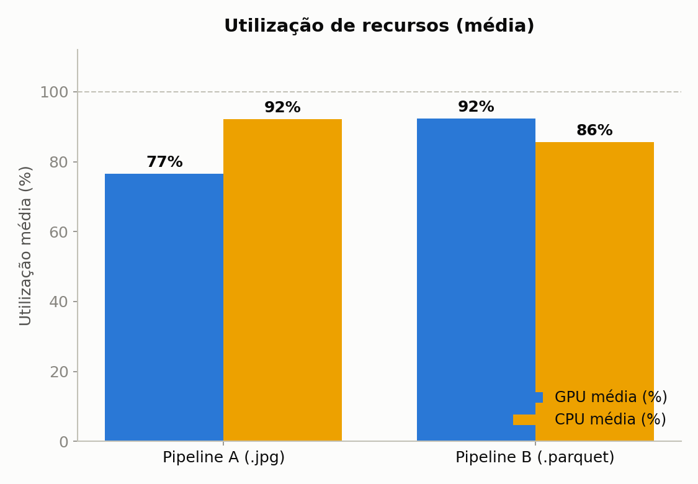
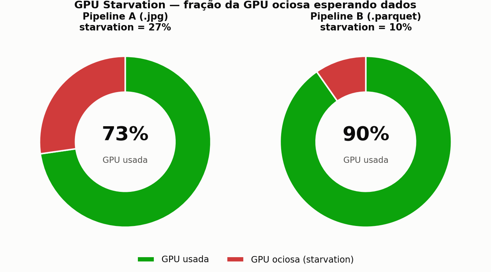

#### Custo e amortização do ETL (investimento único)

O ETL Spark levou **56 s** para gerar 9,4 GB / 35 Parquet / 70.433 registros. Comparando o tempo total para N passadas de 70k imagens:

```
jpg:      29·N s          (re-decodifica toda vez, sem ETL)
parquet:  56 + 21·N s     (paga o ETL 1x, depois le rapido)
break-even:  29·N = 56 + 21·N  →  N ≈ 7 passadas
```

**Discussão:** a partir de ~7 passadas o Parquet vence no tempo **total**, e cada passada seguinte economiza ~8 s. Treino real roda dezenas a centenas de épocas → o Parquet vence folgado; o único custo remanescente são GB de disco barato (5,5× o volume de entrada).

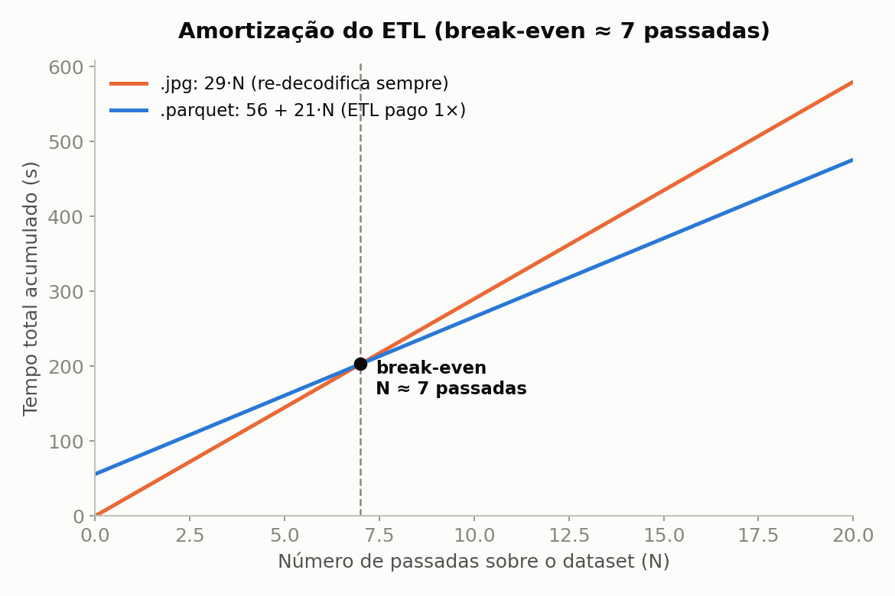
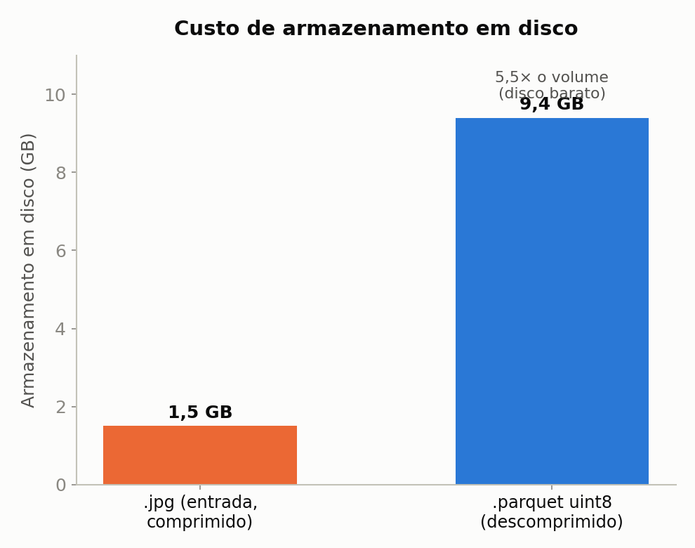

#### Resumo (KPIs) e dashboard

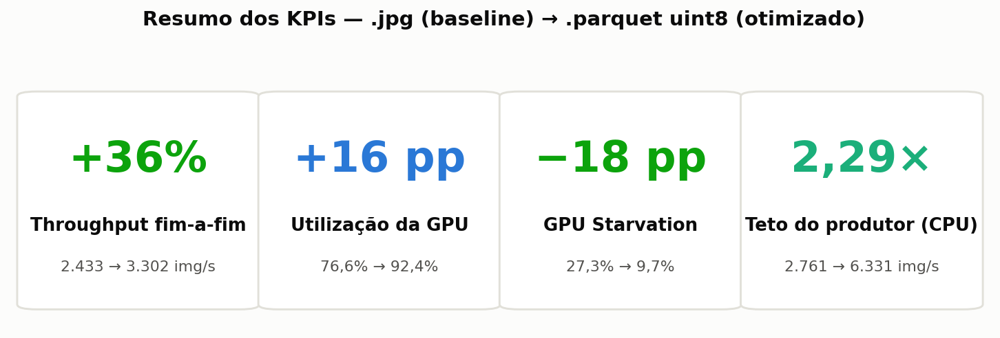
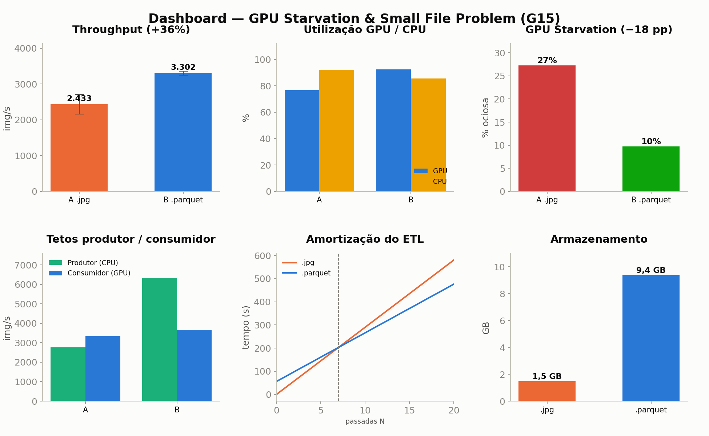

**Interpretação do número "Big Data":** a **capacidade de ingestão ficou 2,29× maior**. O ganho fim-a-fim é 1,36× (não 3×) **porque o gargalo mudou de lado**: agora é a GPU (3.656 img/s) que limita, não mais o decode. Esse é o comportamento esperado e correto.

---

## 7. Limitations and conclusions

### O que funcionou

Provamos experimentalmente, com estatística, que o Small File Problem estrangula a ingestão na CPU e causa GPU Starvation, e que um ETL Spark barato (pago 1×) que reempacota os dados em Parquet `uint8` **inverte o gargalo**: de um sistema CPU-bound e ocioso (77% GPU, 27% starvation) para um sistema GPU-bound e eficiente (92% GPU, 10% starvation), com **+36% de throughput e maior estabilidade** — sem trocar hardware nem modelo. A jornada (falsificar a hipótese de disco, corrigir a métrica de CPU, migrar treino → inferência) é parte do rigor do trabalho.

### Limitações (declaradas)

- **Nó único:** o Spark rodou em modo local (`local[2]`); não avaliamos scale-out multi-nó.
- **ETL medido 1×:** o tempo do ETL (~56 s) foi registrado em uma única execução; para rigor pleno deveria ser repetido ≥3× (as ingestões A e B já têm 3 rodadas).
- **RAM entre execuções:** o baseline foi registrado com 4 GB e o otimizado com 16 GB de pico. Como o gargalo do baseline é a **CPU de decode** (não a RAM), isso não muda a conclusão — mas o ideal é re-rodar o baseline com os mesmos limites.
- **Dataset inflado por duplicação:** aumenta volume/I-O de forma realista, mas não a diversidade estatística das imagens (irrelevante para a métrica de throughput, que é o objeto de estudo).
- **Escopo = inferência em batch:** medimos forward-only de propósito, para o custo do backward não esconder o efeito da ingestão. No treino real (dezenas de épocas) o ganho seria **ainda maior** pela amortização do ETL.
- **Quando o trade NÃO vale:** pouquíssimas passadas / inferência isolada (o ETL não amortiza); storage escasso/caro em escala de petabytes; ou CPU/GPU folgado (o ETL nem é necessário).

### Conclusão

**A forma como os dados são armazenados pode importar tanto quanto o poder de cálculo bruto.** Mover o pré-processamento pesado para um ETL offline e o leve para a GPU alimentou o acelerador com dado sequencial e barato de ler, resolvendo o starvation sem investir em hardware. Trabalhos futuros: comparar com TFRecords/WebDataset; sharding em cluster Spark multi-nó; medir o impacto em treino completo.

---

## 8. References and external resources

- **Dataset:** [Dogs vs. Cats — Kaggle](https://www.kaggle.com/c/dogs-vs-cats/data)
- **Imagem base:** [NVIDIA NGC TensorFlow `25.02-tf2-py3`](https://catalog.ngc.nvidia.com/orgs/nvidia/containers/tensorflow)
- **Apache Spark 3.5 (PySpark):** [spark.apache.org/docs/3.5.0](https://spark.apache.org/docs/3.5.0/)
- **Apache Parquet:** [parquet.apache.org](https://parquet.apache.org/)
- **Apache Arrow / PyArrow:** [arrow.apache.org](https://arrow.apache.org/)
- **tf.data (TensorFlow):** [tensorflow.org/guide/data_performance](https://www.tensorflow.org/guide/data_performance)
- **MobileNetV2:** Sandler et al., 2018 — [arXiv:1801.04381](https://arxiv.org/abs/1801.04381)
- **Pillow:** [python-pillow.org](https://python-pillow.org/)
- **psutil:** [github.com/giampaolo/psutil](https://github.com/giampaolo/psutil) · **nvidia-ml-py (pynvml):** [pypi.org/project/nvidia-ml-py](https://pypi.org/project/nvidia-ml-py/)
- **Prática de indústria (mesmo trade):** [TFRecord](https://www.tensorflow.org/tutorials/load_data/tfrecord), [WebDataset](https://github.com/webdataset/webdataset), [NVIDIA DALI](https://developer.nvidia.com/dali)
</content>
</invoke>
