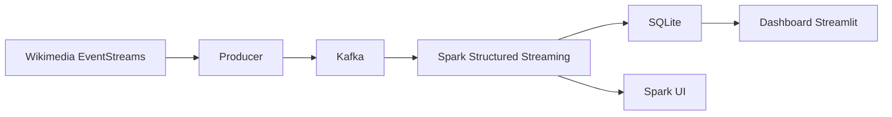

# Relatório do Projeto Final: Wikimedia Real-Time Topic Analytics

## 1. Contexto e motivação

A Wikipedia é editada continuamente por milhões de colaboradores ao redor do mundo. A Wikimedia Foundation expõe essas edições como um stream público de eventos em tempo real. Este projeto consome esse stream, classifica cada edição por tópico e mostra como o volume de edições se distribui ao longo do tempo.

O objetivo é demonstrar um pipeline de Big Data local com três etapas principais:

- ingestão contínua de eventos com Kafka;
- processamento incremental com Spark Structured Streaming;
- persistência e visualização dos resultados em SQLite e Streamlit.

O foco do trabalho não é apenas gerar uma classificação, mas verificar se o sistema transforma dados em tempo real de forma estável, com vazão observável e sem acúmulo excessivo de mensagens.

## 2. Dados

### 2.1 Descrição detalhada

**Fonte principal**: Wikimedia EventStreams, endpoint público de Server-Sent Events.

**Endpoint utilizado**:

```text
https://stream.wikimedia.org/v2/stream/recentchange
```

Cada evento recebido contém, entre outros campos, os seguintes atributos usados pelo projeto:

| Campo           | Tipo    | Descrição                                         |
| --------------- | ------- | ------------------------------------------------- |
| `title`         | string  | Título da página ou artigo editado                |
| `namespace`     | inteiro | Namespace do evento (`0`, `6`, `14`, `146`, etc.) |
| `comment`       | string  | Resumo bruto da edição                            |
| `parsedcomment` | string  | Resumo com marcações HTML já resolvidas           |
| `timestamp`     | inteiro | Horário Unix da edição, em segundos               |
| `type`          | string  | Tipo do evento recebido do stream                 |

O projeto filtra eventos de edição e aplica limpeza textual antes da classificação. Títulos do Wikidata, arquivos e categorias recebem tratamento especial para preservar o conteúdo semântico.

### 2.2 Como obter os dados

Um pequeno conjunto de amostra já está incluído em [datasample/wikimedia-recentchange-sample.txt](datasample/wikimedia-recentchange-sample.txt). Esse arquivo tem menos de 1 MB e é usado para replay local quando o objetivo for testar sem depender da rede.

Para o fluxo completo, não é necessário baixar nenhum dataset adicional. O produtor se conecta diretamente ao stream da Wikimedia quando o projeto é executado em modo normal.

Se você quiser forçar o replay local da amostra, basta configurar o produtor com:

```bash
PRODUCER_SOURCE=sample
```

## 3. Como instalar e executar

> O projeto foi desenhado para rodar com Docker e Docker Compose. Não é necessário instalar Python, Spark ou Kafka no host para executar o fluxo principal.

### 3.1 Quick start

Para executar localmente a partir da pasta [finalproject/20261/g10](.):

```bash
./bin/start.sh
```

Ou, manualmente:

```bash
docker compose up --build
```

Depois que os containers estiverem saudáveis:

- o dashboard fica disponível em [http://localhost:8501](http://localhost:8501);
- o Spark UI fica disponível em [http://localhost:4040](http://localhost:4040) enquanto o consumidor estiver rodando.

Se quiser testar sem depender da internet, use a amostra local:

```bash
PRODUCER_SOURCE=sample docker compose up --build
```

### 3.2 Como executar com o dataset completo

No modo padrão, o produtor lê o stream ao vivo da Wikimedia definido por `WIKIMEDIA_URL`.

Os principais parâmetros de execução ficam em `.env`:

```bash
MODEL_NAME=intfloat/multilingual-e5-base
WINDOW_DURATION_NUMERIC=5
WINDOW_DURATION_UNIT=minutes
WINDOW_SLIDE_DURATION_NUMERIC=5
WINDOW_SLIDE_DURATION_UNIT=minutes
MAX_OFFSETS_PER_TRIGGER=5000
PRODUCER_SOURCE=live
```

Para testar em CPU ou em GPU, o código já faz seleção automática do dispositivo quando possível. A GPU é recomendada, mas o pipeline continua funcionando em CPU.

## 4. Arquitetura do projeto



### Componentes principais

| Componente            | Container                  | Função                                                           |
| --------------------- | -------------------------- | ---------------------------------------------------------------- |
| `kafka`               | `apache/kafka:3.7.0`       | Broker de mensagens em modo KRaft                                |
| `wikimedia_producer`  | `python:3.11-slim`         | Lê o stream da Wikimedia ou a amostra local e envia para o Kafka |
| `spark_consumer`      | `apache/spark:3.5.1`       | Faz limpeza, classificação e agregação por janela                |
| `sqlite_init`         | mesma imagem do consumidor | Cria o esquema do SQLite                                         |
| `wikimedia_dashboard` | `python:3.11-slim`         | Exibe métricas e resultados históricos                           |

### Fluxo de dados

1. O produtor recebe eventos da Wikimedia ou da amostra local.
2. O Kafka armazena os eventos em um tópico intermediário.
3. O Spark consome os eventos, limpa os textos e classifica cada edição em um tópico.
4. O Spark agrega os resultados em janela temporal e grava as métricas em SQLite.
5. O dashboard lê o SQLite e exibe a evolução das categorias.

## 5. Cargas de trabalho avaliadas

### [WORKLOAD-1] Classificação semântica

Cada evento limpo é transformado em embedding e comparado com os vetores das 12 categorias do projeto. A categoria com maior similaridade é atribuída ao evento.

**Saída**: `category` e `confidence`.

**Métrica observável**: quantidade de eventos classificados por segundo e distribuição por categoria.

### [WORKLOAD-2] Pré-processamento de texto

O pipeline normaliza os textos antes da classificação:

- remove wiki-links;
- remove comentários de seção;
- trata títulos de arquivos e categorias;
- usa `parsedcomment` para itens Wikidata quando o título não carrega semântica suficiente.

**Métrica observável**: número de linhas aceitas para classificação e taxa de eventos descartados por limpeza vazia.

### [WORKLOAD-3] Agregação temporal

Os eventos classificados são agrupados por categoria e por janela temporal de 5 minutos com watermark para eventos atrasados.

**Métrica observável**: total de eventos por janela, tempo de processamento por micro-batch e número de linhas persistidas no SQLite.

## 6. Experimentos e resultados

> Esta seção descreve a bateria local que será executada na máquina do usuário. Os resultados devem ser coletados localmente, com o hardware disponível, e acompanhados pelo Spark UI e pelos logs do consumidor.

### 6.1 Ambiente experimental

A bateria foi planejada para a seguinte máquina local:

- AMD Ryzen 7 7735HS
- GeForce RTX 4050 Laptop GPU
- 16 GB de RAM
- 6 GB VRAM
- Linux com Docker e Docker Compose

Se a GPU não estiver disponível no ambiente Docker, o sistema continua funcionando em CPU. Nesse caso, os testes ainda são válidos, mas o tempo de processamento tende a aumentar.

### 6.2 Descrição dos testes realizados

A bateria foi desenhada para comparar o comportamento do sistema com diferentes níveis de paralelismo local:

- `local[1]`
- `local[*]`, onde `*` corresponde ao número de threads lógicas disponíveis na máquina

#### O que medimos

Os testes foram realizados por 10 minutos, 5 vezes para cada um dos 3 níveis de paralelismo local.

| Métrica                  | Unidade         | Resultado                                           |
| ------------------------ | --------------- | --------------------------------------------------- |
| Eventos emitidos         | eventos/segundo | Eventos recebinos no Kafka                          |
| Eventos recebidos        | eventos/segundo | Entrada no Spark                                    |
| Eventos processados      | eventos/segundo | Vazão efetiva do Spark após limpeza e classificação |
| Latência por micro-batch | ms              | Tempo gasto por lote processado                     |
| Uso de CPU               | %               | Carga do host                                       |
| Uso de GPU               | %               | Carga na GPU do host                                |
| Uso de memória           | GB              | Consumo de RAM pelo pipeline                        |
| Uso de memória (GPU)     | GB              | Consumo de RAM da GPU pelo pipeline                 |
| Linhas por janela        | contagem        | Total de eventos agregados na janela tumbling       |

#### Janela usada nos testes

A janela padrão da bateria é **tumbling** de 5 minutos. O slide é igual à duração da janela, ou seja, a janela não se sobrepõe a outra.

### 6.3 O que foi testado?

A bateria local compara duas configurações de paralelismo e origem real dos dados:

| Teste | Configuração | Objetivo                                       |
| ----- | ------------ | ---------------------------------------------- |
| T1    | `local[1]`   | Medir o comportamento mínimo do pipeline       |
| T2    | `local[*]`   | Medir uso total das threads lógicas da máquina |

### 6.4 Resultados

#### T1 - `local[1]`

Foram gerados 2 Structured Streaming Queries (Valores apresentados são para média de ambas)

| Métrica                  | Unidade         | Resultado        |
| ------------------------ | --------------- | ---------------- |
| Eventos emitidos         | eventos/segundo | 58,926           |
| Eventos recebidos        | eventos/segundo | 56,905           |
| Eventos processados      | eventos/segundo | 55,560           |
| Latência por micro-batch | ms              | 449.50           |
| Uso de CPU               | %               | Entre 30 e 50    |
| Uso de GPU               | %               | Picos de 0 a 100 |
| Uso de memória           | GB              | 11,2             |
| Uso de memória (GPU)     | GB              | 3,53             |
| Linhas por janela        | contagem        | 20               |

#### T2 - `local[*]`

Foram gerados 2 Structured Streaming Queries (Valores apresentados são para média de ambas)

| Métrica                  | Unidade         | Resultado |
| ------------------------ | --------------- | --------- |
| Eventos emitidos         | eventos/segundo | X         |
| Eventos recebidos        | eventos/segundo | X         |
| Eventos processados      | eventos/segundo | X         |
| Latência por micro-batch | ms              | X         |
| Uso de CPU               | %               | X         |
| Uso de GPU               | %               | X         |
| Uso de memória           | GB              | X         |
| Uso de memória (GPU)     | GB              | X         |
| Linhas por janela        | contagem        | X         |

## 7. Limitações e conclusões

### O que funcionou

O pipeline integra Kafka, Spark, SQLite e Streamlit em uma única execução local. O fluxo processa eventos em tempo real, classifica os textos e publica as métricas no dashboard.

### Limitações

- o modelo semântico depende de inferência em lote e pode ficar mais lento em CPU;
- o stream ao vivo da Wikimedia depende de conexão com a internet;
- a janela é fixa no modo principal e precisa de reinício para mudar parâmetros estruturais;
- o SQLite é suficiente para o dashboard local, mas não é a melhor escolha para múltiplos leitores concorrentes em produção.

### Conclusão

O projeto demonstra um pipeline completo de transformação de dados com ingestão, classificação, agregação temporal e visualização. A bateria local foi estruturada para responder se o sistema realmente processa os eventos recebidos, mantém a janela agregada coerente e sustenta a execução com o hardware disponível.

## 8. Referências e recursos externos

- [Wikimedia EventStreams](https://wikitech.wikimedia.org/wiki/Event_Platform/EventStreams)
- [Apache Kafka 3.7](https://kafka.apache.org/37/documentation.html)
- [Apache Spark Structured Streaming](https://spark.apache.org/docs/3.5.1/structured-streaming-programming-guide.html)
- [sentence-transformers](https://www.sbert.net/)
- [Streamlit](https://docs.streamlit.io/)
- [PyTorch](https://pytorch.org/)
- [Modelos do Hugging Face usados no projeto](https://huggingface.co/)
- [Amostra local de dados](datasample/wikimedia-recentchange-sample.txt)
