# Arquitetura do Projeto (diagramas)

Motor de Liquidação estilo Pix com Apache Flink (PyFlink) · Grupo G3.

Diagramas mermaid da arquitetura, do nível mais alto ao detalhe de cada bloco.
Renderizam no GitHub, no VS Code (extensão Markdown Preview Mermaid) e em
`mermaid.live`.

---

## 1. Visão geral (os dois caminhos a partir do mesmo input)

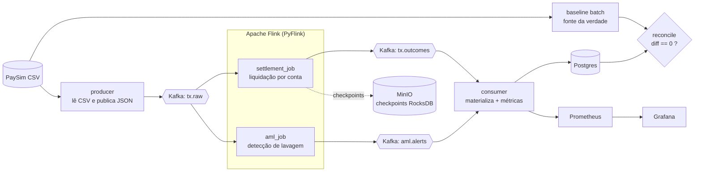

Caminho **stream** (tempo real): `CSV -> producer -> Kafka -> Flink -> Kafka ->
consumer -> Postgres`. Caminho **batch** (offline determinístico): `CSV ->
baseline`. No fim, `reconcile` compara os dois: diff zero prova o exactly-once.

---

## 2. Tempo e ordem como função pura do input

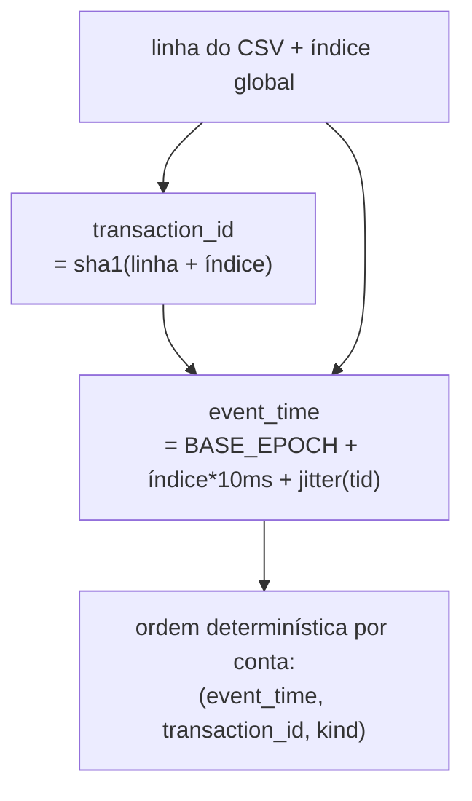

Como `event_time` não vem do relógio de execução, a ordem por conta é idêntica no
stream e no batch. É isso que torna o saldo final reprodutível e a prova ao centavo
possível.

---

## 3. Fluxo de dados ponta a ponta (sequência)

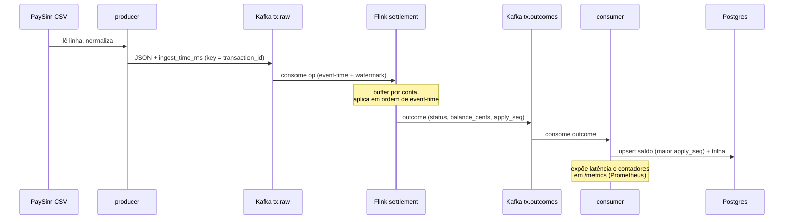

---

## 4. Dentro do job de liquidação (`settlement_job`)

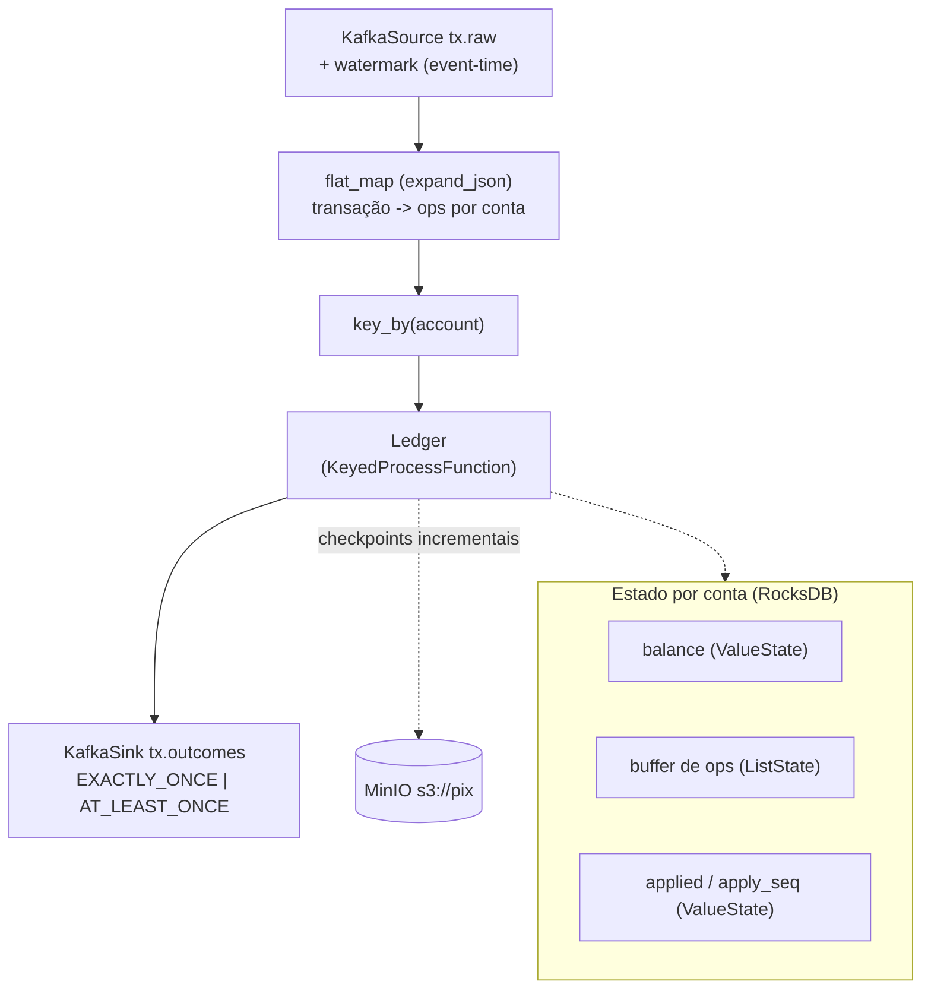

### Ciclo de vida de uma op dentro do Ledger

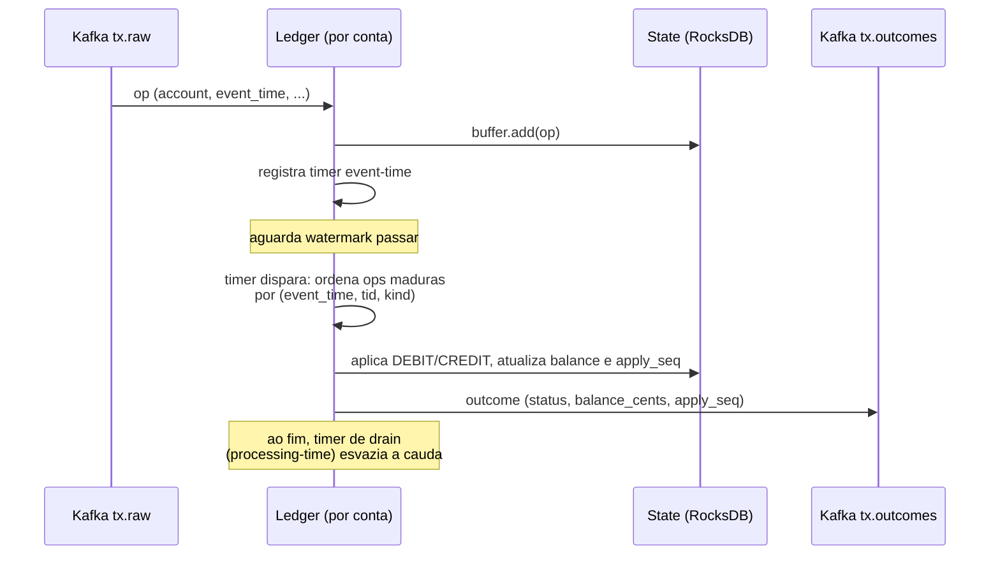

---

## 5. Expansão de uma transação em ops do ledger

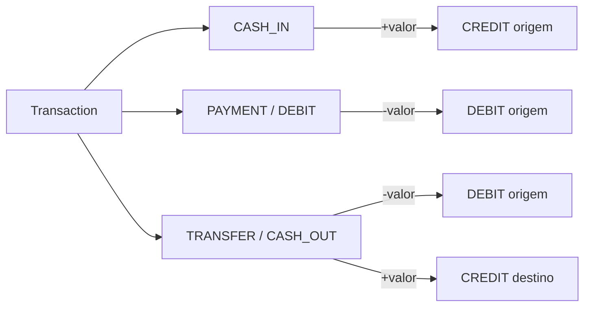

Regra de aceitação: **DEBIT só liquida se `valor <= saldo`** (senão `REJECTED`);
**CREDIT sempre soma**.

---

## 6. Detecção de lavagem (`aml_job`)

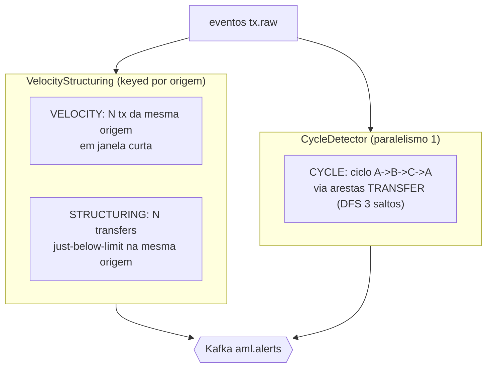

A detecção de ciclo precisa de visão global do grafo recente de transferências, por
isso roda com paralelismo 1. Velocity e structuring são keyed por conta de origem.

---

## 7. Materialização e observabilidade (`consumer`)

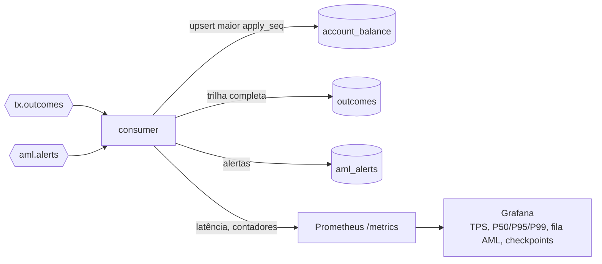

---

## 8. A prova final (reconciliação)

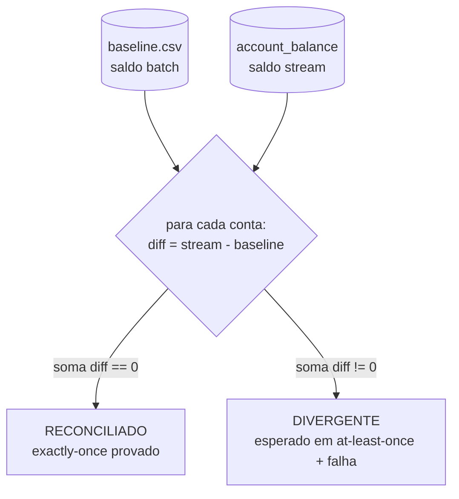

Sob `EXACTLY_ONCE` o resultado é zero. Sob `AT_LEAST_ONCE` com uma falha injetada
(matar um TaskManager), espera-se divergência por double counting, exatamente o que
o experimento quer demonstrar.

---

## 9. Infraestrutura (Docker Compose)

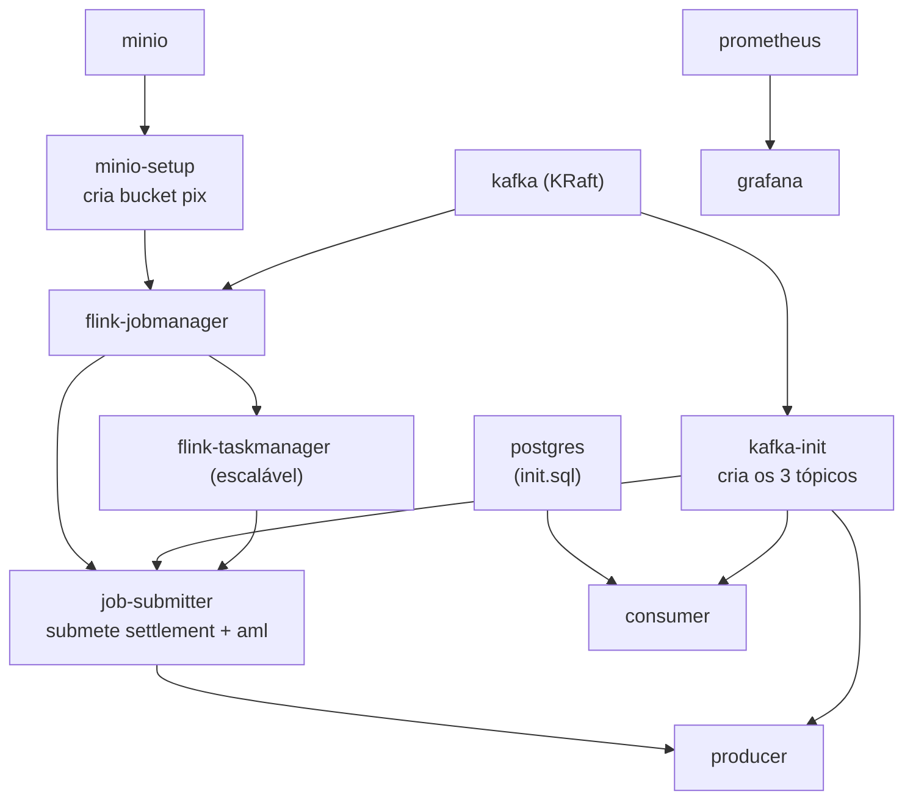

Estado do Flink em **RocksDB** com checkpoints incrementais no **MinIO**
(`s3://pix/checkpoints`); é daí que vem a recuperação após falha. Garantia,
intervalo de checkpoint, paralelismo e limiares de AML são parametrizados por env
(`.env`), o que permite variar configurações nos experimentos sem tocar no código.

---

## 10. Demonstração de falha e recuperação

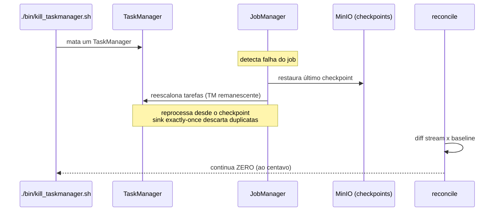
