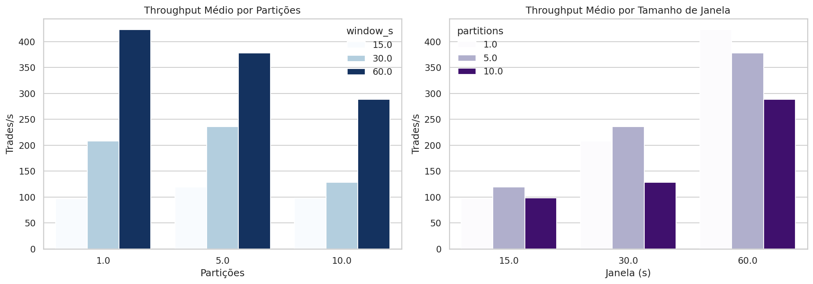
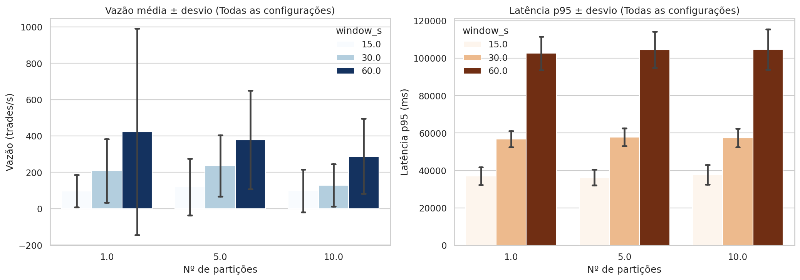
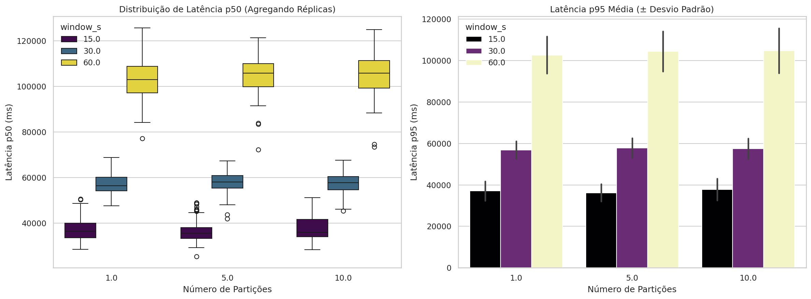
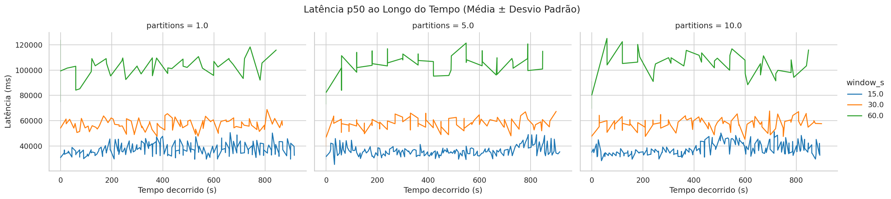

# Pipeline de Streaming de Trades — Binance → Kafka → Spark

Projeto final da disciplina de Big Data. Um **pipeline de processamento de dados em
tempo real** que ingere negócios (trades) do mercado de criptomoedas, agrega-os em
candles OHLCV por janela temporal, calcula indicadores técnicos (EMA, RSI) e avalia
o desempenho do sistema sob diferentes níveis de paralelismo.

---

## 1. Fonte de dados

- **O quê:** stream de trades em tempo real do par **BTC/USDT** da Binance.
- **De onde:** WebSocket público da Binance — `wss://stream.binance.com:9443/ws/btcusdt@trade`
  ([documentação](https://developers.binance.com/docs/binance-spot-api-docs/web-socket-streams)).
- **Formato de entrada:** mensagens JSON, uma por trade, empurradas continuamente pela Binance.

Cada trade traz preço, quantidade, identificador único (`trade_id`), timestamp e o lado
agressor (compra/venda).

## 2. Workload (processamento)

Sobre esse fluxo, o pipeline executa **processamento de streaming com janelas temporais**:

1. **Ingestão e normalização** dos trades crus para um schema único.
2. **Agregação em janelas** (*window functions*) de N segundos, produzindo candles **OHLCV**
   (Open, High, Low, Close, Volume) — com desempate correto de Open/Close pelo `trade_id`.
3. **Indicadores técnicos** sobre a série de candles: **EMA(9)** e **RSI(14)**.
4. **Instrumentação**: latência fim-a-fim, vazão (trades/s) e completude.

## 3. Por que isso é relevante

Candles e indicadores são a base de praticamente toda análise técnica de mercado. Calcular
isso **em tempo real** é o que permite sistemas de trading, alertas e gestão de risco
reagirem a um mercado que se move em milissegundos — algo impossível com processamento em
lote tradicional (carregar tudo num banco e analisar depois).

## 4. Que tipo de processamento é este?

**Stream processing (processamento de fluxo)**, estruturado, com estado e janelas temporais.
Não é batch: os dados são ilimitados e processados conforme chegam, com *watermark* para
lidar com eventos atrasados.

## 5. Por que isso é Big Data?

O enunciado considera dado válido aquele que exige **≥ 1 GB de armazenamento e/ou é caro de
processar**. Nosso argumento **não é volume estático, é velocidade e volume não-limitado**:

- **Velocidade (Velocity):** o stream é contínuo e de alta frequência. Medimos picos de
  **~90–100 trades/s** só no BTC/USDT. São centenas de milhares de eventos por hora, sem fim.
- **Volume não-limitado:** um fluxo que nunca "termina". Persistindo os trades crus, o
  dataset cresce indefinidamente e ultrapassa 1 GB em poucas horas de coleta.
- **Caro de processar:** agregar com janelas e estado, sob latência baixa e de forma
  escalável, exige uma stack de streaming distribuído (Kafka + Spark) — não cabe num
  `pandas.read_csv`.

As 3 V's clássicas aparecem: **Volume** (acumulação contínua), **Velocidade** (tempo real),
**Veracidade** (dados crus que exigem ordenação/desempate por `trade_id`).

## 6. Arquitetura

```
   ┌──────────────┐     JSON      ┌─────────────────┐    JSON     ┌──────────────────────┐    CSV     ┌──────────────┐
   │  1. Coletor  │  ──────────▶  │  2. Kafka       │  ────────▶  │  3. Processador      │  ───────▶  │ 4. Análise   │
   │  binance.py  │   trade msg   │  tópico `trades`│   consume   │  Spark Structured    │  métricas  │ analysis     │
   │ (WebSocket)  │   key=symbol  │  1..N partições │             │  Streaming           │  + candles │ .ipynb       │
   └──────────────┘               └─────────────────┘             │  (OHLCV+EMA+RSI)     │            │ (gráficos)   │
                                                                  └──────────────────────┘            └──────────────┘
```

| Componente | Tecnologia | Papel | Formato |
|---|---|---|---|
| Coletor | Python + `websockets` + `confluent-kafka` | Ingestão e normalização; produz no Kafka com reconexão | JSON |
| Fila | Apache Kafka (KRaft) | Desacopla produtor/consumidor; particionamento p/ paralelismo | JSON |
| Processador | Apache Spark Structured Streaming | Janelamento OHLCV, indicadores, métricas | CSV (saída) |
| Análise | Jupyter + pandas + matplotlib | Estatística e gráficos dos experimentos | PNG/CSV |

**Schema da mensagem (contrato entre os módulos):**

```json
{"trade_id": 6419174977, "ts_trade": 1781746345543, "ts_ingest": 1781746345641,
 "price": "64723.98", "qty": "0.00328", "side": "sell", "symbol": "BTCUSDT"}
```

- `open` = preço do trade de **menor** `trade_id` na janela (`min_by`)
- `close` = preço do trade de **maior** `trade_id` na janela (`max_by`)

---

## 7. Como rodar

A aplicação inteira está dockerizada. Pré-requisito: Docker e Docker Compose instalados na máquina.

### Serviços do Compose
- `kafka` — broker (KRaft, sem ZooKeeper). Acessível em `localhost:9092` (host) e `kafka:29092` (containers).
- `collector` — coletor da Binance (Python nativo).
- `processor` — processador analítico (Spark Structured Streaming).
- `jupyter` — ambiente SciPy isolado para análise de dados e geração de gráficos.

Para uma execução livre (fora da bateria de testes), basta rodar:
```bash
docker compose up --build
```

---

## 8. Experimentos e análise de desempenho

Os experimentos avaliam a escalabilidade horizontal e o trade-off entre retenção e latência, variando a seguinte grade:
- **Tamanho da janela:** 15, 30 e 60 segundos.
- **Partições do Kafka:** 1, 5 e 10 partições.
- **Duração por rodada:** 16 minutos (960 segundos) para acumular histórico suficiente para os indicadores (mínimo de 14 candles para o RSI).
- **Repetições:** 3 rodadas completas (intercaladas para capturar a diferença de volatilidade temporal do mercado).

> ⚠️ **Atenção:** Devido à combinação de 9 configurações × 3 repetições × 16 minutos, a execução completa da bateria leva aproximadamente 7,2 horas ininterruptas.

### Executando a coleta

```bash
# 1. Garanta que não há nenhum container rodando e bloqueando o tópico
docker compose down

# 2. Inicie o script orquestrador (ele subirá o Kafka automaticamente)
./bin/experiment.sh
```

O script salvará o estado de cada execução gerando os arquivos `metrics/performance_p<P>_w<W>_r<R>.csv` e os respectivos candles. O horário exato do teste é registrado nos CSVs para correlacionar a vazão (throughput) com a agitação do mercado financeiro naquele momento.

### Analisando os Resultados

Toda a análise estatística (média ± desvio-padrão) e a plotagem dos gráficos com barras de erro também são feitas via container.

> **⚠️ Permissões:** Como os arquivos CSV e a pasta de métricas são gerados pelo container do Spark (que processa os dados como `root`), o container do Jupyter (que roda com usuário restrito) pode apresentar erro ao tentar salvar os gráficos finais. Para liberar o acesso de escrita, execute este comando na raiz do projeto antes de abrir o notebook:
> ```bash
> docker run --rm -v "$(pwd)/metrics:/app/metrics" python:3.12-slim chmod -R 777 /app/metrics
> ```

```bash
# Suba o ambiente analítico em segundo plano
docker compose up jupyter
```

No final do log, copie a URL gerada (ex: `http://127.0.0.1:8888/lab?token=...`) e abra no seu navegador. Navegue até o arquivo `analysis.ipynb` e execute as células. As tabelas resumo serão impressas e os gráficos `.png` aparecerão automaticamente na sua pasta `metrics/` local.

## 9. Estrutura do repositório

```text
/
├── bin/
│   └── experiment.sh           # Script orquestrador da bateria de experimentos
├── metrics/                    # CSVs, gráficos e métricas geradas
├── src/
│   ├── analysis.ipynb          # Análise estatística e visualização dos resultados
│   ├── binance.py              # Coletor/producer Kafka a partir da Binance
│   ├── config.py               # Configuração central da aplicação
│   └── processor.py            # Processador Spark (OHLCV + EMA/RSI + métricas)
├── docker-compose.yml          # Definição dos serviços Kafka, collector e processor
├── Dockerfile                  # Imagem da aplicação Python+Spark
├── README.md                   # Documentação do projeto
└── requirements.txt            # Dependências Python
```

## 10. Experimentos e Resultados

### 10.1 Ambiente experimental
Os experimentos foram executados localmente para estressar a capacidade de concorrência e paralelismo da arquitetura. As especificações da máquina utilizada foram:
* **Processador:** 13th Gen Intel(R) Core(TM) i5-13450HX (2.40 GHz) - 10 Núcleos físicos
* **Memória RAM:** 16 GB
* **Sistema Operacional:** Linux/Ubuntu
* **Containerização:** Docker com Docker Compose (Broker Kafka KRaft + Spark Structured Streaming)

### 10.2 O que você testou?
Para entender os limites do sistema, manipulamos duas variáveis independentes principais e avaliamos seu impacto no desempenho:
* **Parâmetros variados:**
  * Número de Partições do Kafka (`1`, `5` e `10` partições).
  * Tamanho da Janela de Agregação (`15s`, `30s` e `60s`).
* **Métricas coletadas:** Vazão/Throughput (trades processados por segundo) e Latência (p50 e p95 do tempo de resposta).
* **Repetições:** Cada uma das 9 combinações de configuração foi executada em **3 rodadas (runs)** distintas de 16 minutos cada, permitindo o cálculo estatístico para contabilizar a variabilidade do mercado em tempo real.

### 10.3 Resultados

Abaixo está a tabela consolidada com as médias e desvios padrões (Std Dev) extraídos das múltiplas execuções:

| Partições | Janela (s) | Rodadas | Vazão Média (trades/s) | Latência p50 Média (ms) | Latência p95 Média (ms) |
| :---: | :---: | :---: | :---: | :---: | :---: |
| 1 | 15 | 3 | 96.6 ± 41.3 | 37056.7 ± 2750.6 | 37091.5 ± 2805.0 |
| 1 | 30 | 3 | 208.4 ± 123.4 | 56828.1 ± 662.6 | 56828.1 ± 662.6 |
| 1 | 60 | 3 | 426.1 ± 457.4 | 102684.7 ± 1168.1 | 102684.7 ± 1168.1 |
| 5 | 15 | 3 | 118.4 ± 116.5 | 36202.3 ± 847.7 | 36229.7 ± 885.4 |
| 5 | 30 | 3 | 236.7 ± 100.2 | 57749.6 ± 859.1 | 57749.6 ± 859.1 |
| 5 | 60 | 3 | 382.4 ± 206.6 | 104432.1 ± 2406.8 | 104432.1 ± 2406.8 |
| 10 | 15 | 3 | 98.4 ± 71.7 | 37693.7 ± 1717.4 | 37819.8 ± 1749.1 |
| 10 | 30 | 3 | 128.1 ± 51.4 | 57418.0 ± 302.4 | 57418.0 ± 302.4 |
| 10 | 60 | 3 | 288.6 ± 47.8 | 104679.7 ± 1853.4 | 104679.7 ± 1853.4 |


##### Comparação de Throughput



##### Barras de Erro - Vazão e Latência



##### Distribuição de Latência



##### Linha do Tempo da Latência



#### Discussão das Tendências
* **Impacto do Tamanho da Janela:** Observa-se que a vazão escala quase linearmente com o tamanho da janela de agregação. Janelas maiores (60s) amortizam o custo de I/O do Spark e melhoram a eficiência da CPU, atingindo o pico de ~426 trades/s na configuração de 1 partição. Como esperado, o custo dessa eficiência é o aumento proporcional da latência (retenção de estado).
* **O Gargalo do Paralelismo (Análise Crítica):** O resultado mais contraintuitivo (e interessante) é que escalar horizontalmente piorou o desempenho bruto. Aumentar as partições de 5 para 10 causou uma **queda** de ~24% na vazão (de 382 para 288 trades/s) na janela de 60s. O alto desvio padrão na configuração de 1 partição (± 457.4) indica que, embora atinja picos altos, ela é muito sensível à volatilidade dos dados de entrada.

## 11. Limitações e Conclusões

**O que deu certo:**
A arquitetura de *stream processing* provou ser resiliente, processando o fluxo ininterrupto sem gargalos progressivos (*backpressure*) ao longo dos testes de 16 minutos. O uso de 5 partições com janelas de 30 a 60 segundos se provou o "sweet spot" do sistema, garantindo alta vazão e estabilizando a variação da latência p95.

**Limitações e Desafios:**
A principal limitação encontrada foi a restrição física de hardware atuando como gargalo na orquestração. Como a máquina de testes possuía 10 núcleos físicos, forçar 10 partições concorrentes para leitura no Kafka + processamento no Spark resultou em *context switching* severo. A CPU gastou mais tempo gerenciando a sincronização entre as threads (*straggler problem*) do que processando os trades úteis. Conclui-se que o excesso de partições em um ambiente *single-node* é um antipadrão de arquitetura.

## 12. Referências e recursos externos
* [Apache Kafka Documentation](https://kafka.apache.org/documentation/)
* [Spark Structured Streaming Programming Guide](https://spark.apache.org/docs/latest/structured-streaming-programming-guide.html)
* [Binance Spot API / WebSocket Streams](https://developers.binance.com/docs/binance-spot-api-docs/web-socket-streams)