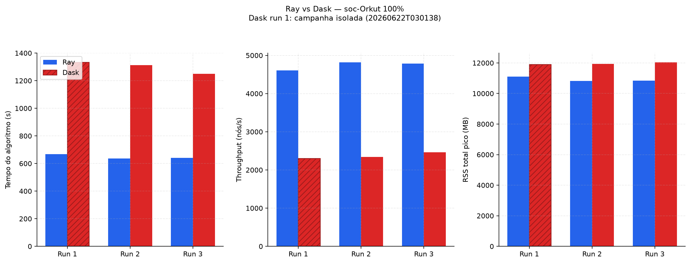
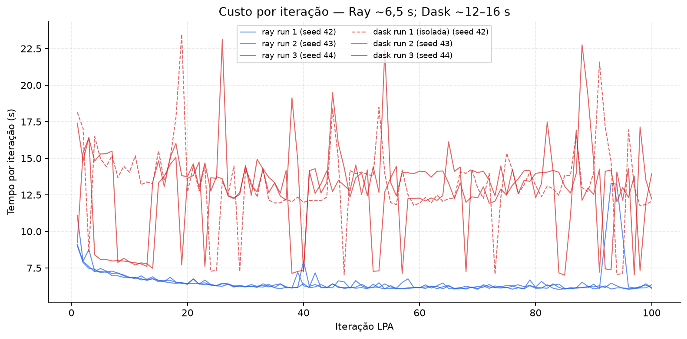
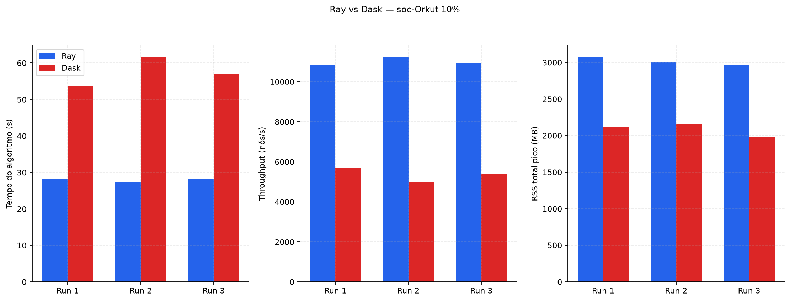
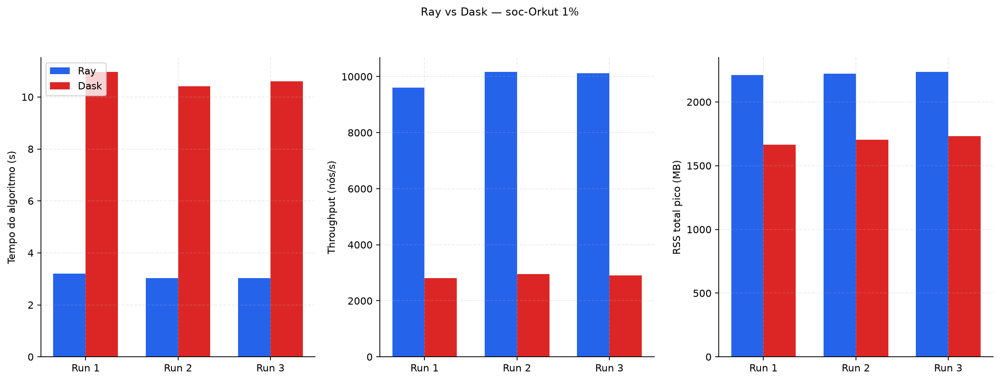

# Final project report: *Distributed Label Propagation — Ray vs Dask on soc-Orkut*

**Group 6 — Felipe Geraldo de Oliveira & Eduardo Cesar Cauduro Coelho**

## 1. Context and motivation

Online social networks such as **Orkut** are graphs with millions of nodes and
hundreds of millions of links. A central question in Big Data and network
analysis is: *who is naturally grouped with whom?* — i.e., finding
**communities** (sets of nodes densely connected to each other and weakly
connected to the rest).

Community detection is relevant for recommendation, fraud detection, audience
segmentation and understanding social structure. At the scale of Orkut
(3M nodes, ~117M edges), in-memory sequential algorithms become slow and
RAM-bound, which motivates **parallelising** the computation.

**Main goal:** compare two distributed implementations of the **Label
Propagation (LPA)** algorithm — one on **Ray**, one on **Dask** — running the
*same* algorithm over the *same* graph on a single VM, measuring execution
time, throughput, memory and partition quality. The comparison is about
**runtime/infrastructure**, not about a different algorithm: both share the
same core (`lpa_core` + a Numba voting kernel).

## 2. Data

### 2.1 Detailed description

| Aspect | Value |
|--------|-------|
| Dataset | [SNAP com-Orkut](https://snap.stanford.edu/data/com-Orkut.html) |
| Type | Undirected social graph (one edge `u v` per line) |
| Nodes | 3 072 441 |
| Edges (SNAP, undirected) | ~117 million |
| Arcs in CSR (symmetrised) | ~234 million |
| Compressed file | ~1.7 GB (`com-orkut.ungraph.txt.gz`) |
| In-memory graph | ~1 GB (CSR + overhead) |

Justification as **Big Data**: the compressed source exceeds **1 GB** and the
workload (iterative LPA over 234M arcs, up to 100 iterations) is **expensive**
— each iteration traverses the whole adjacency list, and keeping the graph
plus replicas plus object store in RAM heavily pressures VM memory.

A small **0.1% BFS sample** (1 632 nodes, ~9.7K arcs, ~24 KB) is bundled in
`datasample/` so the project can be tested in ~1 minute without downloading
Orkut.

### 2.2 How to obtain the data

The **sample** (`datasample/orkut_0p1pct.npz`) is already in this repository
(< 1 MB) and needs no download.

The **full dataset** is downloaded automatically by the Docker entrypoint when
`data/raw/soc-orkut-relationships.txt` is missing, using `bin/download_dataset.sh`:

```bash
# Inside the container (run automatically), or manually:
bin/download_dataset.sh
# → downloads com-orkut.ungraph.txt.gz from SNAP, gunzips to data/raw/soc-orkut-relationships.txt
```

The full dataset is **not** included in the repository (too large).

## 3. How to install and run

> The project runs **only with Docker**. No other installation is required.

### 3.1 Quick start (using sample data in `datasample/`)

```bash
cd finalproject/20261/g6
mkdir -p data reports && sudo chown -R 1000:1000 data reports   # uid of the container user
./bin/run-sample.sh
# equivalent to:
# docker compose run --rm \
#   -e GRAPH_RAW_PATH=datasample/orkut_0p1pct.npz \
#   -e BENCHMARK_FRACTIONS=0.1 -e BENCHMARK_RUNS=1 lpa
```

This builds the image, runs Ray + Dask on the 0.1% sample (1 run) and writes
`reports/metrics_raw_<stamp>.csv` + `reports/comparison_<stamp>.md`.

### 3.2 How to run with the full dataset

```bash
cd finalproject/20261/g6
mkdir -p data reports && sudo chown -R 1000:1000 data reports

docker compose up --build -d        # downloads Orkut if missing, runs 1%/10%/100% × 6 workers × 3 runs
docker compose logs -f              # follow until the report is generated
```

The container **terminates on its own** (`Exited (0)` = success). Outputs land
in `reports/`:

```
reports/
├── metrics_raw_<stamp>.csv      # times, memory, communities
├── benchmark_run_<stamp>.log    # per-iteration log
├── comparison_<stamp>.md        # Ray vs Dask report
└── partitions_<stamp>/          # community JSON files
```

Environment variables (override with `-e`):

| Variable | Default | Effect |
|----------|---------|--------|
| `BENCHMARK_FRACTIONS` | `1,10,100` | Fractions of Orkut |
| `LPA_WORKERS` | `6` | Fixed worker count (Ray + Dask) |
| `BENCHMARK_RUNS` | `3` | Repetitions per cell |
| `BENCHMARK_BACKEND` | `both` | `ray`, `dask` or `both` |
| `LPA_MAX_ITER` | `100` | Max LPA iterations |

Smaller/faster run on the full dataset:

```bash
docker compose run --rm \
  -e BENCHMARK_FRACTIONS=1 -e BENCHMARK_RUNS=1 -e BENCHMARK_BACKEND=both lpa
```

## 4. Project architecture

The pipeline runs on a **single VM** via **Docker Compose**:

```
SNAP .txt  ->  preprocessing (COO -> out-CSR symmetrised, numpy)
                    |
        +-----------+-----------+
        |                       |
   ray_impl                dask_impl
   ray.put + @ray.remote   client.scatter + client.submit
        |                       |
        +-----------+-----------+
                    |
                    v
        lpa_core (Numba) -- vote per chunk
                    |
            synchronous snapshot + merge per iteration
                    |
                    v
        metrics (time, RSS, Q) -> CSV + report
```

| | **Ray** | **Dask** |
|---|---------|----------|
| Model | `ray.put` + `@ray.remote` | `client.scatter` + `client.submit` |
| Workers | 1 process / CPU | `LocalCluster`, 1 thread / worker |
| Shared core | `lpa_core` + **Numba** voting kernel | idem |
| Graph | CSR in memory (same) | idem |

**Containers:** a single `lpa` service (built from `Dockerfile`). The
entrypoint (`bin/docker-entrypoint.sh`) downloads Orkut if missing, runs the
Ray benchmark, then the Dask benchmark with `--append` (same stamp), and
generates the Markdown report. Data flows: host `data/` and `reports/` are
volume-mounted; the sample in `datasample/` is baked into the image.

**File formats:** input SNAP `.txt` (or `.npz` artefact for partial
fractions); output `metrics_raw_<stamp>.csv`, `comparison_<stamp>.md`,
`partitions_<stamp>/*.communities.json`.

## 5. Workloads evaluated

The same LPA algorithm is run on **two runtimes** and **three graph sizes**.
Each (runtime × size) combination is a named workload.

- **[WORKLOAD-RAY]** Synchronous distributed LPA on **Ray** (object store +
  remote tasks). Evaluated at 1%, 10% and 100% of Orkut.
- **[WORKLOAD-DASK]** Synchronous distributed LPA on **Dask Distributed**
  (`LocalCluster`, `client.submit`). Evaluated at 1%, 10% and 100% of Orkut.

Both workloads share `lpa_core`: each iteration takes a frozen snapshot of
labels, every worker votes the majority label of its chunk's nodes (Numba
kernel, ties broken by smallest label), and the driver merges before the next
iteration. Quality is measured by **modularity Q** (Blondel et al., 2008).

## 6. Experiments and results

### 6.1 Experimental environment

| Item | Value |
|------|-------|
| Machine | VM, 6 vCPUs, ~16 GB RAM |
| OS | Linux (Docker) |
| Workers | 6 (fixed, `LPA_WORKERS=6`) |
| Max iterations | 100 |
| Repetitions | **3 runs** per configuration (seeds 42, 43, 44) |
| Backends | Ray and Dask |
| Fractions | 100% (full graph) · 10% · 1% (BFS sample) |

For fractions < 100%, a BFS sample artefact (`.npz`) is pre-built before
timing LPA, so sampling time is **excluded** from `algorithm_time_s`.

### 6.2 How to perform benchmarking (simple guide)

```bash
# 3 repetitions of the full grid (1%, 10%, 100% x Ray + Dask):
docker compose up --build -d

# Or a single configuration, 3 runs:
docker compose run --rm \
  -e BENCHMARK_FRACTIONS=10 -e BENCHMARK_RUNS=3 -e BENCHMARK_BACKEND=both lpa
```

The runner writes one CSV row per (fraction × backend × run) with
`algorithm_time_s`, `throughput_nodes_per_s`, `peak_process_tree_rss_mb`,
`num_communities`, etc. Average and sample standard deviation are computed
across the 3 runs.

### 6.3 What did you test?

- **Parameters varied:** graph size (1%, 10%, 100%) and runtime (Ray vs Dask).
  Workers fixed at 6.
- **Metrics measured:** algorithm execution time (s), throughput (nodes/s),
  peak RSS (MB), number of communities.
- **Repetitions:** 3 runs per configuration; **average ± standard deviation**
  reported below. Partitions are identical across seeds (synchronous
  deterministic LPA), so the 3 runs measure **temporal** variability.

### 6.4 Results

#### Execution time (algorithm only, avg ± std, 3 runs)

| Workload | Fraction | Avg Time (s) | Std Dev (s) | Runs |
| ---------- | ------------- | ------------ | ----------- | ---- |
| WORKLOAD-RAY | 1% | 3.09 | 0.08 | 3 |
| WORKLOAD-DASK | 1% | 10.66 | 0.23 | 3 |
| WORKLOAD-RAY | 10% | 27.92 | 0.43 | 3 |
| WORKLOAD-DASK | 10% | 57.51 | 3.21 | 3 |
| WORKLOAD-RAY | 100% | 648.8 | 13.3 | 3 |
| WORKLOAD-DASK | 100% | 1298.0 | 36.0 | 3 |

**Discussion:** Ray is ~2× faster than Dask at 100% and ~2–3.5× faster at the
smaller fractions. The low standard deviation (<6% of the mean for Ray) shows
consistent performance. Dask's higher per-iteration overhead (scheduling +
memory) explains the gap; the gap narrows at 100% because more nodes per
iteration amortise fixed costs.

#### Throughput (nodes/s, avg ± std, 3 runs)

| Workload | Fraction | Avg Throughput (n/s) | Std Dev (n/s) | Runs |
| ---------- | ------------- | --------------------- | -------------- | ---- |
| WORKLOAD-RAY | 1% | 9962 | 258 | 3 |
| WORKLOAD-DASK | 1% | 2884 | 61 | 3 |
| WORKLOAD-RAY | 10% | 11008 | 171 | 3 |
| WORKLOAD-DASK | 10% | 5359 | 296 | 3 |
| WORKLOAD-RAY | 100% | 4704 | 96 | 3 |
| WORKLOAD-DASK | 100% | 2368 | 67 | 3 |

**Discussion:** Throughput **increases** with fraction (more nodes per
iteration amortise communication overhead), but the Ray/Dask ratio
**decreases** from ~3.5× (1%) to ~2.0× (100%) because fixed overhead weighs
less on Dask at larger sizes.

#### Resource usage (peak RSS, avg ± std, 3 runs)

| Workload | Fraction | Avg Memory (MB) | Std Dev (MB) | Runs |
| ---------- | ------------- | ----------------- | -------------- | ---- |
| WORKLOAD-RAY | 1% | 2224 | 9 | 3 |
| WORKLOAD-DASK | 1% | 1700 | 28 | 3 |
| WORKLOAD-RAY | 10% | 3018 | 43 | 3 |
| WORKLOAD-DASK | 10% | 2085 | 77 | 3 |
| WORKLOAD-RAY | 100% | 11177 | ~100 | 3 |
| WORKLOAD-DASK | 100% | 11960 | ~100 | 3 |

**Discussion:** Dask uses slightly less memory at small fractions, but at
100% Ray uses ~7% less RSS. In the mixed Ray→Dask campaign, Dask run 1 (seed
42) failed by OOM twice (worker exceeded 95% memory budget); an isolated Dask
run on a clean VM succeeded (1333 s). Ray completed 3/3 in the mixed campaign.

#### Partition quality

| Fraction | Communities (Ray) | Communities (Dask) | Match |
| ---------- | ------------------- | --------------------- | ----- |
| 1% | 80 | 80 | identical |
| 10% | 66 | 66 | identical |
| 100% | 590 | 590 | identical |

Ray and Dask produce **identical partitions** in every successful run,
confirming both execute the same synchronous algorithm; the comparison is a
valid runtime study. At 100%, two mega-communities cover ~91% of the nodes and
`converged=false` at 100 iterations (expected at this scale).

#### Plots

**100% — Ray vs Dask (time, throughput, memory; Dask run 1 hatched = isolated):**



**100% — time per iteration:**



**10% — Ray vs Dask:**



**10% — time per iteration:**


**1% — Ray vs Dask:**



## 7. Limitations and conclusions

**What worked:**
- Ray delivers ~2× the throughput of Dask on the full Orkut graph with lower
  memory pressure and 100% success in the mixed campaign.
- Partitions are identical between runtimes, so the runtime comparison is fair.
- Docker Compose runs the whole pipeline (download → Ray → Dask → report) in
  one command; partial fractions reuse a BFS artefact to avoid re-scanning
  SNAP on every run.

**Limitations / what did not work:**
- No run reached `converged=true` in 100 iterations (normal on Orkut: dense
  mega-communities; ~9% of nodes keep oscillating while communities stabilise
  early).
- Dask run 1 failed by OOM in the mixed Ray→Dask campaign (memory stress from
  Ray); it succeeds on a clean VM. Mitigations: `shm_size: 4gb`, fewer
  workers, restart the container between backends.
- Experiments run on a **single VM** (not a multi-node cluster), so this is a
  single-host parallelism study, not a distributed-cluster scaling study.
- Only 3 repetitions per configuration (meets the minimum requirement); more
  runs would tighten the standard deviations further.

**Conclusion:** For iterative synchronous graph algorithms like LPA on a
single VM, **Ray** is the better choice: ~2× faster, lower memory, more
robust under memory stress, with identical output quality to Dask.

## 8. References and external resources

1. Raghavan, U. N., Albert, R., & Kumara, S. (2007). Near linear time algorithm to detect community structures in large-scale networks. *Physical Review E*, 76(3), 036106.
2. Blondel, V. D. et al. (2008). Fast unfolding of communities in large networks. *J. Stat. Mech.* P10008.
3. Leskovec, J. & Krevl, A. (2014). SNAP Datasets — Stanford Large Network Dataset Collection. https://snap.stanford.edu/data — **soc-Orkut**: https://snap.stanford.edu/data/com-Orkut.html
4. Moritz, P. et al. (2018). Ray: A Distributed Framework for Emerging AI Applications. OSDI 2018. https://docs.ray.io
5. Rocklin, M. (2015). Dask: Parallel Computation with Blocked Algorithms and Task Scheduling. SciPy 2015. https://distributed.dask.org
6. Lam, S. K., Pitrou, A., & Seibert, S. (2015). Numba: A LLVM-based Python JIT compiler. LLVM-HPC.
