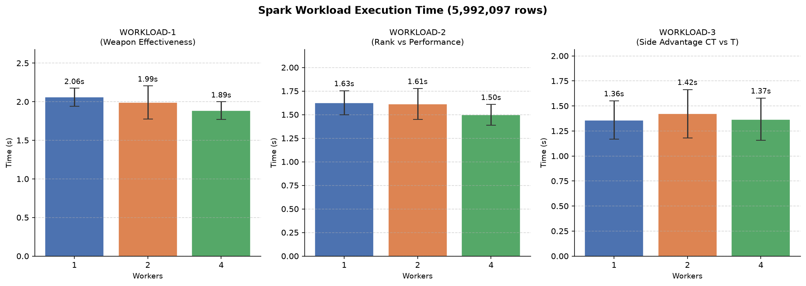

# Final project report: CS:GO Competitive Match Damage Analysis

## 1. Context and motivation

CS:GO (Counter-Strike: Global Offensive) is one of the most played competitive first-person shooters in the world. The ESEA platform hosts thousands of professional and semi-professional matches per day, generating millions of damage events per match cycle.

The goal of this project is to process damage event logs from ESEA competitive matches to uncover patterns related to weapon lethality, player rank vs. actual performance, and the tactical impact of each side (Counter-Terrorist vs. Terrorist). These analyses require aggregating over millions of rows and correlating multiple dimensions simultaneously — making it a natural Big Data batch processing problem.

**Why is this Big Data?**
- The dataset (`part1` only) contains ~6 million rows and occupies 1.2 GB of raw CSV.
- Full ESEA archives span multiple such files, easily reaching tens of GBs.
- Aggregations like per-player damage across all rounds require shuffling data across partitions — expensive on a single machine without a distributed framework.

## 2. Data

### 2.1 Detailed description

**Source:** [ESEA Master Damage Demos — Kaggle](https://www.kaggle.com/datasets/skihikingkevin/csgo-matchmaking-damage)

Each row is one damage event from a CS:GO match demo. The dataset has 24 columns:

| Column | Description |
|---|---|
| `file` | Demo file (match identifier) |
| `round` | Round number within the match |
| `tick` / `seconds` | Game tick and elapsed time in the round |
| `att_team` / `vic_team` | Attacking and victim team names |
| `att_side` / `vic_side` | Side (`CounterTerrorist` or `Terrorist`) |
| `hp_dmg` / `arm_dmg` | HP and armor damage dealt |
| `is_bomb_planted` | Whether the bomb was planted at the time |
| `bomb_site` | Site where bomb was planted (A/B) |
| `hitbox` | Body part hit (Head, Chest, Stomach, etc.) |
| `wp` / `wp_type` | Weapon name and category (Rifle, Pistol, SMG, etc.) |
| `att_id` / `vic_id` | Steam ID of attacker and victim |
| `att_rank` / `vic_rank` | Matchmaking rank of each player |
| `att_pos_x/y` / `vic_pos_y/y` | 2D position on the map at time of event |

### 2.2 How to obtain the data

A sample dataset is included in the project under `datasample/` for quick testing. The current workflow is designed to work with that folder directly: if it contains one CSV or several CSV files, the job will read all of them automatically.

You can also add more `.csv` files to `datasample/` and the pipeline will process them as part of the same input set.

For the full dataset, download from Kaggle:

```bash
# Requires kaggle CLI configured with API key
kaggle datasets download -d skihikingkevin/csgo-matchmaking-damage
unzip csgo-matchmaking-damage.zip -d data/
```

Or download manually from: https://www.kaggle.com/datasets/skihikingkevin/csgo-matchmaking-damage

**Do not include the full dataset in the repository.**

## 3. How to install and run

> The only requirement is Docker (tested with Docker 24+). No other tools needed.

### 3.1 Quick start (sample data in `datasample/`)

```bash
./bin/run.sh
# or with 2 workers:
./bin/run.sh 2
```

This runs `spark-submit` inside Docker against all CSV files found in `datasample/` at the project root. No manual datapath or filename selection is required. Each workload is executed 100 times asynchronously by default to make the timing more meaningful for lightweight queries. Results are written to `misc/output/`.

### 3.2 Running with your own data folder

If you want to use a different folder, set `DATA_PATH` to the **absolute path** of that directory. The pipeline will read every `.csv` file inside it automatically. You can also override the default 100 asynchronous repetitions with `REPEAT_COUNT`:

```bash
DATA_PATH=/absolute/path/to/folder REPEAT_COUNT=100 ./bin/run.sh 4
```

Example:

```bash
DATA_PATH=$(pwd)/data ./bin/run.sh 4
```

### 3.3 Full benchmark (all worker configurations)

```bash
# 1 worker, 5 repetitions
DATA_PATH=$(pwd)/data ./bin/benchmark.sh 1 5

# 2 workers, 5 repetitions
DATA_PATH=$(pwd)/data ./bin/benchmark.sh 2 5

# 4 workers, 5 repetitions
DATA_PATH=$(pwd)/data ./bin/benchmark.sh 4 5
```

> **Note:** `DATA_PATH` must be an absolute path — Docker volume mounts do not accept relative paths.

## 4. Project architecture

```
┌──────────────────────────────────────────────────────────┐
│                    Docker Compose                         │
│                                                           │
│  [esea_*.csv]                                             │
│      │  (volume mount)                                    │
│      ▼                                                    │
│  spark-job (spark-submit)                                 │
│      │  submits job to                                    │
│      ▼                                                    │
│  spark-master:7077  ──►  spark-worker (×N_WORKERS)        │
│      │                                                    │
│      ▼  (volume mount)                                    │
│  misc/output/  (CSV results per workload)                 │
└──────────────────────────────────────────────────────────┘
```

- **spark-master**: Bitnami Spark 3.5 in master mode; Spark UI available at port 8080.
- **spark-worker**: One or more worker instances (controlled by `N_WORKERS` env var). Each worker gets 4 cores and 4 GB RAM.
- **spark-job**: Runs `spark-submit` against `src/main.py`, reads every CSV found in the mounted data directory, and writes results to `misc/output/`.
- The number of workers is controlled at runtime — no changes to the compose file are needed for benchmarking.

## 5. Workloads evaluated

### WORKLOAD-1 — Weapon Effectiveness

Group all damage events by weapon name and weapon type; compute count, average HP damage, average armor damage, and headshot percentage.

```
groupBy(wp, wp_type)
→ count(*), avg(hp_dmg), avg(arm_dmg), sum(hitbox=="Head") / count(*) * 100
→ order by avg_hp_dmg desc
```

**Question:** Which weapons deal the most damage per hit and have the highest headshot rate?

### WORKLOAD-2 — Player Rank vs. Performance

First, aggregate per-player totals. Then collapse to per-rank averages.

```
groupBy(att_id, att_rank)
→ sum(hp_dmg), count(*), avg(hp_dmg)

groupBy(att_rank)
→ count(att_id), avg(avg_hp_dmg), avg(total_hp_dmg)
→ order by att_rank
```

**Question:** Does a player's rank reliably predict how much damage they deal per event?

### WORKLOAD-3 — Side Advantage (CT vs T)

Group by attacking side, victim side, and bomb-planted flag to reveal damage asymmetries by situation.

```
groupBy(att_side, vic_side, is_bomb_planted)
→ count(*), avg(hp_dmg), sum(hp_dmg)
→ order by att_side, vic_side, is_bomb_planted
```

**Question:** Which side deals more damage? Does having the bomb planted shift the damage balance?

## 6. Experiments and results

### 6.1 Experimental environment

Experiments run on Linux 6.17.0 (Ubuntu), Docker 24+, dataset: `esea_master_dmg_demos.part1.csv` (5,992,097 rows, 1.2 GB). Each worker configured with 4 cores and 4 GB RAM (`apache/spark:3.5.0`).

### 6.2 How to perform benchmarking

```bash
# 1 worker, 5 repetitions
./bin/benchmark.sh 1 5

# 2 workers, 5 repetitions
./bin/benchmark.sh 2 5

# 4 workers, 5 repetitions
./bin/benchmark.sh 4 5
```

Collect the `[TIMING]` lines from output. Each line has the format:
```
[TIMING] WORKLOAD-N (description): X.XXXs
```

To regenerate the bar charts with error bars after new runs:
```bash
cd misc && python3 plot_results.py
# output: misc/output/benchmark_results.png
```

### 6.3 What was tested

- **Parameter varied:** number of Spark workers (1, 2, 4)
- **Metric:** wall-clock execution time per workload (seconds)
- **Repetitions:** 5 per configuration

### 6.4 Results

> To be filled after running experiments. Use the table format below.

| Workload | Workers | Avg Time (s) | Std Dev (s) | Runs |
|---|---|---|---|---|
| WORKLOAD-1 | 1 | 2.06 | 0.12 | 5 |
| WORKLOAD-1 | 2 | 1.99 | 0.22 | 5 |
| WORKLOAD-1 | 4 | 1.89 | 0.12 | 5 |
| WORKLOAD-2 | 1 | 1.63 | 0.13 | 5 |
| WORKLOAD-2 | 2 | 1.61 | 0.16 | 5 |
| WORKLOAD-2 | 4 | 1.50 | 0.11 | 5 |
| WORKLOAD-3 | 1 | 1.36 | 0.19 | 5 |
| WORKLOAD-3 | 2 | 1.42 | 0.24 | 5 |
| WORKLOAD-3 | 4 | 1.37 | 0.21 | 5 |



## 7. Limitations and conclusions

> To be filled after analysis and experiments.

Possible limitations to discuss:
- Only `part1` of the ESEA dataset was used; full dataset would yield more statistically robust rank distributions.
- Spatial analysis (heatmaps) of `att_pos_x/y` was excluded to keep scope focused.
- Worker overhead in small-data runs (sample) may show longer times with more workers due to coordination cost.

## 8. References and external resources

- ESEA CS:GO Matchmaking Damage Dataset: https://www.kaggle.com/datasets/skihikingkevin/csgo-matchmaking-damage
- Apache Spark 3.5 Documentation: https://spark.apache.org/docs/3.5.0/
- Bitnami Spark Docker image: https://hub.docker.com/r/bitnami/spark
- PySpark DataFrame API: https://spark.apache.org/docs/latest/api/python/reference/pyspark.sql/dataframe.html
