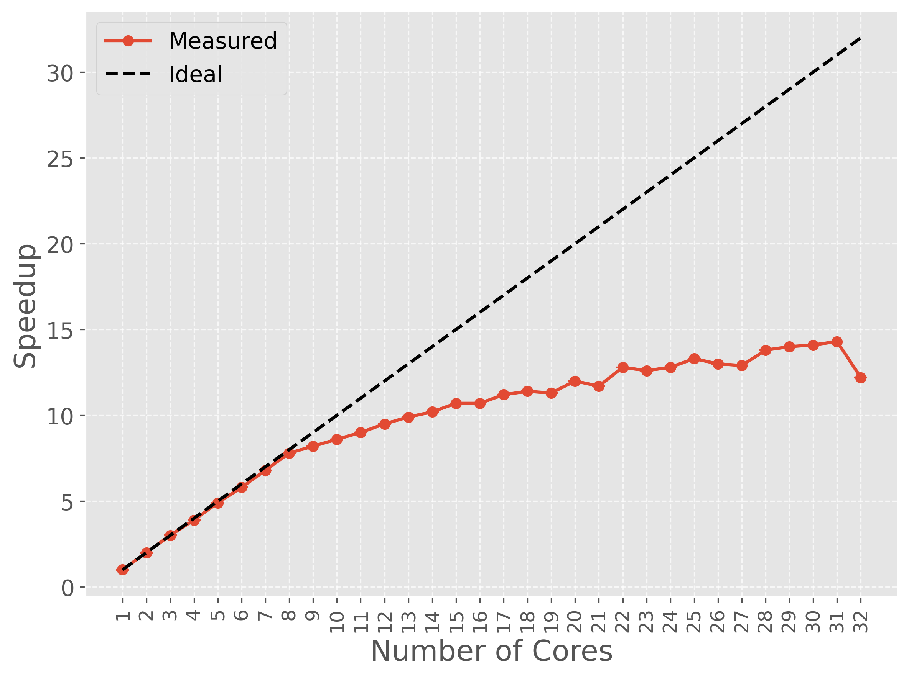
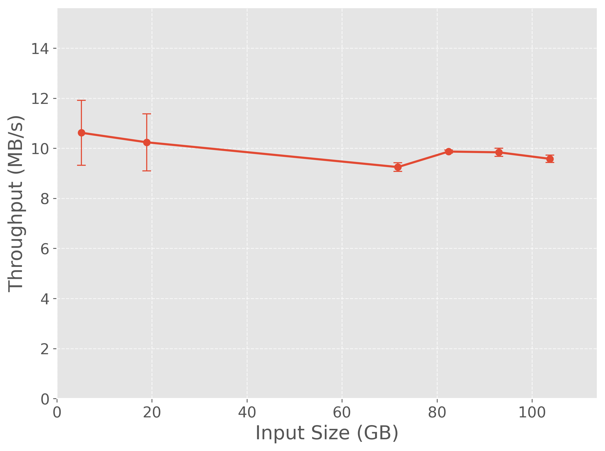

# Final project report: *Distributed ETL Pipeline for Subgraph Optimization Log Analysis using Apache Spark*

## 1. Context and motivation

- The objective of this project is to develop a distributed ETL (Extract, Transform, Load) pipeline capable of processing large volumes of execution logs generated by optimization algorithms running in parallel computing environments.

- The data analyzed in this project originates from experiments conducted for the research paper "An Experimental Study of Variable Neighborhood Search for General-Purpose Subgraph Optimization in Parallel Systems" (Carvalho, Moreira, Dias, SSCAD 2025). These experiments generate large text log files containing detailed information about the execution of metaheuristic algorithms applied to subgraph optimization problems.

- Although the final solution produced by an optimization algorithm is important, understanding how quickly the algorithm converges to its best solution is equally relevant. Researchers often need to determine not only the quality of the final solution but also the moment during execution when that solution was first discovered.

- To address this problem, this project implements a distributed processing architecture capable of reading compressed log files, extracting relevant execution metrics, calculating the time required to reach the best solution, and generating structured datasets suitable for subsequent statistical analysis.

- Because the logs consist of large amounts of unstructured textual data and require computationally expensive pattern matching operations, Apache Spark was selected as the processing framework, allowing the workload to be distributed across multiple processing cores.

## 2. Data

### 2.1 Detailed description

- The dataset consists of compressed text log files (.txt.gz) generated by a distributed Subgraph Optimization framework.
- The logs were produced during the experiments described in:
```Carvalho, Moreira, Dias. An Experimental Study of Variable Neighborhood Search for General-Purpose Subgraph Optimization in Parallel Systems. SSCAD 2025.```
- **Data source**: ```https://github.com/dcc-ufla-graph-mining/fractal/tree/CCPE2026```
- **Data characteristics**:
  - Each log file contains:
    - Experiment configuration parameters;
    - Graph identifiers;
    - Optimization objective functions;
    - Numbers of threads used;
    - Execution timestamps;
    - Intermediate solutions found during execution;
    - Final best solution information;
    - Execution statistics.
- The ETL pipeline extracts the following metrics:

| Metric                      | Description                                               |
| --------------------------- | --------------------------------------------------------- |
| Graph Name                  | Input graph used in the experiment                        |
| Initial Vertices            | Number of vertices used in the initial solution           |
| Number of Initial Solutions | Parameter controlling initialization                      |
| Timeout                     | Maximum execution time                                    |
| Objective Function          | Optimization objective                                    |
| Number of Threads           | Parallelism level                                         |
| Total Execution Time        | Total runtime of the experiment                           |
| Effective Runs              | Number of VNS executions                                  |
| Best Solution Cost          | Cost of the best solution found                           |
| Best Solution Vertices      | Number of vertices in the best solution                   |
| Best Solution Edges         | Number of edges in the best solution                      |
| Best Solution               | Final optimized subgraph                                  |
| Time to Best Solution       | Time elapsed until the best solution was first discovered |

### 2.2 How to obtain the data

- A small sample dataset is already included in: `datasample/`
- To generate the full dataset, access the repository previously cited and follow the instructions to run the system.

## 3. How to install and run

### 3.1 Quick start (using sample data in `datasample/`)
- Clone the repository::
  ``` 
  git clone <https://github.com/diogoocv/pdm/tree/finalproject-20261-g9/finalproject/20261/g9>
  cd <pdm/finalproject/20261/g9>
  ```
- Build the docker container:
  ```bash
  docker compose up --build
  ```
- Run the system:
```bash
  ./bin/run-etl.sh <CORES> <MEMORY> <INPUT_PATH>
  ```
- For running a quick example with the `datasample/`:
```bash
  ./bin/run-experiments
  ```

This script will:

1. Start all required containers;
2. Upload the sample dataset to MinIO;
3. Submit the Spark ETL job;
4. Store the generated results locally.

Generated outputs can be found in:

```text
results/
```

### Accessing services

| Service         | URL                   |
| --------------- | --------------------- |
| Spark Master UI | http://localhost:8080 |
| MinIO Console   | http://localhost:9001 |
| Jupyter Lab     | http://localhost:8888 |

MinIO credentials:

```text
User: pdm_minio
Password: pdm_minio
```

Jupyter token:

```text
pdm2026
```

### 3.2 How to run with the full dataset

Replace the sample files located in:

```text
datasample/
```

with the complete collection of log files.

Then restart the environment:

```bash
docker compose down
docker compose up -d
```

Finally, execute:

```bash
./bin/run-experiments.sh
```

The pipeline will process all files available in the MinIO bucket.

---

## 4. Project architecture

### Architecture overview

```text
                    +----------------------+
                    |  Log Files (.txt.gz) |
                    +----------+-----------+
                               |
                               v
                    +----------------------+
                    |      MinIO (S3)      |
                    | Distributed Storage  |
                    +----------+-----------+
                               |
                               v
                    +----------------------+
                    |   Apache Spark SQL   |
                    |   ETL Application    |
                    +----------+-----------+
                               |
                               v
                    +----------------------+
                    | Input Partitioning   |
                    | Parallel Spark Tasks |
                    +----------+-----------+
                               |
                               v
                    +----------------------+
                    | DataFrame Processing |
                    | Regex + Aggregation  |
                    +----------+-----------+
                               |
                               v
                    +----------------------+
                    | Structured CSV Files |
                    |      Results         |
                    +----------------------+
```

---

### Components

#### MinIO

MinIO is an S3-compatible object storage service used as the input data repository.

Responsibilities:

- Store compressed log files (`.txt.gz`);
- Provide scalable object storage through the S3 API;
- Serve data to Spark via the S3A connector;
- Simulate a cloud storage environment without requiring external infrastructure.

Container:

```text
pdm-minio
```

---

#### MinIO Setup

Responsible for automatically creating the bucket structure and uploading the sample dataset during the environment initialization.

Container:

```text
pdm-minio-setup
```

---

#### Apache Spark

Spark executes the complete ETL pipeline in parallel using the DataFrame API and Spark SQL.

Responsibilities:

- Read log files from MinIO;
- Partition the input dataset;
- Execute parallel parsing tasks;
- Perform filtering, aggregations and joins;
- Generate structured analytical datasets;
- Export the final CSV files.

Containers:

```text
pdm-spark-master
pdm-spark-worker
```

---

#### Jupyter Environment

Provides an interactive environment for development, debugging and performance evaluation.

Container:

```text
pdm-jupyter
```

---

### Data flow

The ETL pipeline follows the workflow below:

1. Log files are uploaded to MinIO.
2. Spark accesses the objects through the S3A connector.
3. The input files are automatically divided into partitions.
4. Spark creates one processing task for each partition.
5. Tasks are distributed among the available CPU cores and executed in parallel.
6. Each task parses its assigned partition using regular expressions and generates intermediate DataFrames.
7. Aggregations and joins combine the intermediate information into the final dataset.
8. The resulting DataFrame is exported as CSV files.
9. Output files are stored in the local `results/` directory.

---

### Spark execution workflow

Although the ETL pipeline is implemented as a sequence of DataFrame transformations, Spark uses **lazy evaluation**. Instead of executing each transformation immediately, Spark builds a logical execution plan and postpones computation until an action (the CSV export) is requested. Before execution, Spark optimizes this plan to reduce unnecessary computations and improve resource utilization.

The execution model adopted by the pipeline is illustrated below.

```text
               Input logs stored in MinIO
                         │
                         ▼
              S3A connector reads the files
                         │
                         ▼
      Files are divided into input partitions
                         │
                         ▼
      One Spark task is created per partition
                         │
         ┌───────────────┴───────────────┐
         │                               │
         ▼                               ▼
     CPU Core 1                     CPU Core 2
  Process Partition A          Process Partition B
         │                               │
         ▼                               ▼
  Read compressed logs           Read compressed logs
  Regex extraction               Regex extraction
  Filtering                      Filtering
  Type conversion                Type conversion
         │                               │
         └───────────────┬───────────────┘
                         ▼
          Intermediate Spark DataFrames
                         │
          (recomputed when required)
                         ▼
        Aggregations and Broadcast Joins
                         │
                         ▼
              Final Structured Dataset
                         │
                         ▼
                CSV files written to disk
```

#### Input partitioning

The input files stored in MinIO are divided into multiple input partitions. Each partition becomes an independent unit of work that can be processed separately. Only the partitions currently assigned to active tasks are loaded into memory, allowing datasets much larger than the available RAM to be processed efficiently.

The exact number of partitions depends on the characteristics of the input dataset and Spark's partitioning strategy.

#### Parallel task execution

Each input partition is assigned to a Spark task.

Spark schedules these tasks among the available CPU cores. Since each task occupies one core, several partitions can be processed simultaneously. Whenever a task finishes, Spark immediately assigns another pending partition to the available core until all partitions have been processed. Because the number of partitions is typically much larger than the number of CPU cores, tasks are executed in successive waves until the entire dataset has been processed.

#### Processing performed by each task

Each task executes the same sequence of operations over its assigned partition.

The main processing steps include:

- Reading compressed log records from MinIO through the S3A connector;
- Decompressing the assigned `.txt.gz` files;
- Filtering only the relevant log lines;
- Extracting structured information using regular expressions;
- Converting extracted values into typed Spark columns;
- Producing intermediate DataFrames used by subsequent aggregation and join operations.

Since these intermediate DataFrames are not cached, Spark repeats this parsing process whenever another branch of the execution plan requires data derived from the raw input.

#### Aggregations and joins

After the parsing phase, Spark combines information extracted from different partitions.

Aggregation operations (`groupBy`) require records with the same key to be grouped before computing the final result. This redistribution of records is known as a **shuffle**.

To minimize communication overhead, the pipeline broadcasts the small parameter DataFrames (`df_args`, `df_threads`, `df_best`, and `df_start_time`) before joining them with the much larger timeline DataFrame (`df_timeline`). As a result, only a very small amount of data is exchanged between tasks, keeping shuffle overhead negligible.

#### Memory management

The ETL pipeline processes data incrementally instead of loading the complete dataset into memory.

Each task loads and processes only its assigned partition, allowing datasets much larger than the available memory to be analyzed. After a partition has been processed, its temporary objects become eligible for garbage collection.

Because the workload performs extensive regular-expression parsing over billions of log lines, many temporary Java objects are created during execution. However, experimental observations show that garbage collection accounts for only a small fraction of the total execution time, indicating that the application is primarily **CPU-bound** rather than memory-bound.

---

### Technologies used

- Apache Spark 3.5.1
- PySpark
- Spark SQL
- MinIO
- Docker
- Docker Compose
- Python 3
- Regular Expressions (Regex)
- S3A Connector

---

# 5. Workloads evaluated

The project evaluates the performance of a parallel ETL pipeline designed to process large collections of compressed optimization logs.

For every execution, the pipeline reads log files from MinIO, extracts structured information using regular expressions, computes execution metrics (including the **Time to Best Solution**), and exports the results as structured CSV datasets.

Two complementary workloads were designed to evaluate different scalability aspects of the system.

---

## [WORKLOAD-1] Core Scalability

This workload evaluates how the ETL pipeline benefits from additional computational resources.

The input dataset remains fixed throughout all executions, while the number of CPU cores allocated to Spark is varied.

During each execution, the complete ETL workflow is performed:

1. Reading compressed log files from MinIO;
2. Partitioning the input dataset;
3. Parallel parsing of log records;
4. Extraction of execution parameters and optimization metrics;
5. Construction of intermediate Spark DataFrames;
6. Aggregation and broadcast joins;
7. Computation of the Time to Best Solution metric;
8. Export of the final structured CSV dataset.

Configuration:

- Fixed input dataset: approximately **5.17 GiB**;
- Number of CPU cores varied from **1 to 32**;
- Driver memory fixed at **50 GB**.

Objective:

Evaluate the strong scalability of the ETL application and measure how execution time changes as additional processing resources become available.

---

## [WORKLOAD-2] Data Volume Scaling

This workload evaluates how the ETL pipeline behaves as the amount of input data increases.

The computational resources remain fixed, while progressively larger datasets are processed.

Each execution performs exactly the same ETL operations described in Workload 1.

Configuration:

- Number of CPU cores fixed at **32**;
- Driver memory fixed at **50 GB**;
- Input size increased by processing progressively larger collections of compressed log files.

Objective:

Evaluate the throughput of the ETL application and determine how efficiently it scales when processing increasingly larger datasets.

---

## Performance metrics

The following metrics were collected for every experiment:

- Total execution time (seconds);
- Number of allocated CPU cores;
- Input dataset size (bytes);
- Processing throughput (MB/s);
- Speedup relative to the single-core execution.

Throughput was computed as

```text
Throughput = Input_Size_MB / Execution_Time_s
```

while speedup was calculated as

```text
Speedup = T₁ / Tₙ
```

where **T₁** is the execution time using one CPU core and **Tₙ** is the execution time obtained with **n** cores.

Higher throughput and speedup values indicate better utilization of the available computational resources.

## 6. Experiments and results

### 6.1 Experimental environment

All experiments were executed on a dedicated physical machine.

Hardware specifications:

| Component       | Specification         |
| --------------- | --------------------- |
| Processor       | Intel Core i9-14900KF |
| CPU Frequency   | Up to 6.0 GHz         |
| Physical Cores  | 24                    |
| Logical Threads | 32                    |
| Memory          | 64 GB RAM             |
| Storage         | SSD                   |
| Architecture    | x86_64                |

Software specifications:

| Component        | Version             |
| ---------------- | ------------------- |
| Operating System | Debian GNU/Linux 12 |
| Linux Kernel     | 6.1.0-28-amd64      |
| Docker           | Docker Engine       |
| Docker Compose   | Docker Compose      |
| Apache Spark     | 3.5.1               |
| Python           | Python 3            |
| MinIO            | Latest Docker image |

The Spark cluster was deployed entirely using Docker Compose and consisted of:

* One Spark Master node;
* One Spark Worker node;
* One MinIO object storage service;
* One MinIO setup container responsible for dataset ingestion;
* One Jupyter Notebook environment for development and debugging.

---

## 6. Experiments and results

### 6.1 Experimental environment

All experiments were performed using the execution environment described in Section 4. The complete ETL pipeline was executed inside Docker containers, with Apache Spark processing log files stored in MinIO through the S3A connector.

Hardware specifications:

| Component | Specification |
|------------|---------------|
| Processor | Intel Core i9-14900KF |
| CPU Frequency | Up to 6.0 GHz |
| Physical Cores | 24 |
| Logical Threads | 32 |
| Memory | 64 GB RAM |
| Storage | SSD |
| Architecture | x86_64 |

Software specifications:

| Component | Version |
|------------|---------|
| Operating System | Debian GNU/Linux 12 |
| Linux Kernel | 6.1.0-28-amd64 |
| Docker | Docker Engine |
| Docker Compose | Docker Compose |
| Apache Spark | 3.5.1 |
| Python | Python 3 |
| MinIO | Latest Docker image |

The execution environment consisted of the following services:

- Apache Spark;
- MinIO object storage;
- MinIO setup container for automatic dataset ingestion;
- Jupyter Notebook environment for development and experimentation.

During every experiment, Spark accessed the input data directly from MinIO through the S3A connector. The ETL pipeline automatically partitioned the input dataset into multiple independent tasks, which were dynamically distributed among the available CPU cores. Each task processed one partition by reading the corresponding log records, applying regular-expression parsing, extracting structured information, and generating intermediate DataFrames. After the parallel parsing stage, Spark executed aggregation and broadcast-join operations to build the final analytical dataset, which was exported as CSV files.

The pipeline processes data incrementally rather than loading the entire dataset into memory. Consequently, only the partitions currently assigned to active tasks are kept in memory, enabling the system to process datasets substantially larger than the available RAM.

---

### 6.2 Benchmarking methodology

Two benchmarking campaigns were conducted to evaluate the workloads presented in Section 5.

For every experimental configuration, the complete ETL pipeline was executed **five independent times**. Each execution performed the entire processing workflow, including reading compressed log files from MinIO, partitioning the input dataset, parallel parsing, DataFrame transformations, aggregations, joins, computation of the *Time to Best Solution* metric, and generation of the final CSV dataset.

The total wall-clock execution time was measured externally by the benchmarking script, while the ETL pipeline automatically recorded the execution parameters and generated the structured output datasets.

The following performance metrics were collected:

- Total execution time (seconds);
- Number of allocated CPU cores;
- Input dataset size (bytes);
- Processing throughput (MB/s);
- Speedup (for the core scalability workload).

For every experimental configuration, the following statistical measures were computed from the five executions:

- Arithmetic mean;
- Standard deviation;
- 95% confidence interval (CI).

For the **Core Scalability** workload, the speedup was computed as

```text
Speedup(N) = T₁ / Tₙ
```

where **T₁** is the average execution time obtained using one CPU core and **Tₙ** is the average execution time obtained using **N** CPU cores.

For the **Data Volume Scaling** workload, throughput was computed as

```text
Throughput = Input_Size_MB / Execution_Time_s
```

where *Input_Size_MB* represents the amount of processed input data and *Execution_Time_s* is the total execution time.

To ensure statistically meaningful comparisons, every reported value corresponds to the average of five independent executions, and all plots include **95% confidence intervals** to represent the variability observed during the experiments.

---

## 6.3 Results

### Workload 1 – Core Scalability

This experiment evaluates how the ETL pipeline benefits from increasing computational resources while maintaining a fixed input dataset (approximately 5.17 GB).

Each configuration was executed five times, varying the number of allocated CPU cores from 1 to 32.

*The complete table containing all 32 configurations is available in: https://docs.google.com/spreadsheets/d/1QLEqhxUtBlAoQT-c6sgNu_KxWkqgzuBQSQUO4W_TnPg.*

| Cores | Avg. Execution Time (s) | Std. Dev. (s) | Runs | 95% CI (s) | Speedup |
| ----: |------------------------:| ------------: | ---: | ---------: | ------: |
|     1 |                  5971.0 |         68.64 |    5 |      85.23 |    1.0× |
|     2 |                  3022.4 |         30.73 |    5 |      38.16 |    2.0× |
|     3 |                  2002.0 |         38.80 |    5 |      48.18 |    3.0× |
|     4 |                  1520.8 |         22.20 |    5 |      27.56 |    3.9× |
|     5 |                  1221.6 |          9.32 |    5 |      11.57 |    4.9× |
|     6 |                  1033.4 |         10.41 |    5 |      12.92 |    5.8× |
|     7 |                   880.8 |          7.98 |    5 |       9.91 |    6.8× |
|     8 |                   769.4 |          7.02 |    5 |       8.72 |    7.8× |
|     9 |                   730.6 |          5.77 |    5 |       7.17 |    8.2× |
|    10 |                   693.6 |          8.29 |    5 |      10.30 |    8.6× |
|    12 |                   630.0 |         10.79 |    5 |      13.40 |    9.5× |
|    14 |                   585.2 |          9.88 |    5 |      12.27 |   10.2× |
|    16 |                   560.4 |         18.66 |    5 |      23.17 |   10.7× |
|    18 |                   522.0 |         23.87 |    5 |      29.64 |   11.4× |
|    20 |                   496.8 |         21.65 |    5 |      26.88 |   12.0× |
|    22 |                   466.4 |         29.24 |    5 |      36.30 |   12.8× |
|    24 |                   466.2 |         22.48 |    5 |      27.91 |   12.8× |
|    26 |                   459.4 |         25.82 |    5 |      32.06 |   13.0× |
|    28 |                   433.8 |         14.13 |    5 |      17.55 |   13.8× |
|    30 |                   422.4 |          5.81 |    5 |       7.22 |   14.1× |
|    32 |                   490.6 |         44.39 |    5 |      55.12 |   12.2× |


#### Core Scalability Plots

<p align="center">
  
</p>

**Figure 1.** Strong scalability of the ETL pipeline. The dashed line represents the ideal linear speedup, while the error bars correspond to the 95% confidence interval.

#### Discussion

Although the ETL pipeline benefits from additional CPU cores, its scalability is far from linear. The best observed configuration achieved a speedup of approximately **14×** using **30 CPU cores**, significantly below the ideal **30×** speedup. Furthermore, performance slightly decreased when increasing the allocation to **32 threads**, indicating that the application reaches a scalability ceiling before fully utilizing all available computational resources.

Analysis of the Spark execution logs indicates that the workload is primarily **CPU-bound**, with the main bottleneck being the repeated processing of the input dataset. During a single execution, Spark reads the input data approximately **eight times**, resulting in a cumulative input volume roughly eight times larger than the original dataset. This behavior occurs because multiple intermediate DataFrames (`df_args`, `df_threads`, `df_best_raw`, and `df_timeline`) are independently derived from the same raw input without persistence. As a result, each action triggers a new traversal of the lineage, causing repeated file reading, GZIP decompression, text parsing, and regular-expression extraction over essentially the same data. Since regular-expression matching is the most computationally expensive operation in the pipeline, these repeated scans substantially increase CPU utilization and limit scalability.

The execution logs also show that scheduler delays, shuffle operations, and memory usage are negligible compared to task execution time, indicating that synchronization, data movement, and memory pressure are not the primary limiting factors. Additionally, the use of compressed `.txt.gz` files introduces a secondary limitation because GZIP is not a splittable compression format. Consequently, individual compressed files cannot be processed by multiple tasks simultaneously, contributing to workload imbalance whenever file sizes differ significantly.

This imbalance is reflected in the Spark monitoring data, where task durations range from only a few seconds to nearly fifty minutes. As shorter tasks complete, CPU cores remain idle while waiting for the longest-running tasks to finish, reducing processor utilization during the final portion of each stage and explaining the diminishing performance gains obtained with higher thread counts.

Despite these limitations, the application demonstrates stable execution across repeated runs, with relatively small confidence intervals and low variability. The results indicate that the ETL pipeline is well suited for medium and large datasets, where the available parallelism compensates for the framework overhead. However, the current implementation is not recommended for small datasets (e.g., below approximately **1 GB**), for which Spark's execution overhead becomes significant relative to the amount of useful computation.

Potential optimizations include reducing the number of full scans by combining multiple extraction steps into a single parsing pass or persisting reusable intermediate DataFrames, improving partition balance to reduce task skew, and replacing repeated regular-expression parsing with more efficient parsing strategies. These optimizations would reduce CPU utilization, minimize redundant I/O, and improve scalability without requiring changes to the overall architecture.

---

### Workload 2 – Data Volume Scaling

The second experiment evaluates how the ETL pipeline behaves as the input dataset grows while keeping the computational resources fixed at **32 logical threads**.

Each dataset size was processed five times.

| Input Size (GB) | Avg. Throughput (MB/s) | Std. Dev. (MB/s) | 95% CI (MB/s) | Runs |
| --------------: | ---------------------: | ---------------: | ------------: | ---: |
|            5.17 |                  10.62 |             1.05 |          1.30 |    5 |
|           18.91 |                  10.24 |             0.92 |          1.14 |    5 |
|           71.77 |                   9.25 |             0.14 |          0.17 |    5 |
|           82.43 |                   9.87 |             0.05 |          0.06 |    5 |
|           93.00 |                   9.84 |             0.13 |          0.16 |    5 |
|          103.74 |                   9.58 |             0.12 |          0.15 |    5 |


##### Volume Scaling Plots 

<p align="center">
  
</p>

**Figure 2.** Throughput as a function of input data size. Error bars represent the 95% confidence interval obtained from five independent executions.

#### Discussion

#### Discussion

The throughput remains remarkably stable despite the approximately twenty-fold increase in input size, varying only between **9.25 MB/s** and **10.62 MB/s**. This behavior indicates that the execution time grows almost proportionally to the amount of processed data, demonstrating good scalability with respect to data volume.

The largest datasets also exhibit very small standard deviations and narrow confidence intervals, indicating that the ETL pipeline maintains consistent performance even when processing more than **100 GB** of compressed log data.

Unlike the core scalability experiment, no significant performance degradation is observed as the dataset grows. The workload performed for each input partition remains essentially the same—reading compressed log files, applying regular-expression parsing, and computing the required metrics—so increasing the input size primarily results in a proportional increase in the number of processed partitions rather than introducing additional execution overhead.

Although a slight throughput reduction (approximately **13%**) is observed for the largest datasets, this decrease is modest considering the substantial increase in processed data. The results indicate that the ETL pipeline maintains nearly constant processing efficiency across different dataset sizes, making it suitable for large-scale analysis of optimization logs.

---

## 7. Limitations and conclusions

This project presented the design and evaluation of a distributed ETL pipeline for processing large collections of subgraph optimization execution logs using Apache Spark. The pipeline reads compressed log files stored in MinIO, extracts execution parameters and optimization metrics through regular-expression parsing, computes additional analytical metrics, and exports the processed data as structured CSV files for further analysis.

Two complementary benchmarking campaigns were conducted to evaluate both computational scalability and data-volume scalability. The experimental results show that the application benefits from additional processing resources, although the achieved speedup is considerably below the ideal linear behavior. The best configuration reached approximately **14× speedup** when using **30 CPU cores**, indicating that the application successfully exploits parallelism but is ultimately limited by characteristics of the current ETL implementation.

The Spark execution logs reveal that these scalability limitations are primarily caused by the application itself rather than by Spark's runtime overhead. The pipeline repeatedly scans the same input dataset to construct multiple intermediate DataFrames, causing the compressed logs to be read, decompressed and parsed several times during a single execution. Since the workload is dominated by computationally expensive regular-expression matching, these repeated scans substantially increase the CPU workload. Additionally, the use of GZIP-compressed files limits input parallelism because individual compressed files cannot be split among multiple tasks, contributing to task imbalance whenever file sizes differ significantly.

Despite these limitations, the data-volume experiments demonstrate that the proposed architecture scales well with increasing input size. As the dataset grows from approximately **5 GB** to more than **100 GB**, throughput remains close to **10 MB/s**, with only a modest reduction and very low execution-time variability. This indicates that the pipeline maintains stable performance for large datasets and that the observed scalability bottlenecks are associated mainly with computational efficiency rather than with memory management, shuffle operations or storage bandwidth.

The experimental analysis also identifies several opportunities for future optimization. Reducing the number of complete scans over the input logs, combining multiple extraction stages into a single parsing pass, improving partition balance, and replacing part of the regular-expression processing with more efficient parsing techniques would significantly reduce CPU utilization and improve scalability. In addition, adopting columnar storage formats such as Parquet would improve the efficiency of downstream analytical workloads.

Overall, the results demonstrate that Apache Spark provides an effective platform for large-scale processing of scientific execution logs. Although the current implementation does not fully exploit the available computational resources due to CPU-intensive parsing and repeated input traversal, it successfully processes datasets exceeding 100 GB while maintaining stable throughput. These findings validate the proposed architecture and provide a clear roadmap for improving the scalability of future versions of the ETL pipeline.

## 8. References and external resources

The following external resources, datasets, libraries, and tools were used throughout this project:

* Carvalho, J. H., Moreira, M. S., and Dias, U. S. (2025). *An Experimental Study of Variable Neighborhood Search for General-Purpose Subgraph Optimization in Parallel Systems*. Proceedings of the Symposium on High Performance Computing Systems (SSCAD 2025).

* Apache Spark. https://spark.apache.org/

* Apache Hadoop. https://hadoop.apache.org/

* MinIO Object Storage. https://min.io/

* Docker. https://www.docker.com/

* Docker Compose. https://docs.docker.com/compose/

* Python Programming Language. https://www.python.org/

* Pandas. https://pandas.pydata.org/

* NumPy. https://numpy.org/

* Matplotlib. https://matplotlib.org/

* SciPy. https://scipy.org/

* Google Sheets (used for experimental data aggregation and statistical analysis). https://www.google.com/sheets/

* Debian GNU/Linux. https://www.debian.org/

