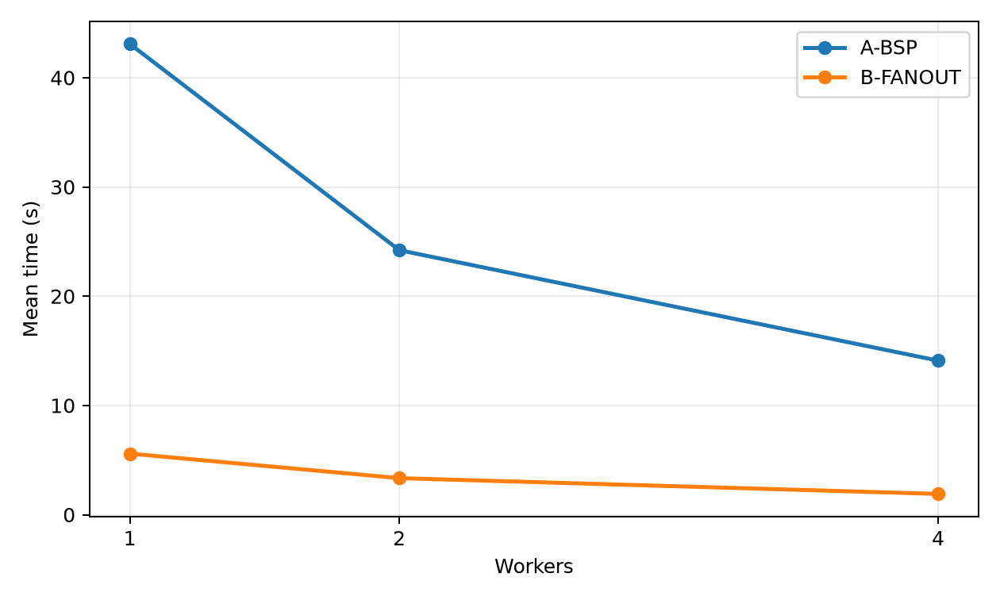
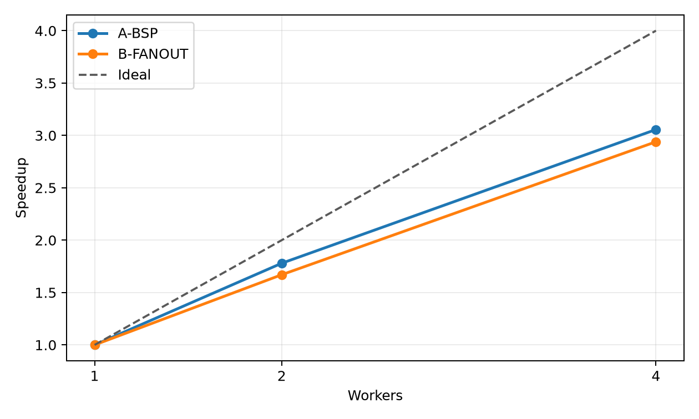

# Final project report: *Shortest paths on the real RMSP road-network graph*

**Course:** Big Data (DCC/UFLA) — Final project 2026/1
**Group:** `pos`
**Author:** Luiz Soares

> This project computes multi-source shortest-path (SSSP) distance matrices over
> the **real road network of the São Paulo Metropolitan Region (RMSP)** — a
> directed, weighted graph with **770,053 vertices** and **2,252,485 edges**,
> derived from the public OpenStreetMap/Geofabrik extract of Brazil. Two
> processing strategies (a BSP/vertex-centric relaxation and a source fan-out of
> independent Dijkstra runs) are compared for correctness and performance, with
> multiple repetitions and statistical reporting.

## 1. Context and motivation

The main goal is to produce a **road-distance matrix** between many points of the
RMSP road network. This is the central pre-processing step of a master's research
project on **siting electric-vehicle charging stations**: candidate sites, demand
zones and competitors must be related by *actual driving distance/time* over the
street network, not by straight-line distance.

From a Big Data perspective the challenge is not only storing the graph but
**repeatedly running shortest paths over a metropolitan-scale network**. The raw
OpenStreetMap extract for Brazil is on the order of gigabytes, and the processed
RMSP road graph used here is a **1,150,979,779-byte** GraphML with hundreds of
thousands of vertices and millions of directed edges. Computing SSSP from many
sources over such a graph is expensive and is the bottleneck of the downstream
optimization, which makes it a good fit for this course.

## 2. Data

### 2.1 Detailed description

- **Source:** OpenStreetMap, via the Geofabrik Brazil extract
  <https://download.geofabrik.de/south-america/brazil-latest.osm.pbf>. The RMSP
  road network is obtained by clipping this extract to the RMSP polygon and
  building the drivable road graph.
- **Processed graph (full dataset):**
  - `road_network.graphml` — the real RMSP road network, **1,150,979,779 bytes**.
  - Derived into two Parquet files that the workloads consume:
    - `vertices.parquet` — **770,053** rows, columns `id, osm_id, lat, lon`.
    - `edges.parquet` — **2,252,485** directed rows, columns `src, dst, length_m, travel_time_s` (positive weights).
- **Sample dataset (in this repo):** `datasample/` contains a **connected
  BFS subgraph** of the full network — **3,500 vertices / 9,791 edges** (~287 KB
  total), same schema. It exists only for quick, out-of-the-box testing.

### 2.2 How to obtain the data

**Sample data:** already included in `datasample/` — nothing to download. It was
produced from the full graph with `bin/make_datasample.py` (BFS from a seed
vertex, ids remapped to a contiguous range).

**Full dataset:** the full graph is **not** committed (it is ~1.1 GB). Reproduce
it from the public OpenStreetMap source:

```bash
# 1. Download the public Brazil OSM extract (~2 GB) from Geofabrik
wget https://download.geofabrik.de/south-america/brazil-latest.osm.pbf

# 2. Build the RMSP drivable road network as GraphML.
#    The network is the Brazil extract clipped to the RMSP polygon and reduced
#    to the drivable street graph (e.g. with OSMnx / osmium), exported as
#    road_network.graphml with `length` and (optionally) `travel_time` edge data.

# 3. Convert the GraphML into the Parquet contract used by the workloads:
python bin/prepare_graph.py --source road_network.graphml --output data/rmsp_graph
#    -> data/rmsp_graph/vertices.parquet
#    -> data/rmsp_graph/edges.parquet
```

`bin/prepare_graph.py` streams the GraphML with `iterparse`, so the 1.1 GB file is
never fully loaded into memory. The exact graph used in this report came from the
dissertation pipeline over this same public Geofabrik source.

> **Important:** do not commit the full dataset. Only the small `datasample/` is
> tracked in the repository.

## 3. How to install and run

> The project runs with a **default Docker installation only** — no other tools
> or local dependencies are required. Tested with Docker 27.x and Docker Compose v2.

### 3.1 Quick start (using sample data in `datasample/`)

From this folder (`finalproject/20261/pos`):

```bash
docker compose up --build
# equivalently:
./bin/run.sh
```

This builds the image, runs both workloads on the bundled sample for worker
counts 1, 2 and 4 with 3 repetitions each, validates that the two workloads
produce identical distances, and writes results to `./output/`:

- `output/metrics.csv` — raw per-repetition measurements.
- `output/plots/summary_table.csv` — mean, std, speedup, efficiency.
- `output/plots/*.png` — charts.
- `output/validation.json` — correctness check (max absolute error between workloads).

You can tune the run with environment variables:

```bash
ORIGINS=32 REPETITIONS=5 WORKERS=1,2,4 docker compose up --build
```

### 3.2 How to run with the full dataset

Prepare the full Parquet graph as in section 2.2 (into `data/rmsp_graph/`), then
point `DATA_DIR` at it:

```bash
DATA_DIR=./data/rmsp_graph ORIGINS=64 REPETITIONS=3 docker compose up --build
# or:
DATA_DIR=./data/rmsp_graph ORIGINS=64 ./bin/run.sh
```

The container mounts `DATA_DIR` read-only at `/data`; everything else is identical
to the quick start.

## 4. Project architecture

Single-container batch pipeline. The graph directory (sample or full) is mounted
into the container; the benchmark runs both workloads, validates them against each
other, and emits metrics, a statistical summary and plots to a mounted output
volume.

```
                 docker compose up --build
                          │
   ┌──────────────────────┴───────────────────────┐
   │  container: pdm-pos-sssp  (misc/Dockerfile)   │
   │                                               │
   │   /data (ro)  ── vertices.parquet             │
   │       │          edges.parquet                │
   │       ▼                                        │
   │   load_graph  ──► CSR matrix + adjacency list  │
   │       │                                        │
   │       ├─► WORKLOAD-A  (BSP / vertex-centric)   │
   │       └─► WORKLOAD-B  (source fan-out Dijkstra)│
   │       │                                        │
   │       ▼                                        │
   │   validate (A vs B)  ─► metrics + plots        │
   └──────────────────────┬────────────────────────┘
                          ▼
                       /output
        metrics.csv · plots/*.png · summary_table.csv · validation.json
```

- **Input format:** Apache Parquet (columnar), derived from GraphML.
- **In-memory model:** SciPy CSR sparse matrix (for fan-out Dijkstra) and a
  Python adjacency list (for the BSP relaxation), shared with worker processes
  copy-on-write via `fork`.
- **Components:** `src/run_experiments.py` (orchestrator + both workloads +
  validation + plotting); `bin/run.sh` / `docker-compose.yml` (Docker entry
  point); `bin/prepare_graph.py` and `bin/make_datasample.py` (data preparation).
- **Everything runs inside one container**; only the data and output directories
  are mounted from the host.

## 5. Workloads evaluated

- **[WORKLOAD-A] BSP-SSSP (vertex-centric).** A relaxation-based single-source
  shortest-path inspired by the Pregel/BSP superstep model: from each source,
  edges are relaxed iteratively until distances converge. This mirrors the
  communication/coordination pattern of a distributed graph engine.
- **[WORKLOAD-B] FANOUT-SSSP (source fan-out).** The graph is held in CSR form and
  an independent Dijkstra is run per source. This minimizes cross-task
  coordination at the cost of keeping the whole graph in memory.

Both workloads distribute their sources across **worker processes** (1/2/4). Using
processes rather than threads is deliberate: Python's GIL prevents threads from
running the pure-Python relaxation (A) or the SciPy Dijkstra (B) in parallel. In
the Linux container the graph is shared with workers **copy-on-write via `fork`**,
so parallelism does not require re-serializing millions of edges. Both workloads
produce the same `origins × vertices` distance matrix, which is compared for
correctness (section 6.4).

## 6. Experiments and results

> These are the results on the **full RMSP graph** (770,053 vertices,
> 2,252,485 edges). The bundled `datasample/` is for quick testing only and
> produces different, much smaller numbers.

### 6.1 Experimental environment

- Deterministic batch benchmark executed by `src/run_experiments.py` inside the
  Docker container (Linux, `fork`-based process pool).
- Full RMSP road graph: 770,053 vertices, 2,252,485 directed edges.
- **64 sources**, **3 repetitions** per configuration, worker counts **1, 2, 4**.
- Reference machine: 11-core x86-64 workstation, Docker 27.x. (Numbers are
  hardware-dependent; rerun with `DATA_DIR=./data/rmsp_graph ORIGINS=64 docker
  compose up --build` to reproduce on your machine.)

### 6.2 How benchmarking was performed

For each `(workload, workers)` configuration the harness measures wall-clock time
over 3 repetitions, then reports mean and sample standard deviation
(`numpy.std(..., ddof=1)`). Speedup is `T(1 worker) / T(n workers)` and parallel
efficiency is `speedup / workers`. Raw data is in
[`misc/results/metrics.csv`](misc/results/metrics.csv); the aggregated table is in
[`misc/results/plots/summary_table.csv`](misc/results/plots/summary_table.csv).

### 6.3 What was tested

- **Varied:** processing strategy (Workload A vs B) and worker count (1/2/4).
- **Measured:** wall-clock execution time, throughput (origins/s), speedup and
  parallel efficiency — each as **mean ± standard deviation over 3 runs**.

### 6.4 Results

**Correctness.** Workloads A and B produced **identical** distance matrices:
maximum absolute error = **0.0**.

**Execution time (mean ± std over 3 runs), 64 sources:**

| Workload | Workers | Avg time (s) | Std (s) | Speedup | Efficiency | Throughput (origins/s) |
| -------- | ------- | ------------ | ------- | ------- | ---------- | ---------------------- |
| A-BSP    | 1       | 43.087       | 0.309   | 1.000   | 1.000      | 1.49 ± 0.01            |
| A-BSP    | 2       | 24.209       | 0.339   | 1.780   | 0.890      | 2.64 ± 0.04            |
| A-BSP    | 4       | 14.099       | 0.378   | 3.056   | 0.764      | 4.54 ± 0.12            |
| B-FANOUT | 1       | 5.588        | 0.035   | 1.000   | 1.000      | 11.45 ± 0.07           |
| B-FANOUT | 2       | 3.346        | 0.025   | 1.670   | 0.835      | 19.13 ± 0.14           |
| B-FANOUT | 4       | 1.901        | 0.017   | 2.939   | 0.735      | 33.67 ± 0.31           |

Plots (in [`misc/results/plots/`](misc/results/plots/)):




**Discussion.** Both workloads scale well with the number of worker processes.
At 4 workers, Workload A reaches a **3.06×** speedup (76 % parallel efficiency) and
Workload B reaches **2.94×** (73 %). Efficiency is high at 2 workers (~0.84–0.89)
and decays gently at 4, which is the expected sub-linear behaviour: the per-source
Dijkstra runs are independent, but they contend for shared memory bandwidth and
the parent still gathers the full distance rows from each worker. Standard
deviations are small (<3 % of the mean), so the measurements are stable. Workload B
is ~7.4× faster than Workload A in absolute terms because it avoids the
coordination rounds of the BSP superstep model and uses SciPy's compiled Dijkstra.
The two strategies agree to **zero error**, so the speedups are obtained without
sacrificing correctness. This confirms that multi-source SSSP over the real RMSP
graph is an **embarrassingly parallel** workload once the per-source computations
are distributed across processes rather than GIL-bound threads.

## 7. Limitations and conclusions

- **What worked:** the complete pipeline runs out-of-the-box on Docker, both on
  the bundled sample and on the full 1.1 GB-derived graph; the two workloads are
  numerically validated (0 error); both scale to ~3× on 4 workers; results are
  reported with mean and standard deviation over 3 repetitions.
- **Limitations:** experiments run on a single machine, so parallelism is bounded
  by the number of physical cores and by shared memory bandwidth — hence the
  gentle efficiency decay from 2 to 4 workers rather than perfect linear scaling.
  The `fork`-based worker model relies on a POSIX (Linux) container; the parent
  also gathers full distance rows over IPC, which caps the speedup of the very
  fast Workload B. A true cluster engine (e.g. Spark/GraphX) would remove the
  single-node ceiling and is the natural next step.
- **Conclusion:** the project delivers the required package for the course — a
  real, expensive-to-process data source, a Big Data justification, graph-based
  batch workloads, a Docker-only reproducible architecture, and an experimental
  performance analysis with statistical reporting and near-3× parallel speedup.

## 8. References and external resources

- OpenStreetMap contributors — <https://www.openstreetmap.org/>
- Geofabrik Brazil OSM extract — <https://download.geofabrik.de/south-america/brazil-latest.osm.pbf>
- Course final-project instructions — <https://github.com/viniciusvdias/pdm/tree/main/finalproject>
- SciPy (`scipy.sparse.csgraph.dijkstra`) — <https://scipy.org/>
- pandas / PyArrow (Parquet I/O) — <https://pandas.pydata.org/> · <https://arrow.apache.org/>
- Matplotlib — <https://matplotlib.org/>
- OSMnx (road-network construction from OSM) — <https://osmnx.readthedocs.io/>

---

*This `README.md` is the full project report.* Supplementary material: a short
academic article ([`misc/article.pdf`](misc/article.pdf)) and the presentation
slides ([`presentation/presentation.pdf`](presentation/presentation.pdf)).
